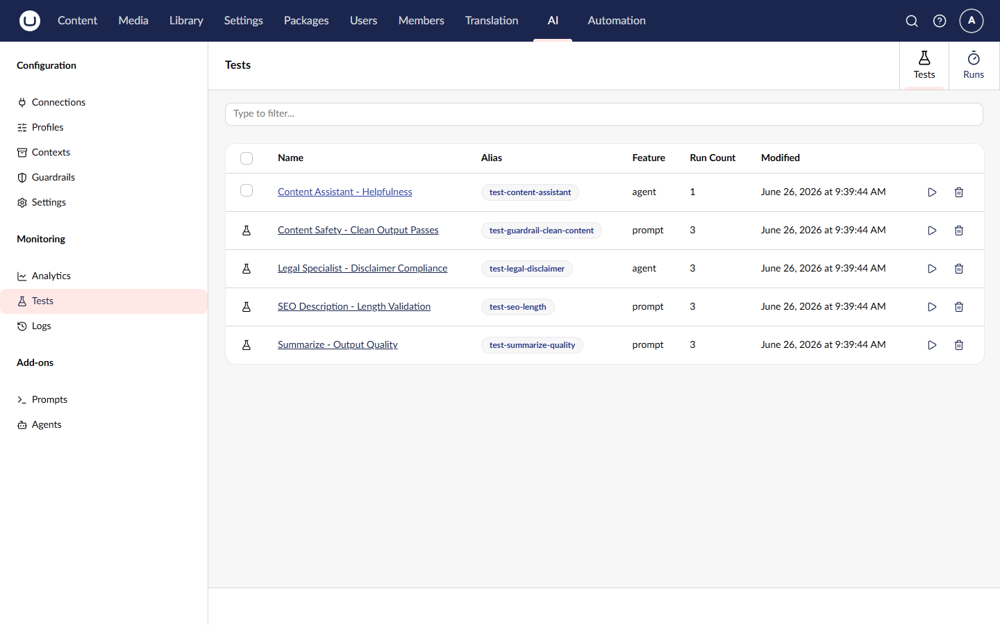

# AI Testing and Evaluation

The AI Testing and Evaluation framework (`Umbraco.AI` core) provides automated validation of AI outputs. You can define tests that run prompts or agents, then grade the results against success criteria to detect regressions and compare model configurations.

## Installation

The testing framework is included in the core `Umbraco.AI` package. No additional installation is required.


You need the Prompt Management or Agent Runtime add-on installed to test prompts or agents respectively.




## Features

- **Graders** - Define success criteria with code-based and model-based graders
- **Variations** - A/B test across different models, profiles, and configurations
- **Baselines** - Set a run as a baseline for regression detection
- **Batch Execution** - Run multiple tests at once or filter by tags
- **Metrics** - Calculate pass@k and pass^k for non-deterministic outputs
- **Transcripts** - Capture full execution traces for debugging

## How It Works

1. **Create a test** targeting a prompt or agent with one or more graders
2. **Run the test** to execute the target and grade the output
3. **Review results** including per-grader scores, metrics, and transcripts
4. **Set a baseline** and compare future runs for regression detection
5. **Add variations** to compare different model configurations side by side

## Quick Example



```bash
# Create a test for a summarization prompt
curl -X POST "https://your-site.com/umbraco/ai/management/api/v1/tests" \
  -H "Authorization: Bearer YOUR_ACCESS_TOKEN" \
  -H "Content-Type: application/json" \
  -d '{
    "alias": "test-summarize-quality",
    "name": "Summarization Quality",
    "testFeatureId": "prompt",
    "testTargetId": "PROMPT_GUID_HERE",
    "runCount": 3,
    "graders": [
      {
        "graderTypeId": "contains",
        "name": "Has bullet points",
        "config": { "searchPattern": "- ", "ignoreCase": true }
      },
      {
        "graderTypeId": "llm-judge",
        "name": "Quality check",
        "config": {
          "evaluationCriteria": "Is the summary concise and accurate?",
          "passThreshold": 0.7
        }
      }
    ],
    "tags": ["quality", "summarization"]
  }'
```



## Documentation

| Section                                  | Description                              |
| ---------------------------------------- | ---------------------------------------- |
| [Concepts](concepts.md)                  | Tests, graders, variations, and metrics  |
| [Getting Started](getting-started.md)    | Step-by-step setup guide                 |
| [Graders](graders.md)                    | All built-in grader types                |
| [Variations](variations.md)              | A/B testing across configurations        |
| [API Reference](api/README.md)           | Management API endpoints                 |

## Related

- [Prompt Management](../add-ons/prompt/README.md) - Prompt templates
- [Agent Runtime](../add-ons/agent/README.md) - Agent definitions
- [Guardrails](../concepts/guardrails.md) - Safety and compliance rules
