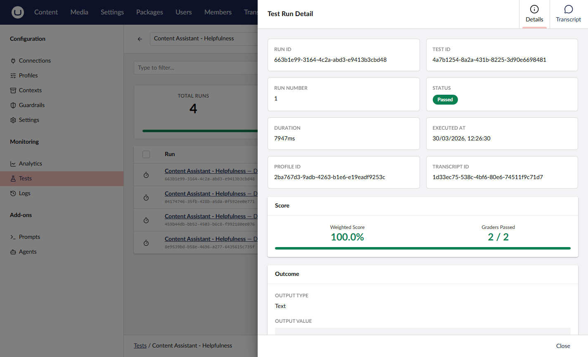

# Testing Concepts

## What is a Test?

A test is a definition that targets a prompt or agent, runs the target one or more times, and evaluates the output against success criteria (graders). Tests act as "unit tests for AI outputs" -- validating that results meet expectations even as models evolve.

### Test Properties

| Property            | Description                                          |
| ------------------- | ---------------------------------------------------- |
| `Alias`             | Unique identifier for code and API references        |
| `Name`              | Display name in the backoffice                       |
| `Description`       | Optional description of what the test validates      |
| `TestFeatureId`     | The test feature (harness) to use: `prompt`, `agent` |
| `TestTargetId`      | The ID of the prompt or agent to test                |
| `ProfileId`         | Optional default profile for execution               |
| `ContextIds`        | Optional default contexts for execution              |
| `TestFeatureConfig` | Feature-specific configuration (JSON)                |
| `Graders`           | Success criteria that evaluate the output            |
| `Variations`        | A/B testing configuration overrides                  |
| `RunCount`          | Number of times to run per execution (1 to N)        |
| `Tags`              | Organization tags for filtering and batch execution  |
| `IsActive`          | Whether the test runs during batch execution         |
| `BaselineRunId`     | Baseline run for regression detection                |

## Test Feature (Harness)

A test feature is the execution harness that knows how to run a specific entity type. Each test feature:

- Sets up the execution context
- Runs the target entity (prompt or agent)
- Captures a transcript of the execution
- Extracts the gradable output value

### Built-in Test Features

| ID       | Name   | Description                         |
| -------- | ------ | ----------------------------------- |
| `prompt` | Prompt | Executes a prompt and captures the response text |
| `agent`  | Agent  | Runs an agent and captures the full conversation  |

Each test feature defines a `ConfigType` that determines the feature-specific configuration. For example, the prompt test feature accepts variables to pass to the template.

## Graders

Graders define success criteria for evaluating test output. Each grader receives the execution transcript and outcome, then returns a score (0 to 1) and a pass/fail judgment.

### Grader Types

| Type          | Description                              |
| ------------- | ---------------------------------------- |
| **CodeBased** | Deterministic, fast. Exact match, regex, JSON validation, tool call checks. |
| **ModelBased** | Flexible, uses an LLM. Semantic evaluation with custom criteria. |

### Grader Configuration Options

Every grader supports these shared options:

| Option     | Type   | Default | Description                                    |
| ---------- | ------ | ------- | ---------------------------------------------- |
| `Negate`   | bool   | false   | Inverts the result (pass becomes fail)         |
| `Severity` | string | Error   | `Info`, `Warning`, or `Error`                  |
| `Weight`   | double | 1.0     | Weight for aggregate scoring (0 to 1)          |

**Severity levels:**

- **Info** - Provides information but does not affect pass/fail
- **Warning** - Logs a failure but does not block the test
- **Error** - Fails the test (default)

For a full list of built-in graders and their configuration, see [Graders](graders.md).

## Variations

Variations let you A/B test the same test definition across different models or configurations. Each variation can override:

- **Profile** - Use a different AI profile (model)
- **Run Count** - Run more or fewer times for the variation
- **Context IDs** - Use different contexts
- **Feature Config** - Override feature-specific settings (deep-merged with the test's config)

When you execute a test with variations, the framework runs the default configuration first, then runs each variation. All runs share a single execution ID for comparison.

For details on setting up variations, see [Variations](variations.md).

## Baseline

You can set any completed run as the baseline for a test. Future runs are compared against the baseline to detect regressions. A regression occurs when a run that previously passed now fails.

Setting a baseline updates the test's `BaselineRunId` property. The comparison endpoints let you view grader-level differences between any two runs.

## Execution

### Execution Modes

| Mode         | Description                                            |
| ------------ | ------------------------------------------------------ |
| **Single**   | Run one test via `POST /tests/{idOrAlias}/run`         |
| **Batch**    | Run multiple tests via `POST /tests/run-batch`         |
| **By Tags**  | Run all tests with specific tags via `POST /tests/run-by-tags` |

### Execution Flow

When you execute a test:

1. The framework resolves the test feature (harness) for the target type
2. The default configuration runs `RunCount` times
3. Each variation runs with its own `RunCount` (inherited or overridden)
4. Each run produces a transcript and outcome
5. Graders evaluate each outcome and produce results
6. The framework calculates metrics across all runs

All runs from a single execution share an `ExecutionId`. Batch runs also share a `BatchId`.

### Metrics

Metrics measure non-deterministic behavior across multiple runs:

| Metric      | Formula                          | Description                           |
| ----------- | -------------------------------- | ------------------------------------- |
| **pass@k**  | `PassedRuns / TotalRuns`         | Probability that at least one run succeeds |
| **pass^k**  | `AllPassed ? 1.0 : 0.0`         | Whether all runs succeeded            |

The execution result includes three sets of metrics:
- **Default metrics** - Runs with the default configuration
- **Variation metrics** - Runs for each variation (separately)
- **Aggregate metrics** - All runs combined (default and variations)

## Transcript

Every test run captures a transcript containing the full execution trace:

| Field         | Description                                     |
| ------------- | ----------------------------------------------- |
| `Messages`    | Chat messages exchanged (system, user, assistant) |
| `ToolCalls`   | Tool calls made during execution (agent tests)  |
| `Reasoning`   | Reasoning or thinking steps (if captured)       |
| `Timing`      | Step-by-step timing information                 |
| `FinalOutput` | The final output produced by the execution      |

Transcripts are stored separately from runs and retrieved via the transcript endpoint.

## Related

- [Graders](graders.md) - All built-in grader types
- [Variations](variations.md) - A/B testing setup
- [API Reference](api/README.md) - Management API endpoints
