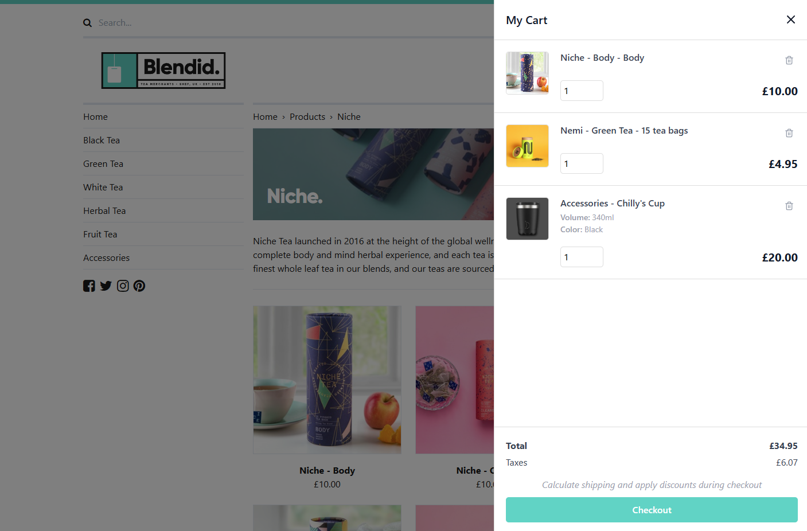

# Overview

Umbraco Commerce Cart is a free and open-source add-on package for Umbraco Commerce. It provides a low-code solution for creating an instant shopping cart in your Umbraco Commerce stores.

Umbraco Commerce Cart allows you to set up your shopping cart with minimal development costs.

In this section, you will learn the key steps necessary to get started with the Cart package for Umbraco Commerce.

It is assumed that you already have an Umbraco website configured, Umbraco Commerce installed and a store set up. If you are not at this stage yet, please read the [core Umbraco Commerce documentation](https://docs.umbraco.com/umbraco-commerce/) to learn how to get started.

## Useful links

As well as the content in these documents, here are a few useful links to learn more about the Umbraco Commerce Cart package.

* [Umbraco Commerce Cart source code](https://github.com/umbraco/Umbraco.Commerce.Cart)
* [Umbraco Commerce Cart issue tracker](https://github.com/umbraco/Umbraco.Commerce.Cart/issues)
