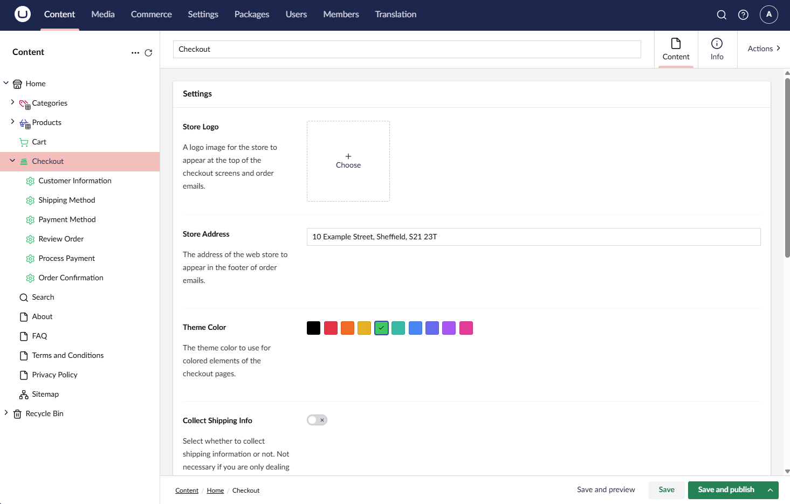

# Configure Umbraco

After installing the Checkout package, a series of content nodes will be created for you on your site. These will control the checkout flow.&#x20;

On the root of these nodes, you can configure a series of options to customize the checkout flow to your needs.

## Step 1: Configuring the Checkout flow

<table><thead><tr><th width="223">Name</th><th>Description</th></tr></thead><tbody><tr><td>Store Logo</td><td>A link to a media item to use as the store logo. If one is not selected, then the store name will be displayed instead.</td></tr><tr><td>Store Address</td><td>The official address of the store. This will be displayed in the footer of all email communications.</td></tr><tr><td>Theme Color</td><td>The color theme to use for the checkout design.</td></tr><tr><td>Collect Shipping Info</td><td>A checkbox to set whether to collect shipping info or not. If deselected, all shipping info-related fields/steps will be removed from the checkout flow</td></tr><tr><td>Order Line Property Aliases</td><td>A comma-separated list of order line property aliases to display in the order summary.</td></tr><tr><td>Checkout Back Page</td><td>The page to go back to when backing out of the checkout flow.</td></tr><tr><td>Terms and Conditions Page</td><td>Defines which page on the site contains the terms and conditions of the store.</td></tr><tr><td>Privacy Policy Page</td><td>The page on the site containing the privacy policy.</td></tr><tr><td>Hide from Navigation</td><td>Checkbox to hide the checkout page from the site's main navigation.</td></tr></tbody></table>

In addition to these root node settings, each checkout step page also has a number of configurable options:

<table><thead><tr><th width="225">Name</th><th>Description</th></tr></thead><tbody><tr><td>Short Step Name</td><td>A short name for this step to display in the checkout navigation.</td></tr><tr><td>Step Type</td><td>The checkout step to display for this step of the checkout flow.</td></tr></tbody></table>

## Linking to the Checkout

With the checkout setup and configured the final step is to configure your cart page to link through to the checkout flow. How you do this is up to you:

* Link to the URL `/checkout` or
* Use a Content Picker to select the checkout node to link to.
