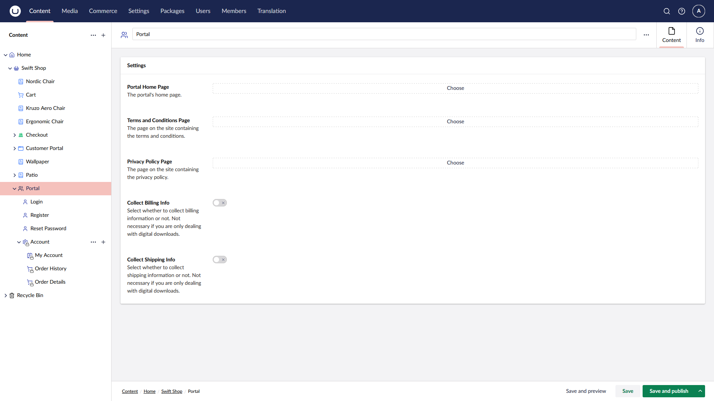

# Configure Umbraco

After installing the Portal package, a series of content nodes will be created for you on your site.

On the root of these nodes, you can configure a series of options for your customer portal.

## Step 1: Configuring the Portal


In Umbraco Commerce 16.1.0, the logo and theme color options have been moved to the store **Settings** section for consistent theming across all add-ons.


<table>
    <thead>
        <tr>
            <th width="223">Name</th>
            <th>Description</th>
        </tr>
    </thead>
    <tbody>
        <tr>
            <td>Portal Home Page</td>
            <td>The root page of the portal.</td>
        </tr>
        <tr>
            <td>Terms and Conditions Page</td>
            <td>Defines which page on the site contains the terms and conditions of the store.</td>
        </tr>
        <tr>
            <td>Privacy Policy Page</td>
            <td>The page on the site containing the privacy policy.</td>
        </tr>
        <tr>
            <td>Collect Billing Info</td>
            <td>A checkbox to set whether to collect billing info or not. If deselected, the billing information will not be displayed in the `Order Details` page.</td>
        </tr>
        <tr>
            <td>Collect Shipping Info</td>
            <td>A checkbox to set whether to collect shipping info or not. If deselected, the shipping information will not be displayed in the `Order Details` page.</td>
        </tr>
    </tbody>
</table>

