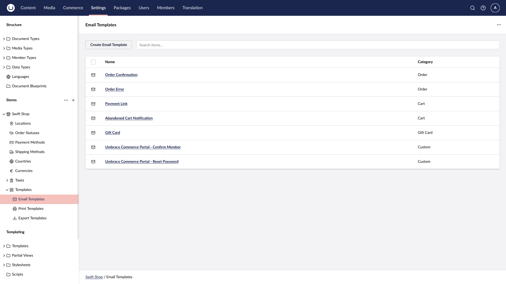
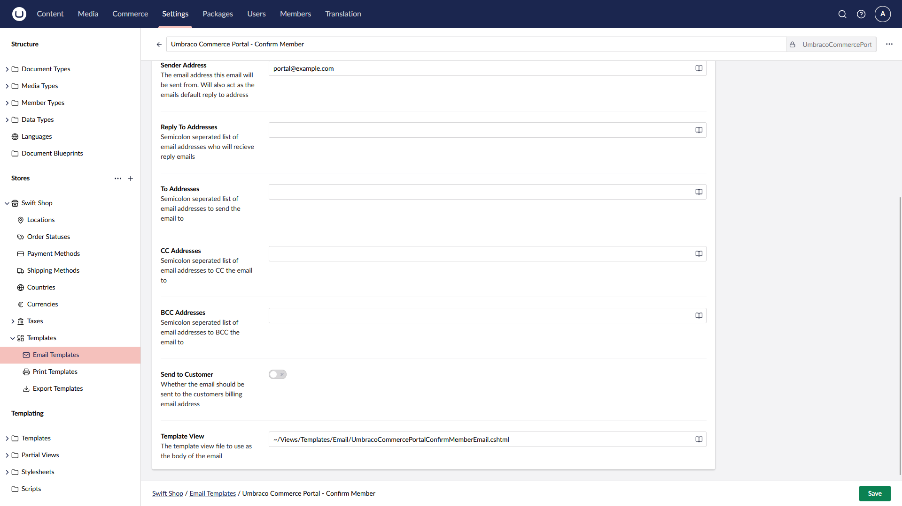

# Customize Email Templates

The Portal includes customizable email templates for account confirmation and password reset, which can be updated to match your site’s design.

## Setup

To allow customization you must first 'override' the existing template files for the step required to be modified. 

To do this follow these steps:

1. Copy the equivalent [templates](https://github.com/umbraco/Umbraco.Commerce.Portal/tree/main/src/Umbraco.Commerce.Portal/Views/Templates/Email). 
2. Add them to `Views/UmbracoCommercePortal` in your project directory. It might be necessary to create the folder first.
3. Make a small text change to one of the Views to verify that the files are in use.
4. Verify that the changes are carried out and displayed correctly.

You are now ready to start customizing the Portal email templates to fit the design of your website.

If you want to use your own email template views, ensure that they are using the `EmailModel`, then go to the `Templates | EmailTemplates` settings of your store, and for each `Umbraco Commerce Portal` template, update the path with the one of your view.

## Useful links

Here are a few useful links to learn more about the Umbraco Commerce Portal package:

* [Umbraco Commerce Portal source code](https://github.com/umbraco/Umbraco.Commerce.Portal)
* [Umbraco Commerce Portal issue tracker](https://github.com/umbraco/Umbraco.Commerce.Portal/issues)
