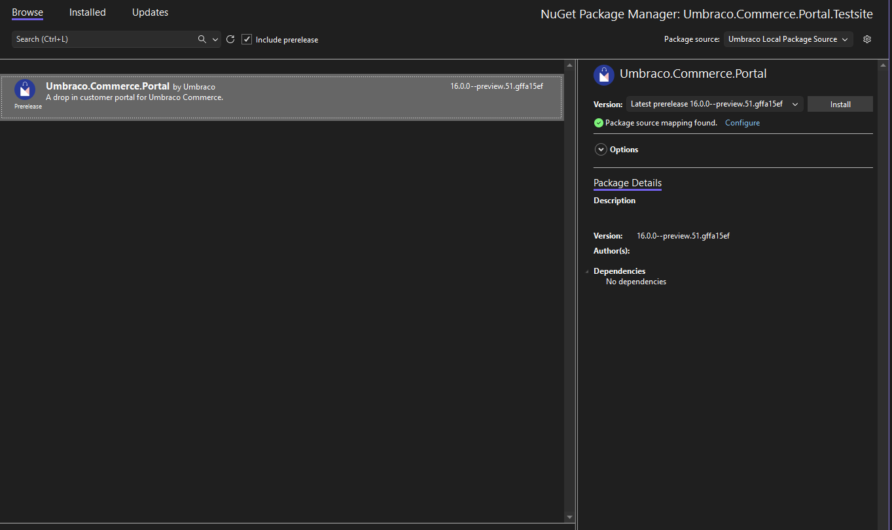
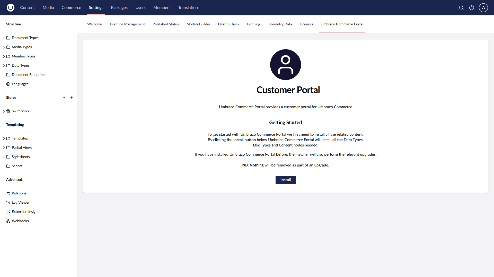
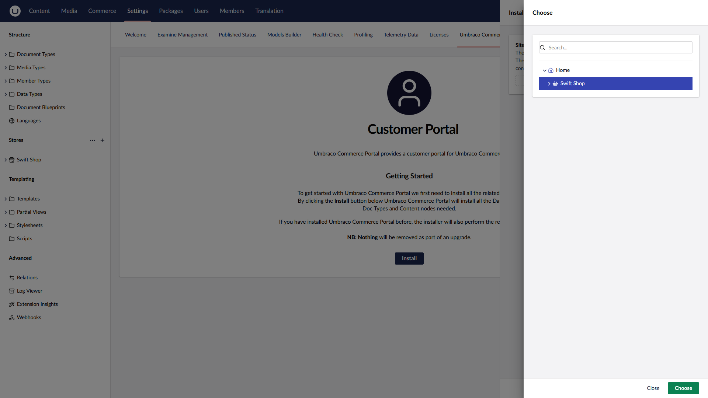
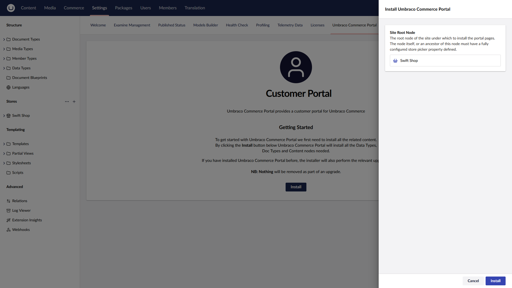

# Installation

The Portal package can be installed directly into your project's code base using NuGet packages.

## NuGet Package Installation

To install the Umbraco Commerce Portal package via NuGet run the following command directly in the NuGet Manager Console window in Visual Studio:

```bash
PM> Install-Package Umbraco.Commerce.Portal
```

Alternatively, you can also find and install the NuGet package via the NuGet Package Manager.



## Content Installation

When the Portal package is installed, all relevant database configurations automatically occur via Umbraco Migrations. There are a series of content creation steps that need to be triggered manually as these types of migrations are not supported by Umbraco.

To install the relevant Portal content follow these steps:

1. Access the Umbraco CMS backoffice.
2. Navigate to the **Settings** section.
3. Locate the **Checkout Dashboard**.



4. Click the **Install** button.
5. Select your site's root node which is configured with a Umbraco Commerce store.
6. Click **Install**.




During this install, Umbraco Commerce Portal will perform the following tasks:

* [x] Configure the Umbraco Commerce store with custom Umbraco Commerce Portal email templates for confirming portal account and reset password.
* [x] Create the Umbraco Commerce Portal member group (`Commerce Portal`), member type (`Umbraco Commerce Portal Member`) and data type (country dropdown).
* [x] Create the Umbraco Commerce Portal Document Types:
    * Portal Container
        * Login, Register and Reset Password pages
        * Portal Management pages:
            * My Account
            * Order History
            * Order Details
* [x] Create the Umbraco Commerce Portal content nodes beneath the select site root node (unpublished).
* [x] Configure the Umbraco Commerce Portal Management Pages public access for members part of the `Commerce Portal` group.

## Upgrading


Before upgrading, it is always advisable to take a complete backup of your site/database.


The Portal package uses a combination of database migrations and a manual install dashboard for both installs and upgrades. Upgrading is generally a case of installing the latest version over the existing package and running through the installation steps.
