# Portal Screenshots

Check out the screenshots below to see what you get with Umbraco Commerce Portal straight out of the box.

## Portal Settings

<figure>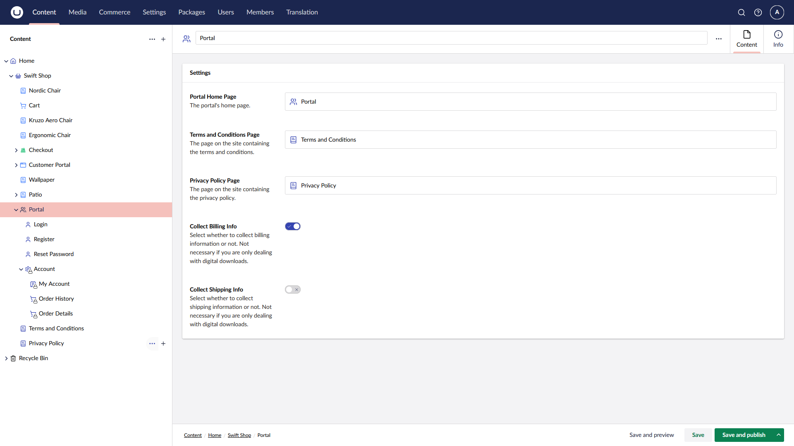<figcaption>
Umbraco Commerce Portal Settings
</figcaption></figure>

 

 

<figure>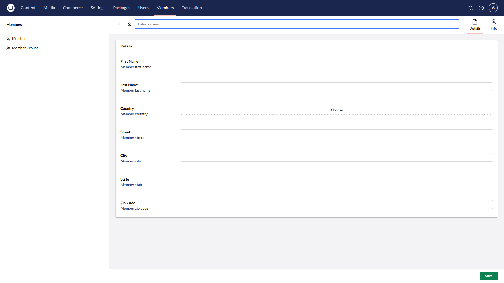<figcaption>
Umbraco Commerce Portal Member Type
</figcaption></figure>

 

<figure>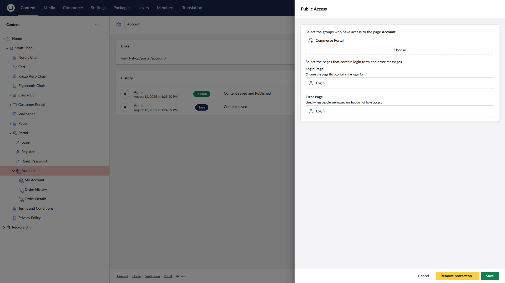<figcaption>
Umbraco Commerce Portal Public Access
</figcaption></figure>

 

## Portal Authentication

<figure>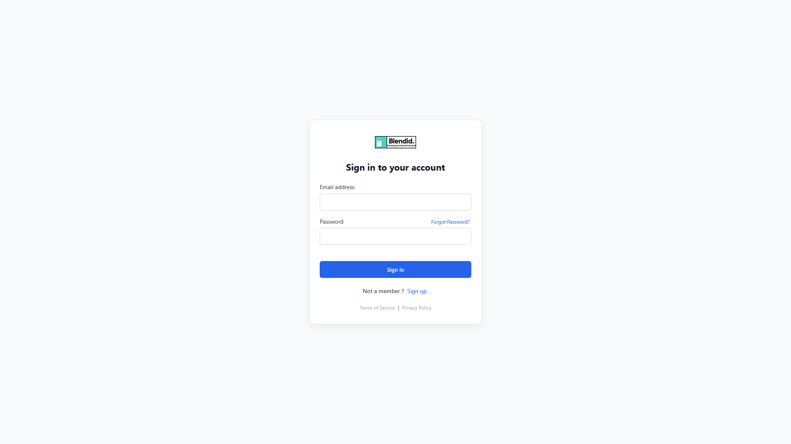<figcaption>
Umbraco Commerce Portal Login Page
</figcaption></figure>

<figure>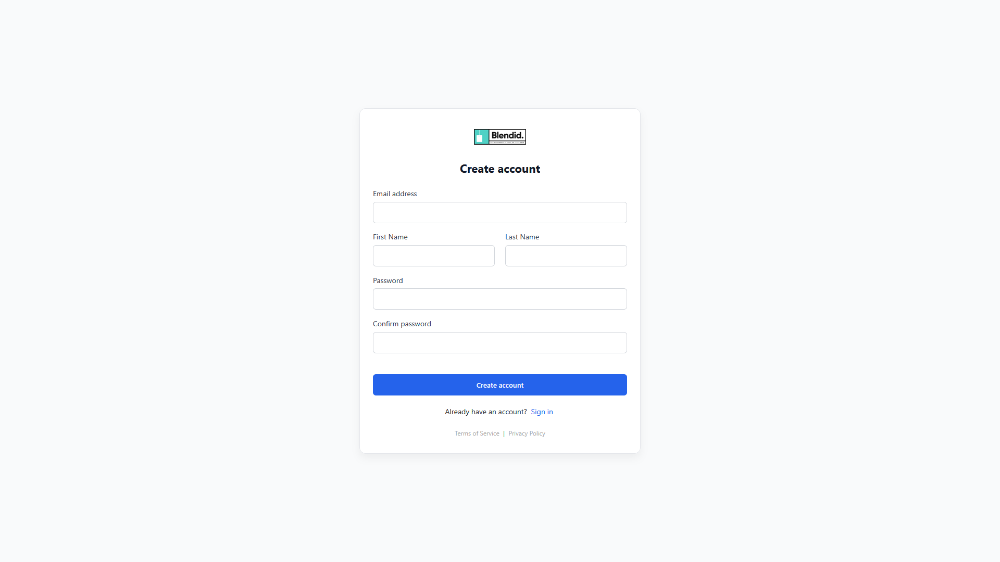<figcaption>
Umbraco Commerce Portal Sign Up Page
</figcaption></figure>

 

 

<figure>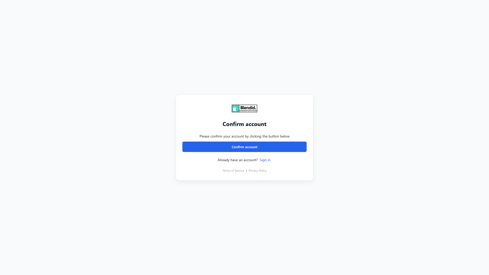<figcaption>
Umbraco Commerce Portal Confirm Account Page
</figcaption></figure>

 

 

<figure>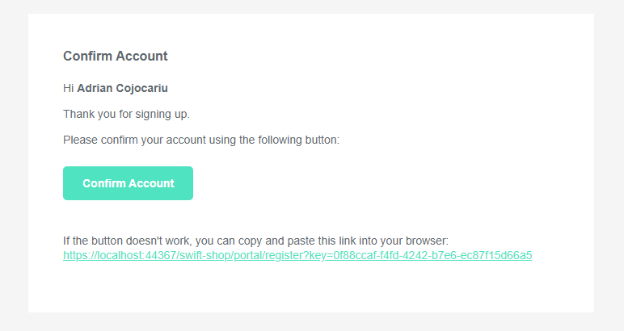<figcaption>
Umbraco Commerce Portal Confirm Account Email
</figcaption></figure>

 

 

<figure>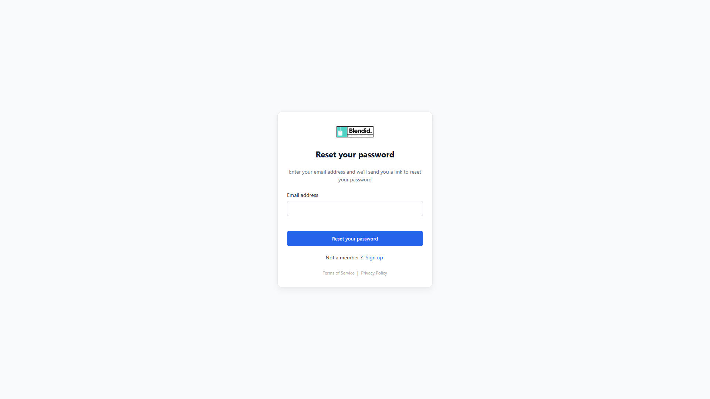<figcaption>
Umbraco Commerce Portal Reset Password Page
</figcaption></figure>

 

 

<figure>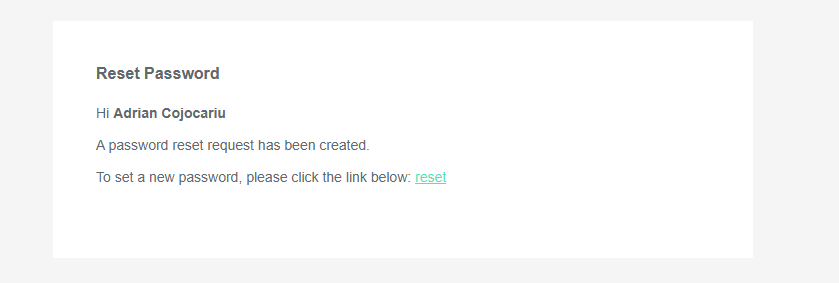<figcaption>
Umbraco Commerce Portal Reset Password Email
</figcaption></figure>

 

## Portal Management

<figure>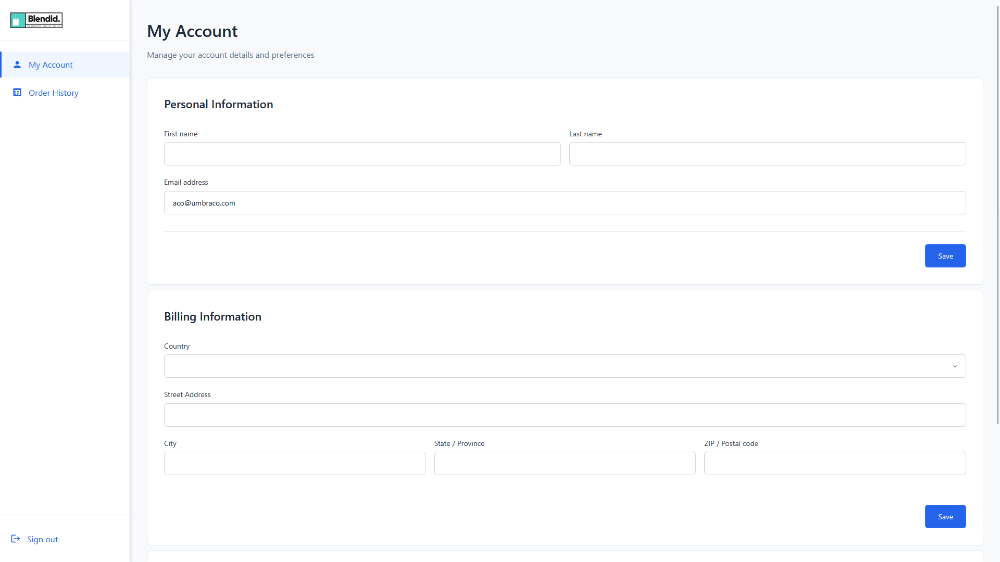<figcaption>
Umbraco Commerce Portal My Account Page
</figcaption></figure>

 

 

<figure>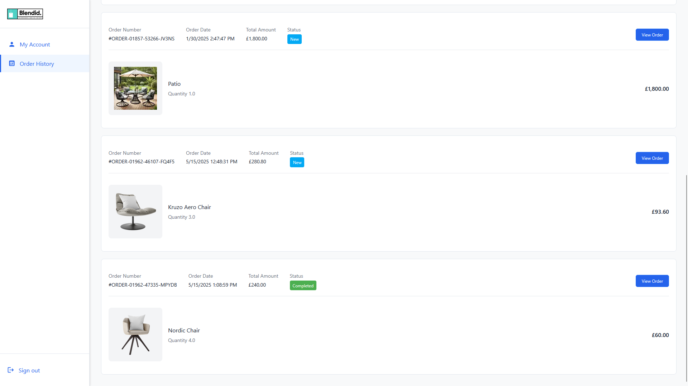<figcaption>
Umbraco Commerce Portal Order History
</figcaption></figure>

 

 

<figure>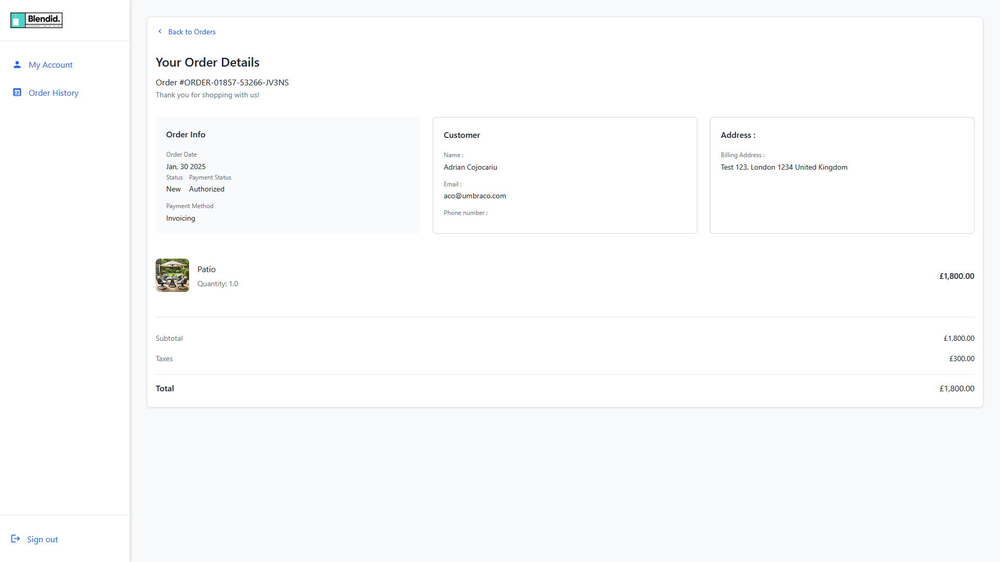<figcaption>
Umbraco Commerce Portal Order Details Page
</figcaption></figure>

 

