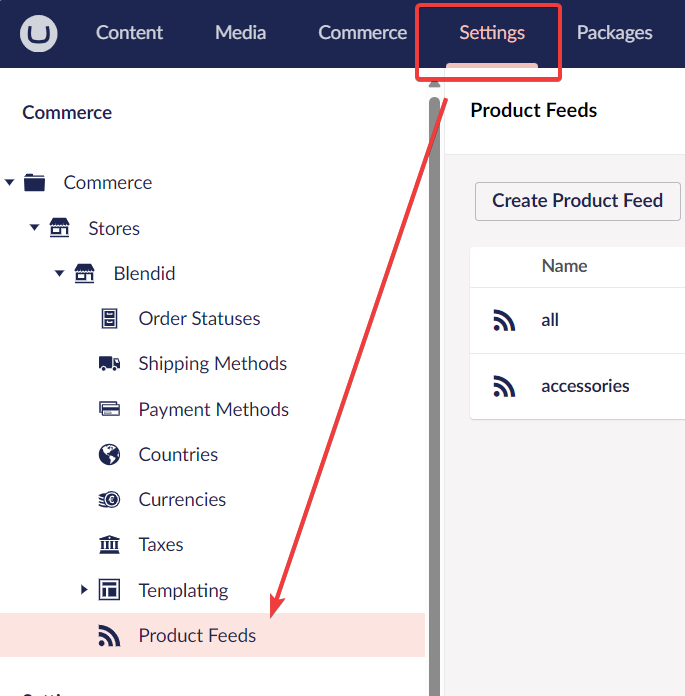
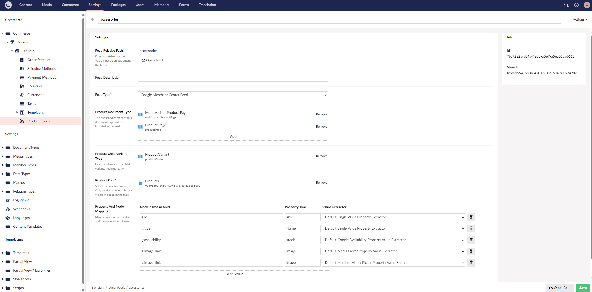
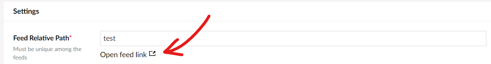
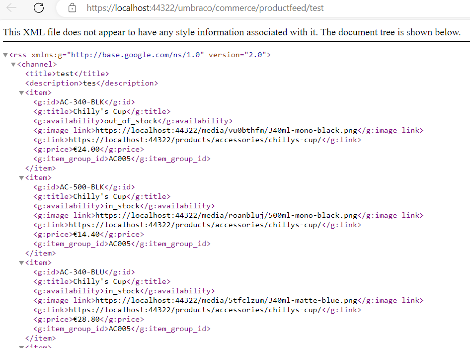

## Introduction
After building an e-commerce website, you might want to share your products with an external service like Google Merchant Center to reach more viewers.

`Umbraco Commerce Product Feeds` package is an XML feed generator plugin that simplifies the creation of structured XML files. It automatically extracts product data from Umbraco node, organizes it according to standards and allows you to add more information to the feed.

The `Umbraco Commerce Product Feeds` package supports the Google Merchant Center feed template.

## Quick start
- Install the package from nuget: [](https://www.nuget.org/packages/Umbraco.Commerce.ProductFeeds/) 

- To add this plugin to your website, locate where you call `IUmbracoBuilder.AddUmbracoCommerce()` and add a call to `IUmbracoCommerceBuilder.AddCommerceProductFeeds()`.

```csharp
        umbracoBuilder.AddUmbracoCommerce(ucBuilder => {
            ucBuilder.AddCommerceProductFeeds(); // add this line
        }
```

- After that, go to your backoffice, open your store's setting page then click on `Product Feed` section.
.

- Inside `Product Feeds` page, click on `Create Product Feed` button and fill in the feed settings. Mandatory fields are marked with a red asterisk (*). You can add more product data by adding new mappings in `Property And Node Mapping` section.

.

- After saving the feed setting, a link to access the feed will show up under `Feed URL Segment` field and at the bottom of the page.


- `Google Merchant Center Feed` sample:

