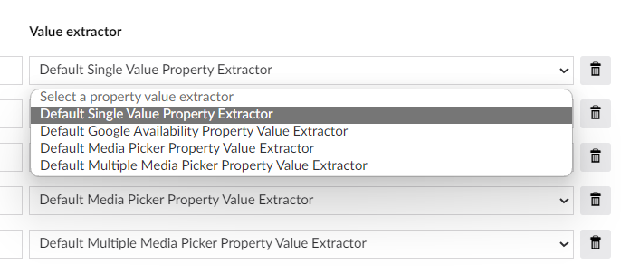

# Extending the plugin

## Add a custom property value extractor
When a default node-name-to-property-alias mapping does not suit your need, you can create a property value extractor to *extract* the property value yourself.

For example, when a product's stock value is `0`, `Google Merchant Feed` desired value is `out_of_stock`. In that case, we have [`DefaultGoogleAvailabilityValueExtractor.cs`](https://github.com/umbraco/Umbraco.Commerce.ProductFeeds/blob/main/src/Umbraco.Commerce.ProductFeeds.Core/Features/PropertyValueExtractors/Implementations/DefaultGoogleAvailabilityValueExtractor.cs) to do the conversion from `0` to `out_of_stock`.

You can often create a new implementation of `ISingleValuePropertyExtractor` or rarely `IMultipleValuePropertyExtractor`.

This plugin uses [Collection Builder pattern](https://docs.umbraco.com/umbraco-cms/implementation/composing#example-modifying-collections) which is commonly used in Umbraco. You can use these two extension methods during application initialization to add your value extractors.

```c#
// IUmbracoBuilder builder;
builder.SingleValuePropertyExtractors()
    .Append<DefaultSingleValuePropertyExtractor>()
    .Append<DefaultGoogleAvailabilityValueExtractor>()
    .Append<DefaultMediaPickerPropertyValueExtractor>();

builder.MultipleValuePropertyExtractors()
    .Append<DefaultMultipleMediaPickerPropertyValueExtractor>();
```

Afterwards, your extractor name should show up in the dropdown under `Property And Node Mapping` section.

