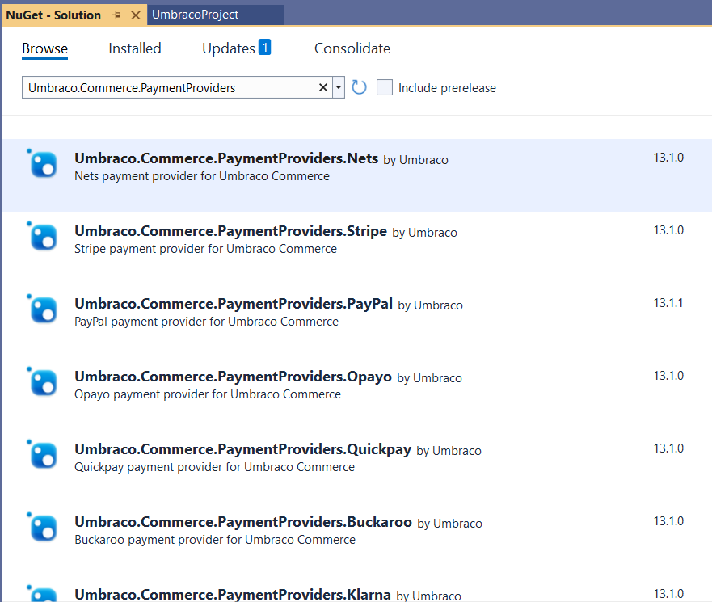

# Install Payment Providers

When you need to install a payment provider into your Umbraco Commerce implementation it is done via NuGet.

You can install a payment provider in one of two ways:

## Install via the NuGet Manager Console

1. Open the **NuGet Manager Console**.
2. Enter the following command:

```bash
Install-Package Umbraco.Commerce.PaymentProviders.PROVIDER
```

3. Use the available [Payment Providers](install-payment-providers.md#available-payment-providers) table below to find the correct package name for the provider you want to install.

## Install via the NuGet Package Manager

1. Open the NuGet Package Manager.
2. Browse for the Payment Provider you want to install.
3. Install the package into your solution.

Alternatively, you can also find and install the NuGet package via the NuGet Package Manager.



## Available Payment Providers

<table><thead><tr><th width="181">Payment Provider</th><th>NuGet Package name</th></tr></thead><tbody>

<tr><td>Buckaroo</td><td><code>Umbraco.Commerce.PaymentProviders.Buckaroo</code></td></tr>

<tr><tr><td>Klarna</td><td><code>Umbraco.Commerce.PaymentProviders.Klarna</code></td></tr><tr><td>Mollie</td><td><code>Umbraco.Commerce.PaymentProviders.Mollie</code></td></tr><tr><td>Nets</td><td><code>Umbraco.Commerce.PaymentProviders.Nets</code></td></tr><tr><td>Paypal</td><td><code>Umbraco.Commerce.PaymentProviders.PayPal</code></td></tr><tr><td>QuickPay</td><td><code>Umbraco.Commerce.PaymentProviders.QuickPay</code></td></tr><tr><td>Stripe</td><td><code>Umbraco.Commerce.PaymentProviders.Stripe</code></td></tr><tr><td>Opayo</td><td><code>Umbraco.Commerce.PaymentProviders.Opayo</code></td></tr><tr><td>Worldpay</td><td><code>Umbraco.Commerce.PaymentProviders.Worldpay</code></td></tr></tbody></table>

## Default Payment Providers

Umbraco Commerce includes the following payment providers by default:

- Invoicing
- Zero

## Upgrading


Before upgrading, always backup your site and database.


Umbraco Commerce uses Umbraco Migrations to install all of its features.  To upgrade, install the latest version over the existing package. This process will add new features and update any missing components.
