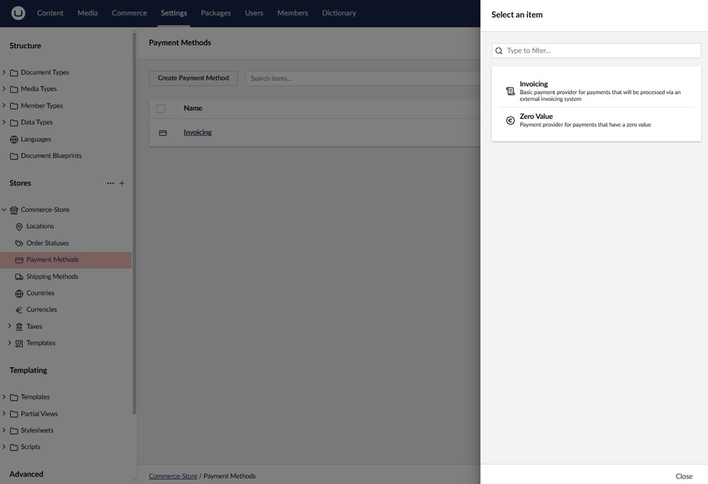

# Configure Umbraco

This article will give you details about how to configure Umbraco to start using the Invoicing payment method with your Umbraco Commerce implementation.

## Step 1: Create a Payment Method

To create Invoicing as a payment method, follow these steps:

1. Navigate to **Settings > Stores > {Store Name} > Payment Methods**.
2. Click **Create Payment Method**.
3. Select **Invoicing** from the list of available payment providers.

  

4. **Enter a Name** for the payment method. For example: *Invoicing*.
5. Enter a value for **SKU**.
6. Click **Save**.

## Step 2: Configure Payment Provider Settings

To configure the Invoicing Provider settings, follow these steps:

1. Navigate to **Settings > Stores > {Store Name} > Payment Methods**.
2. Select *Invoicing*.
3. Choose the appropriate **Tax Class** from the dropdown menu.
4. Enter the **Default Pricing**.
5. Enter the URL of the page in the **Continue URL** field where users should be redirected after completing their payment. For example: `https://www.yourwebsite.com/confirmation`.
6. Enable or disable the ability to cancel pending payments directly from the Backoffice.
7. Enable or disable whether users can manually capture payments for authorized transactions through the Backoffice.
8. Choose the countries where the payment method should be available.
9. Click **Save**.
