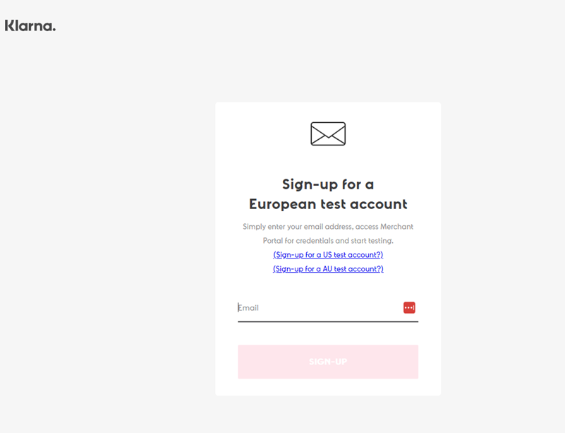
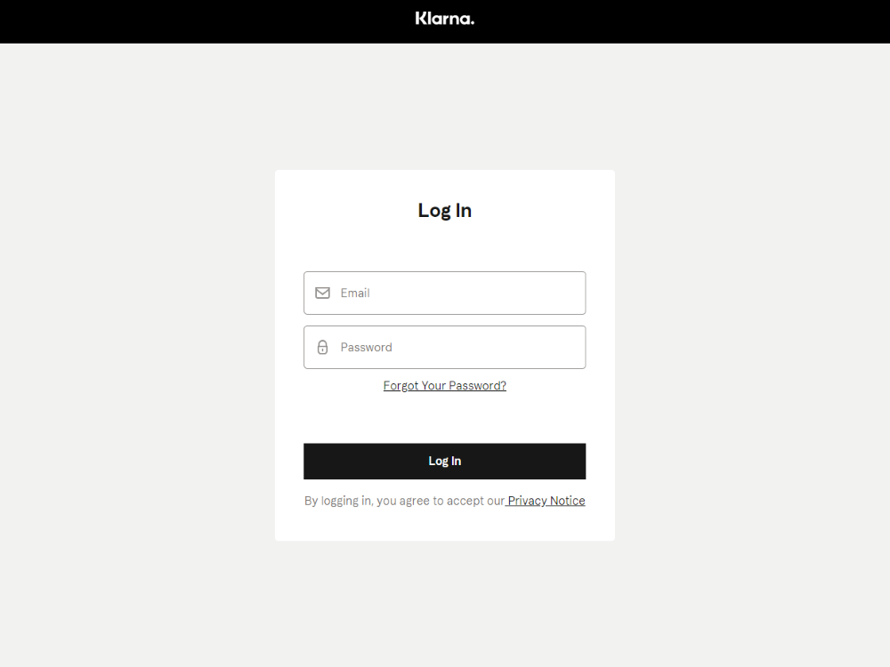

# Configure Klarna

## Step 1: Sign up & Sign in

When working with Klarna, you'll need to sign up for a live and a developer account.

### Sign up for a live account

1. Open the [Klarna site](https://www.klarna.com/).
2. Navigate to the **Klarna for Business** section.
3. Sign up as a **Seller**.

### Sign up for a developer account

1. Click the **Log in** button in the navigation bar of [Klarna Docs](https://docs.klarna.com/resources/developer-tools/testing-payments/before-you-test/).
2. Select the region of your credentials (for example, *Europe*).
3. Select the environment.
4. Click **Sign up**.


Both sign-up processes can take a while. Be sure to sign up well in advance of going live.


### Get your credentials

1. Sign in to the two platforms mentioned below
   * [Live](https://auth.eu.portal.klarna.com/auth/realms/merchants/protocol/openid-connect/auth?client_id=merchant-portal)
   * [Developer](https://login.playground.klarna.com/)
2. Continue following the steps in this article, for each portal.

## API Credentials

Once you are signed in to the Klarna portal(s), follow the steps below to get your API Credentials.

1. Click the **Settings** option at the bottom of the menu on the left-hand side.
2. Select the **Klarna API Credentials** heading.

3. Select **Generate new Klarna API Credentials.**
4. Click **Create Credentials** in the dialog that follows.

You'll be presented with a username and password that you'll need to note down for later use.

## Viewing / Managing Orders

When you start taking orders, you'll be able to view and manage your Klarna orders directly from the portal.

* Navigate to the **Orders** section linked to from the menu on the left-hand side.

