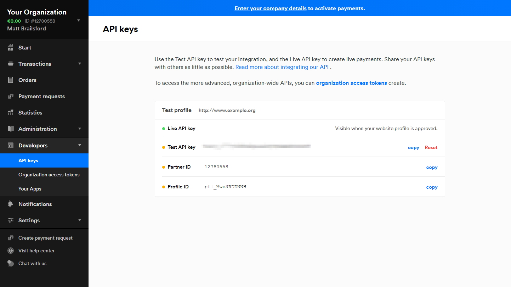

# Configure Mollie

## Step 1: Sign up & Sign in

If you haven't done so yet, head on over to [mollie.com/signup](https://mollie.com/signup) to register for a Mollie account.

If you do not already have an account, you can head over to the [Mollie platform](https://www.mollie.com/dashboard/login) to sign in to your account.

## Step 2: API Keys

In order for Umbraco Commerce to communicate with Mollie securely we need to retrieve a series of API keys used for authentication.

1. Access the [Mollie Portal](https://www.mollie.com/dashboard/login).
2. Click the **Developers** heading.
3. Choose the **API keys** subheading.

On the right-hand side, you will find your **Live API key** and your **Test API key** displayed. Note these down as you will need to enter them into the Umbraco Commerce UI shortly.

## Step 3: Payment Methods

Before you can accept any payments in Mollie, you'll need to set up at least one payment method.

1. Click the **Settings** heading in the sidebar.
2. Choose the **Website profiles** subheading.
3. Find the profile of your site displayed on the right-hand side.

4. Click the **Payment Methods** row to display the various payment methods you can enable.
5. Ensure that at least one of the methods is enabled.


Enabling a payment method may require additional details to be entered.


## Step 4: Test & Live Mode

When viewing your orders in the Mollie dashboard, you can switch between test and live mode. This is done using the **Test mode** toggle switch in the top-right corner.

