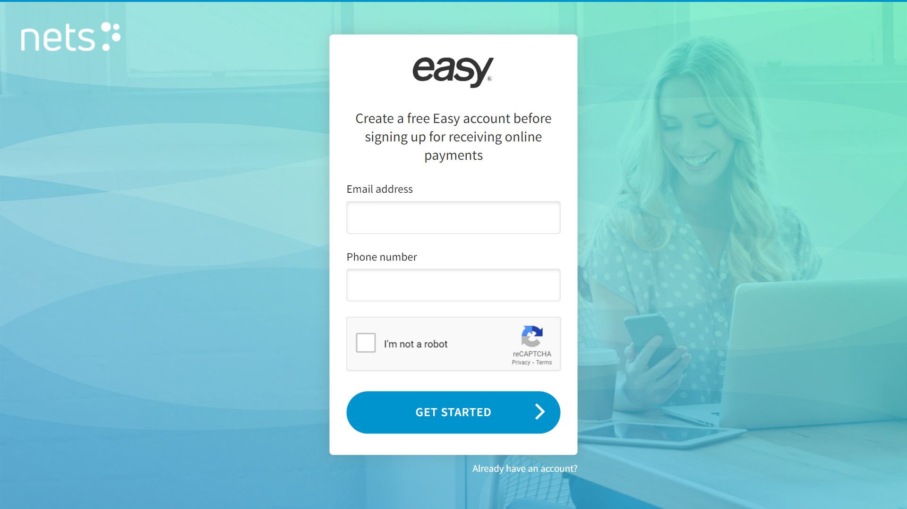

# Configure Nets

## Step 1: Sign up & Sign in

If you haven't done so yet, head on over to the [Nets portal](https://portal.dibspayment.eu/registration) to register for a Nets Easy account.



Or [login to the portal](https://portal.dibspayment.eu/dashboard) if you already have an account.


## Step 2: API Keys

In order for Umbraco Commerce to communicate with Nets securely we need to retrieve a series of API keys used for authentication.

The keys can be found under **Company > Integration** in the Nets Easy portal.


## Step 3: Webhook

In order for Nets Easy to notify Umbraco Commerce of a successful transaction, Nets Easy makes use of webhook technology. This enables sending notifications of changing transaction statuses directly between the two platforms.

Webhooks ensure that Umbraco Commerce will always be notified of status changes, even if the customer decides not to return to the store.

Registration of webhook notifications is handled as part of the payment request using the Umbraco Commerce callback URL.

The following is an example of such a callback URL:

```
https://{store_domain}/umbraco/commerce/payment/callback/nets-easy-checkout/{payment_method_id}/
```

When using this, be sure to replace the parameters in the curly brackets with the corresponding values taken from your store.
