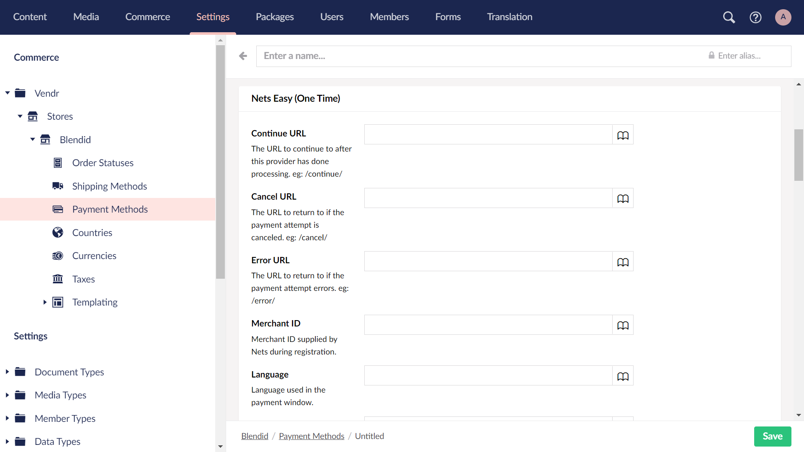

# Configure Umbraco

## Step 1: Create Payment Method

The following steps are all handled through the Umbraco backoffice.

1. Navigate to **Settings > Commerce > Stores > {Store Name} > Payment Methods** section.
2. Select the **Create Payment Method** button to create a new payment method.
3. Choose **Nets Easy (One Time)** from the list of available payment providers.

.png>)

## Step 2: Configure Payment Provider Settings

The following steps are handled within the payment method editor in the Umbraco backoffice.

1. Configure the standard payment method settings as required.
2. Configure the Nets Easy payment provider settings as follows:

| Name                     | Description                                                                                                                     |
| ------------------------ | ------------------------------------------------------------------------------------------------------------------------------- |
| Continue URL             | The URL of the page to navigate to after payment is successful - e.g. `/confirmation/`                                          |
| Cancel URL               | The URL of the page to navigate to if the customer cancels the payment - e.g. `/cart/`                                          |
| Error URL                | The URL of the page to navigate to if there is an error with the payment - e.g. `/error/`                                       |
| Merchant ID              | Merchant ID supplied by Nets during registration or can be found in Nets Easy portal.                                           |
| Language                 | Language used in the payment window, e.g. da-DK or en-GB (default).                                                             |
| Accepted Payment Methods | The allowed payment methods in the payment window.                                                                              |
| Terms URL                | The URL to your terms and conditions.                                                                                           |
| Test Secret Key          | Your test Nets secret key used in test mode.                                                                                    |
| Test Checkout Key        | Your test Nets checkout key used in test mode.                                                                                  |
| Live Secret Key          | Your live Nets secret key used in live mode.                                                                                    |
| Live Checkout Key        | Your live Nets checkout key used in live mode.                                                                                  |
| Test Mode                | Toggle indicating whether this provider should run in test mode.                                                                |
| Auto Capture             | Toggle indicating whether to immediately capture the payment, or whether to authorize the payment for later (manual) capturing. |


Refer to the [Nets Developer documentation](https://developers.nets.eu/nets-easy/en-EU/api/#localization) to learn which languages can be used with Nets Easy.


