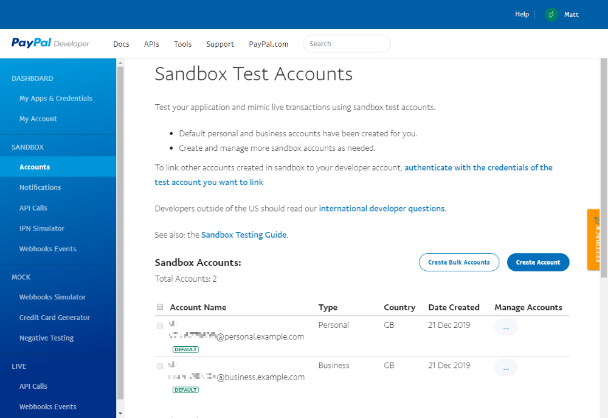
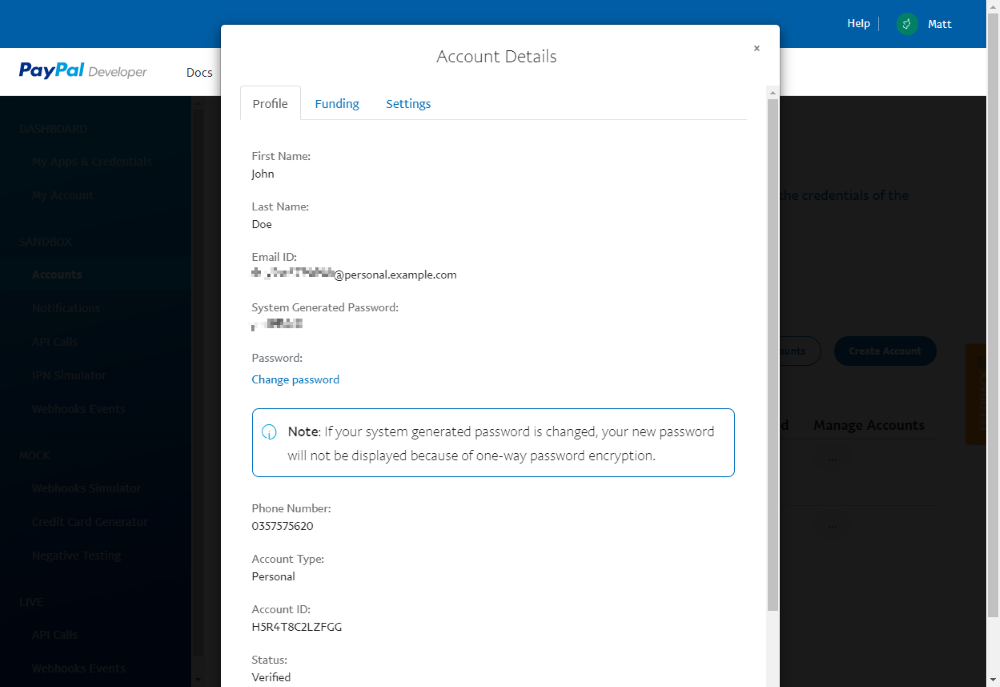
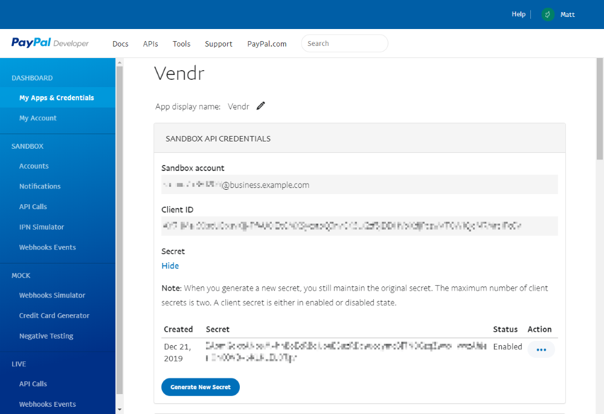
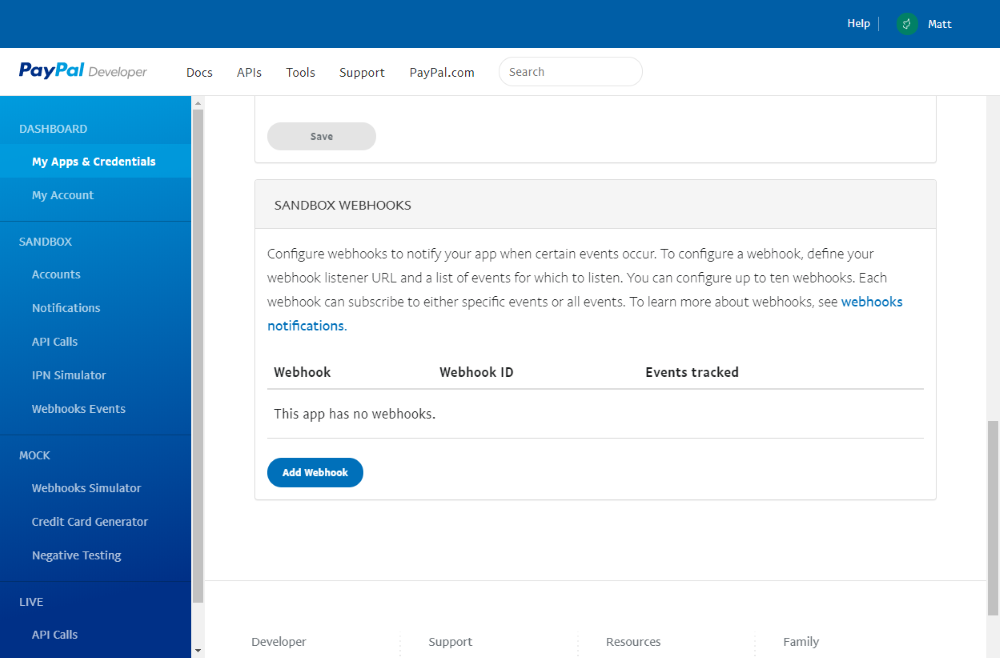

# Configure PayPal

## Step 1: Sign up & Sign In

To use the PayPal provider you will need to sign up for a Business PayPal account. If you haven't created one follow these steps:

1. Head over to the [PayPal site](https://www.paypal.com).
2. Click the **Sign-Up** button in the top corner to create an account.
3. Choose **Business Account** as the account type.


### Sandbox accounts

If you wish to test your system before going live, you need to sign up for a set of Sandbox accounts.

1. Sign in to a valid PayPal account - any account will do.
2. Follow this link: [https://developer.paypal.com/developer/accounts/](https://developer.paypal.com/developer/accounts/).



From here you can view and modify any existing Sandbox accounts you have.

3. Select **Create Account** to create both a business and a personal set of accounts.


4. Locate the **Managed Accounts** column.
5. Select **View/Edit account** for each account.
6. Note down the **Email ID** and **Password**.



## Step 2: Create a PayPal App

In order for Umbraco Commerce to perform actions in your PayPal account on your behalf, we need to create a PayPal App. In fact, we'll need to create two: one for the Sandbox account and one for our Live account.

1. Access the [PayPal Developer Portal](https://developer.paypal.com/developer/applications/).


2. Create the two apps by toggling the **Sandbox\Live** toggle buttons.
3. Clicking the **Create App** button to create an App for each environment.
4. Give your app a name, and choose the **Sandbox Business Account** to associate the App with the Sandbox App.
5. Click the **Create App** button to create the App.


6. Note down the **Client ID**.
7. Click the **Show** link below the **Secret** heading.
8. Note down the **Secret**.



### Webhooks

Webhooks are used for communication between PayPal and the Umbraco Commerce installation. They are managed on the same PayPal portal page as the app secrets.

1. Scroll down to the **Webhooks** section.
2. Click the **Add Webhook** button to create a new Webhook.



3. Provide the URL where the webhook notifications should be sent. See the example below:

```bash
https://{store_domain}/umbraco/commerce/payment/callback/paypal-checkout-onetime/{payment_method_id}/
```


The webhook needs to be a Umbraco Commerce-specific URL. Remember to replace the parameters in curly brackets with the corresponding values taken from your store.


4. Select the **Event Types** to be notified of.
5. **Save** the webhook settings.


These are the recommended Event Types to configure notifications for:

* Checkout order approved
* Checkout order completed
* Payment authorization voided
* Payment capture completed
* Payment capture denied
* Payment capture pending
* Payment capture refunded
* Payment capture reversed



6. Note down the **Webhook ID** for the webhook.


Keep in mind that you will need to create an App and webhook configuration for both Sandbox and Live environments. For the Live environment, this must be set up under the account that will be accepting the payments.
