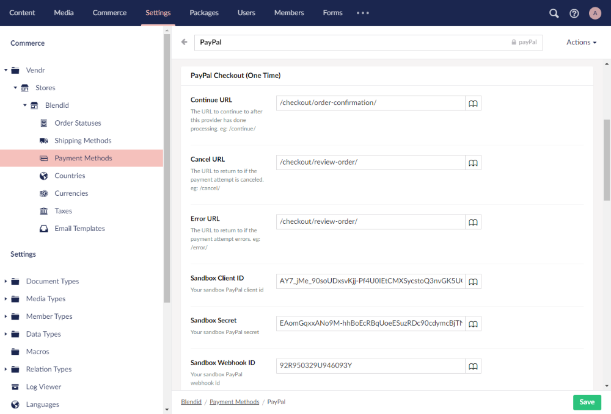

# Configure Umbraco

## Step 1: Create Payment Method

The following steps are all handled through the Umbraco backoffice.

1. Navigate to **Settings > Commerce > Stores > {Store Name} > Payment Methods** section.
2. Select the **Create Payment Method** button to create a new payment method.
3. Choose **PayPal Checkout (One Time)** from the list of available payment providers.

.png>)

## Step 2: Configure Payment Provider Settings

The following steps are handled within the payment method editor in the Umbraco backoffice.

1. Configure the standard payment method settings as required.
2. Configure the PayPal payment provider settings as follows:

| Name               | Description                                                                                                                    |
| ------------------ | ------------------------------------------------------------------------------------------------------------------------------ |
| Continue URL       | The URL of the page to navigate to after payment is successful - e.g. `/confirmation/`                                         |
| Cancel URL         | The URL of the page to navigate to if the customer cancels the payment - e.g. `/cart/`                                         |
| Error URL          | The URL of the page to navigate to if there is an error with the payment - e.g. `/error/`                                      |
| Sandbox Client ID  | The Sandbox PayPal App Client ID                                                                                               |
| Sandbox Secret     | The Sandbox PayPal App Secret                                                                                                  |
| Sandbox Webhook ID | The Sandbox PayPal App Webhook ID                                                                                              |
| Live Client ID     | The Live PayPal App Client ID                                                                                                  |
| Live Secret        | The Live PayPal App Secret                                                                                                     |
| Live Webhook ID    | The Live PayPal App Webhook ID                                                                                                 |
| Capture            | Toggle indicating whether to immediately capture the payment, or whether to authorize the payment for later (manual) capturing |
| Sandbox Mode       | Toggle indicating whether this provider should run in Sandbox mode or Live                                                     |

In addition to these core settings, there are a number of optional advanced settings you can configure:

| Name       | Description                                            |
| ---------- | ------------------------------------------------------ |
| Brand Name | A Brand Name to display in the PayPal Checkout screen. |

