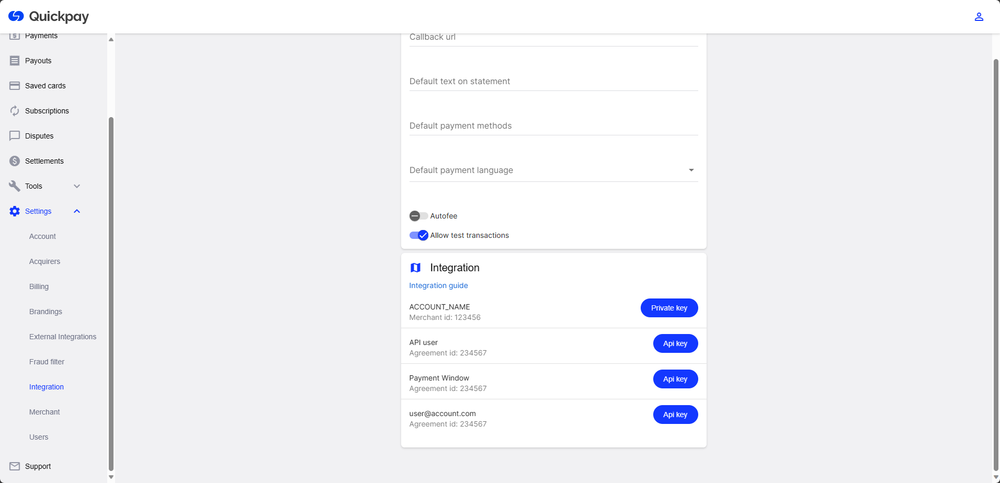

# Configure QuickPay

## Step 1: Sign up & Sign in

If you haven't done so yet, head over to the [QuickPay portal](https://manage.quickpay.net/create-user) to register for a QuickPay account.


Or [login to the QuickPay portal](https://manage.quickpay.net/) if you already have an account.


## Step 2: API Keys

In order for Umbraco Commerce to communicate with QuickPay securely we need to retrieve a series of API keys used for authentication.

The keys can be found under **Settings > Integration** in the QuickPay portal.

You will need the following keys:

* Private key of your account
  * You'll find that in the first option, where your account name is
* Api key of the API user
  * The second option, right below the Private key
* Merchant id
  * This is written below your account name
* Agreement id
  * This is written below API user, Payment Window and your user account name



## Step 3: Webhook

In order for QuickPay to notify Umbraco Commerce of a successful transaction, QuickPay makes use of webhook technology. This enables sending notifications of changing transaction statuses directly between the two platforms.

Webhooks ensure that Umbraco Commerce will always be notified of status changes, even if the customer decides not to return to the store.

Registration of webhook notifications is handled as part of the payment request using the Umbraco Commerce callback URL.

The following is an example of such a callback URL:

```
https://{store_domain}/umbraco/commerce/payment/callback/quickpay-checkout/{payment_method_id}/
```

When using this, be sure to replace the parameters in the curly brackets with the corresponding values taken from your store.
