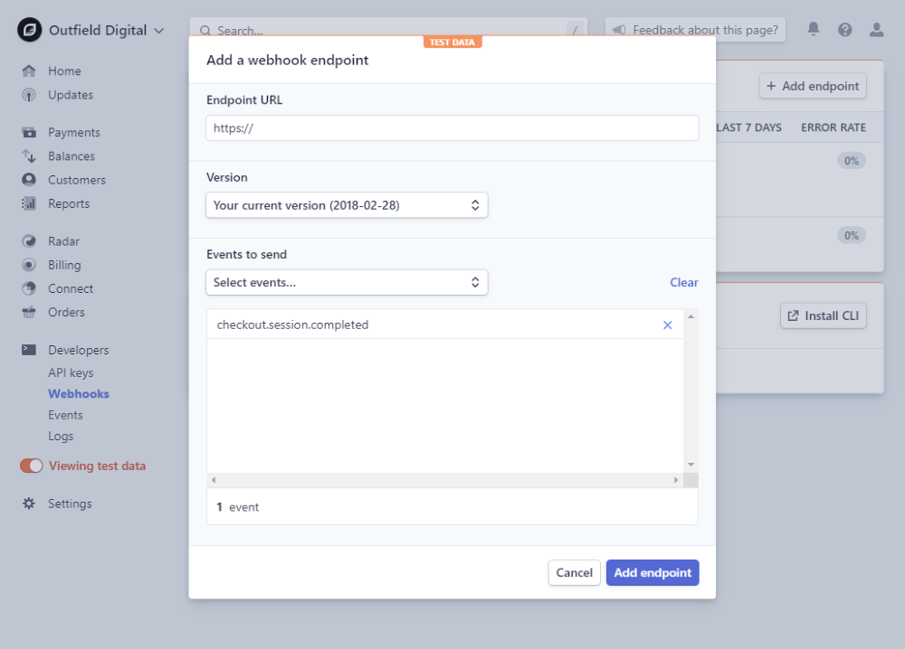
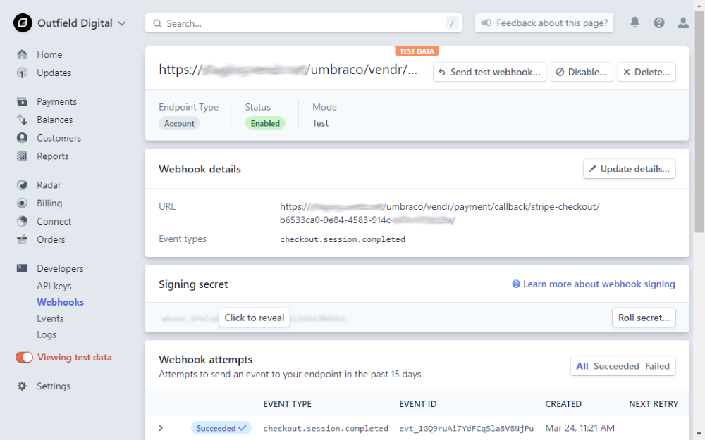

# Configure Stripe

## Step 1: Sign up & Sign in

If you haven't done so yet, head on over to the [Stripe ](https://dashboard.stripe.com/register)[Dashboard](http://dashboard.stripe.com/register) to register for a Stripe account.


Or [login to the Stripe Dashboard](https://dashboard.stripe.com/login) if you already have an account.


### Test & Live mode

When logged in to the Stripe Dashboard it is important to know that there are two modes you can view data and perform tasks under. These are **Test mode** and **Live mode**.

**Test mode** allows you to perform test transactions to ensure your solution is set up correctly.

**Live mode** is where real-life transactions will take place.

Use the **View test data** toggle switch located in the dashboard sidebar to switch between the two modes.

When in test mode the toggle switch will change color, and a **test data** header bar appear above the data panel.


For each of these modes, multiple settings need to be configured.

## Step 2: API Keys

In order for Umbraco Commerce to communicate with Stripe securely we need to generate a series of API keys that Umbraco Commerce can use to authenticate with.

1. Select the **Developers** heading in the sidebar.
2. Select the **API Keys** sub-heading.
3. See your **Publishable key** displayed on the right-hand side.
4. Click the **Reveal test/live key token** button to view your **Secret key**.



Complete the steps listed above for both the Test and the Live mode to generate keys for both.


5. Note down the API keys.

## Step 3: Webhook

For Stripe to notify Umbraco Commerce of a transaction, Stripe makes use of webhook technology to send notifications of the changing transaction statuses. By using webhooks it ensures that the system will always be notified of these status changes. This is also the case if a customer decides not to return to the store once a transaction is complete.

To register a webhook follow these steps:

1. Select the **Developers** heading in the sidebar.
2. Select the **Webhooks** sub-heading.
3. Click the **Add Endpoint** button on the right-hand side.
4. Enter the Umbraco Commerce callback URL. See an example below:

```bash
  https://{store_domain}/umbraco/commerce/payment/callback/stripe-checkout/{payment_method_id}/
```


Be sure to replace the parameters in curly brackets with the corresponding values taken from your store.




5. Leave the **Version** set to **Your current version**.
6. Select the following event types in the **Events to send** dropdown:
   * `checkout.session.completed`
   * `review.closed`
7. Click **Add endpoint** to create the webhook endpoint registration.

Once this is done, you will be sent to the webhook details screen.



8. Locate the **Signing secret** section
9. Click the **Click to reveal** button to display the webhook signing secret.
10. Note down the secret as we will need this later to validate webhook requests.



Be sure to perform this task twice, once for test mode, and once for live mode.

