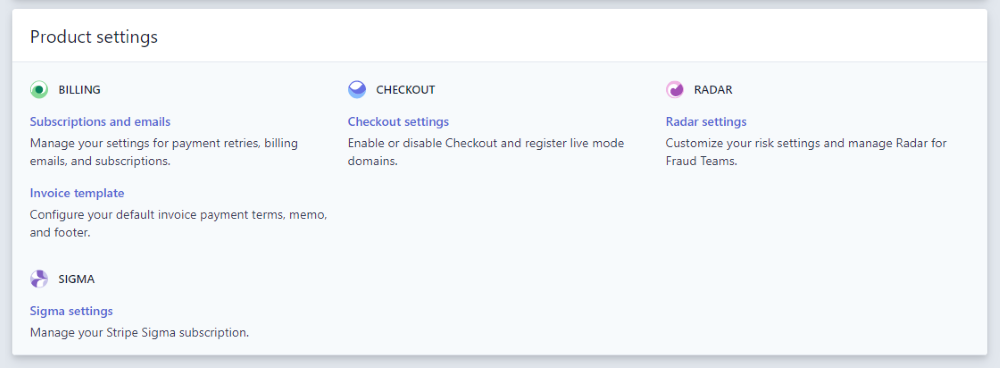
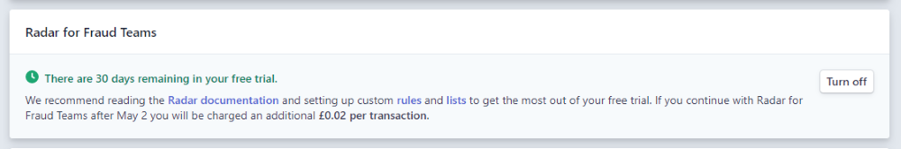

# How to block payments from non billing country sources

Out of the box, Stripe implements a lot of security features for you, making payments safe and secure by default. You may still have a need to provide additional security steps of your own.

If you are based in the EU selling digital goods it would be a requirement to capture two forms of proof of a customer's location for VAT purposes. One recommended way is to capture the customer's billing country, and bank country, and ensure these are the same. The Stripe payment provider allows you to set this up in a few steps.

## Step 1: Capture the customer's billing country

The first step is to ensure you are capturing the customer's billing address or more specifically, the billing address country. Learn how to do this in the core Umbraco Commerce documentation.

## Step 2: Pass the billing country to Stripe

As long as you have populated your orders billing country, it will automatically be sent to Stripe using custom metadata on the transactions customer entity. This will be passed via a metadata entry on the Stripe customer with the key `billingCountry`, with the value of the two-letter ISO code of the given country.

## Step 3: Sign up for Radar for Fraud Teams

In order to configure custom Radar rules you need to sign up for the [Radar for Fraud Teams](https://stripe.com/radar/fraud-teams) added feature. This does incur an additional fee per transaction, however, the added security will outweigh the minimal expense.

To enable **Radar for Fraud Teams** follow these steps:

1. Log in to your Stripe dashboard.
2. Navigate to the **Settings > Product Settings > Radar Settings** section.



3. Enable the **Radar for Fraud Teams** feature, allowing us to define custom Radar rules.



## Step 4: Setup a Stripe Radar rule

To set up a new Stripe Radar rule, follow these steps:

1. Navigate to the **Radar > Rules** section.
2. Locate the **Then, when should a payment be blocked?** panel.
3. Click the **Add rule** button to add a new rule.
4. Enter the following rule in the dialog:

```
Block if ::customer:billingCountry:: != :card_country:
```


5. Click the **Test rule** button to test the rule.
6. Click the **Add and enable** button to add the rule to the list of block rules.



The rule test may fail when you click the **Test rule** button due to there being no transaction with the given metadata being attached to them. You will, however, be able to continue regardless.

