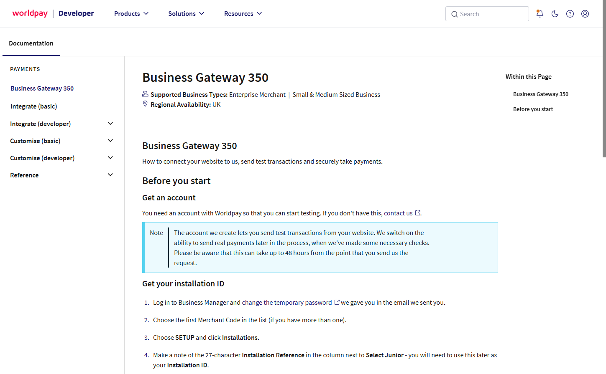

# Configure Worldpay

To setup Worldpay you'll need to head over to [https://docs.worldpay.com/apis/bg350](https://docs.worldpay.com/apis/bg350) and follow the registration instructions



Follow the documentation in order to optain your **Installation ID**.

## Enabling Payment Responses

Follow the Worldpay docs at [https://docs.worldpay.com/apis/bg350/enablepaymentresponses](https://docs.worldpay.com/apis/bg350/enablepaymentresponses) in order to enable Payment Responses. Configure the response URL as follows:

```bash
  https://{store_domain}/umbraco/commerce/payment/callback/worldpay-bs350/{payment_method_id}/
```

When setting up Payment Responses you will be asked to configure a **Response Password**. Remember this for later.

## Enabling Enhanced Security

Follow the Worldpay docs at [https://docs.worldpay.com/apis/bg350/enhancing-security-with-md5](https://docs.worldpay.com/apis/bg350/enhancing-security-with-md5) in order to configure advanced security. 

When setting up Enhanced Security you will be asked to configure a **MD5 secret**. Remember this for later.