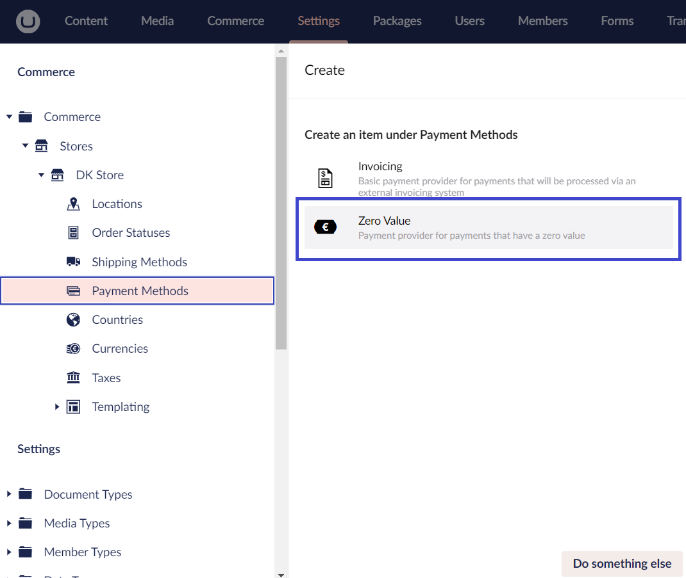

# Configure Umbraco

This article provides detailed instructions on configuring Umbraco to use the Zero payment method with your Umbraco Commerce implementation.

## Step 1: Create a Payment Method

To create Zero as a payment method, follow these steps:

1. Go to the **Settings** section.
2. Open the **Commerce** folder.
3. Navigate to **Stores > {Store Name} > Payment Methods**.
4. Click the **Create Payment Method** button.
5. Select **Zero Value** from the list of available payment providers.

  
  
6. **Enter a Name** for the payment method. For example: *Zero Payment*.
7. Enter a value for **SKU**.
8. Click **Save**.

## Step 2: Configure Payment Provider Settings

To configure the Zero Payment Provider settings, follow these steps

1. Go to the **Settings** section.
2. Open the **Commerce** folder.
3. Navigate to **Stores > {Store Name} > Payment Methods**.
4. Click the **Create Payment Method** button.
5. Select **Zero Value** from the list of available payment providers.

  

6. **Enter a Name** for the payment method. For example: *Zero Payment*.
7. Provide a value for **SKU**.
8. Choose the appropriate **Tax Class** from the dropdown menu.
9. Enter the **Default Pricing**.
10. Select an image for the payment provider.
11. Enter the URL of the page in the **Continue URL** field where users should be redirected after completing their payment. For example: `https://www.yourwebsite.com/confirmation`.
12. Choose the countries where the payment method should be available.
13. Click **Save**.
