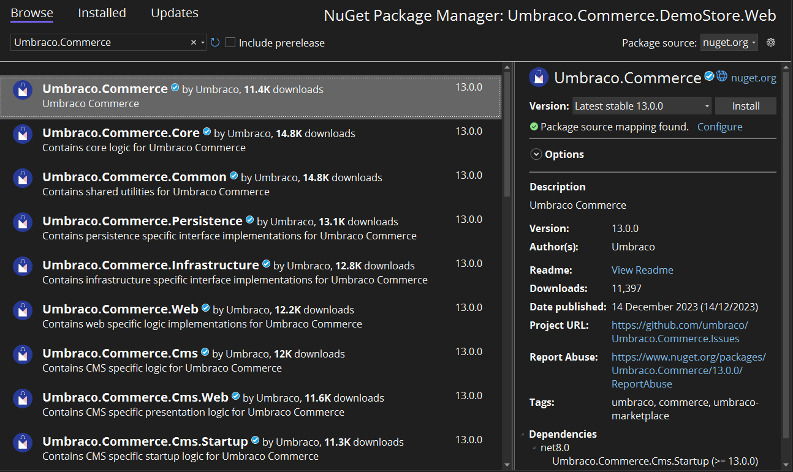

# Install shipping providers

When you need to install a shipping provider into your Umbraco Commerce implementation it is done via NuGet.

The installation can be handled in one of two ways as explained below.

## Install via the NuGet Manager Console

1. Open the NuGet Manage Console.
2. Type in the following command:

```bash
PM> Install-Package Umbraco.Commerce.ShippingProviders.PROVIDER
```

Use the [table of available Shipping Providers](install-shipping-providers.md#available-shipping-providers) to ensure you get the correct package name for the provider you want to install.

## Install via the NuGet Package Manager

1. Open the NuGet Package Manager.
2. Search for the Shipping Provider you want to install.
3. Ensure the "Browse" tab is selected.
4. Install the package into your solution.

Alternatively, you can also find and install the NuGet package via the NuGet Package Manager.



## Available Shipping Providers

<table><thead><tr><th width="181">Shipping Provider</th><th>NuGet Package name</th></tr></thead><tbody>
<tr><td>DHL</td><td><code>Umbraco.Commerce.ShippingProviders.Dhl</code></td></tr>
<tr><td>EasyPost</td><td><code>Umbraco.Commerce.ShippingProviders.EasyPost</code></td></tr>
<tr><td>Shipmondo</td><td><code>Umbraco.Commerce.ShippingProviders.Shipmondo</code></td></tr>
</tbody></table>

## Upgrading


Before upgrading, it is always advisable to take a complete backup of your site and database.


Umbraco Commerce uses Umbraco Migrations to install all of its features. Upgrades follow the same process as the installation processes detailed above, by installing the latest version over the top of the existing package installation. By using this process the installation will only install new features and features that are missing.
