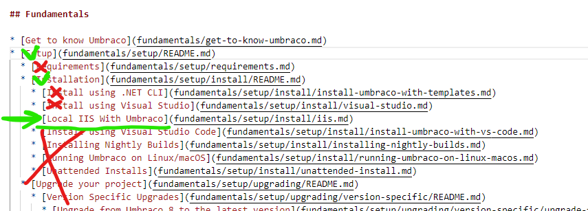

# Create a new version of an article

There are 2 scenarios for when you are looking to add a new article to the Umbraco Documentation.

1. You are [adding new material](how-to-add-a-new-version.md#add-new-material-to-the-documentation) to the documentation site.
   1. This includes not-before-documented topics and new tutorials.
2. You are updating [an article for an **Upcoming major version**](how-to-add-a-new-version.md#update-an-article-for-an-upcoming-major-version).

## Add new material to the documentation

When you are adding a brand new article to the Umbraco Documentation, there are a few questions that we recommend asking yourself before getting started:

What type of article are you going to be writing?

It could be a tutorial, a guide on how to solve something specific, or it could be an article detailing a specific concept or workflow.

The type of article you are writing will determine the content and sometimes also the structure of the material.

Who is the audience of the article?

C# developers, newcomers to Umbraco, and content editors each have different approaches and prerequisites to using Umbraco and reading the documentation.

Knowing your audience will enable you to write in a manner that fits that particular group. It will also give you some pointers on what [types of content](#user-content-fn-1)[^1] should be your focus.

Where does the article fit into the existing structure?

Depending on which product you are adding new material for, the structure of the existing documentation will differ. We recommend browsing the existing material to figure out which section will be the best fit for your new article.

If you have doubts about where to place your article, the documentation team at Umbraco HQ can help you out. In this case, add a note in the description when submitting the PR, letting us know that you need help placing the article.

The steps to create, write, and add a brand new article to the Umbraco Documentation are outlined below:

1. Access the [UmbracoDocs GitHub](https://github.com/umbraco/UmbracoDocs) repository.
2. Fork the repository.
3. Clone your fork to your local machine.
4. Create a new branch using the following naming convention: `productname/topic`
   * Branch name example: `cms/new-content-app-tutorial`
5. Locate the section/folder in the existing structure, where your article fits.
6. Create a new `.md` file and name it identical to the title you will give the article.
   * The file name needs to be all small caps and use hyphens instead of spaces.
   * File name example: `statistics-content-app-tutorial.md`.
7. Write the article.
8. Ensure the article lives up to our [Style Guide](../style-guide/) and follows the outlined [Markdown Conventions](../style-guide/markdown-conventions.md).
9. Add a link to the new article in the [`SUMMARY.md`](#user-content-fn-2)[^2] file.

Once you have completed the article, submit the branch to your UmbracoDocs fork and [submit a PR to the official UmbracoDocs repository](pull-request.md).

## Update an article for an upcoming major version

The documentation is versioned using directories in the root of the repository. The **major** Umbraco CMS version number is used to name the directories, and you will find documentation for each versioned Umbraco product within them.


The documentation follows the Long Term Support (LTS) strategy for Umbraco CMS. This means that whenever a major version is End of Life (EOL), documentation for that version will be moved to GitHub.

Read the [Versioning Strategy](https://docs.umbraco.com/welcome/documentation-and-versions) article to learn more about how to handle documentation for the different versions.


The following sections of the Umbraco Documentation are following the versioning strategy:

* Umbraco CMS
* Umbraco Forms
* Umbraco Deploy
* Umbraco Workflow
* Umbraco Commerce
* Umbraco UI Builder

The documentation site for an upcoming major version of any of our products will be publicly available with the Release Candidate (RC). At Umbraco HQ we will typically start working with the site 3-4 weeks before, setting up the structure on GitHub.

Once the RC is released, you can find the associated documentation using the version drop-down on the Documentation site.


Only updated and new material for the upcoming release will be available on the published RC documentation on GitBook. This will occur during the RC phase.

All articles will still be available through the UmbracoDocs GitHub repository.

When the final version is released, all the documentation will again be available for that version in the published documentation.


### Update an article for the upcoming release

1. Access the [UmbracoDocs GitHub](https://github.com/umbraco/UmbracoDocs) repository.
2. Fork the repository.
3. Clone your fork to your local machine.
4. Create a new branch using the following naming convention: `productnameXX/topic`
   * Branch name example: `cms15/configuration`
5. Locate the article you need to make changes to.
6. Make the necessary changes to the article.

After making the changes to the article(s), it needs to be added to the `SUMMARY.md` file to be published on the documentation site.

Follow the steps below to add the article to the [first available `SUMMARY.md` file](#user-content-fn-3)[^3] by looking upwards in the file structure.

1. Locate the article in the [`SUMMARY.md` file for version 14](how-to-add-a-new-version.md#links-to-summary-files-for-version-14).
2. Copy the line along with any ancestors.
   1. Siblings to the current and any ancestors should be left out unless they have also been updated.
   2. See the image below for an example of what to include.

<figure><figcaption></figcaption></figure>

3. Merge what you have copied with the existing structure in the `SUMMARY.md` file for version 15.
   1. You might experience that the article is already there. In this case you do not need to do anything further.

With the article(s) added to the `SUMMARY.md` file, the final steps involve creating a Pull Request.

1. Add and commit the changes.
2. Submit the branch to your UmbracoDocs fork.
3. [Submit a PR to the official UmbracoDocs repository](https://docs.umbraco.com/welcome/contribute/pull-request#step-2-creating-a-pull-request).

Links to SUMMARY files for version 14

[Umbraco CMS](../../../14/umbraco-cms/SUMMARY.md)

[Umbraco Forms](../../../14/umbraco-forms/SUMMARY.md)

[Umbraco Deploy](../../../14/umbraco-deploy/SUMMARY.md)

[Umbraco Workflow](../../../14/umbraco-workflow/SUMMARY.md)

[Umbraco Commerce](../../../14/umbraco-commerce/SUMMARY.md)

[^1]: Code samples with comments are great for C# developers, while screenshots and step-by-step lists are good for new Umbraco developers.

[^2]: Only articles that are added to the `SUMMARY.md` file will be visible on the published documentation site.

[^3]: This `SUMMARY.md` file defines the navigation structure for the documentation site for which you are currently adding an article. If the file is not added here, it will not appear in the published documentation.
