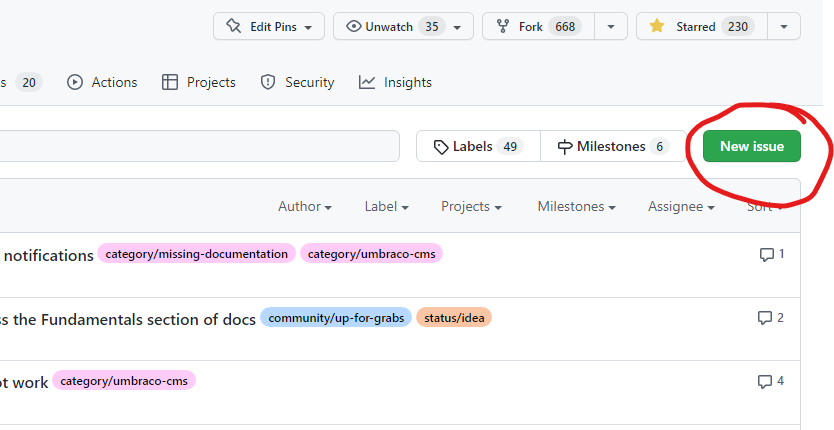

# Submit Feedback

There are different ways to submit feedback on the Umbraco Documentation, whether it's about a single article or the platform as a whole. Your input helps us improve and prioritize what matters most to the community.

This article gives you an overview of the different feedback channels and how to use them.

## Submit Feedback on an Article

On the right-hand side of every article, you'll find an option to submit feedback directly related to that article.

<figure><figcaption>
Rate the documentation by sharing whether an article was helpful.
</figcaption></figure>


Sharing your feedback helps the team at Umbraco HQ provide better material across the products.

The feedback is used when determining which articles need to be reviewed by the documentation team at Umbraco HQ.


## Submit a GitHub Issue

The [Issue Tracker](https://github.com/umbraco/UmbracoDocs/issues) is a way to keep track of ideas, issues with wrong or outdated documentation, and discussions with contributors.

Here are a few examples of when to create an issue:

* You are looking for a specific piece of information, but can't find it.
* You've found a broken link in one of the articles, but don't know how to fix it.
* An article contains outdated or incorrect information, and you don't have time or knowledge to submit a PR.
* You would like to propose a new section or discuss improvements to existing documentation.

### Creating an Issue

1. Go to the [Issue Tracker on GitHub](https://github.com/umbraco/UmbracoDocs/issues).
2. Select **New Issue**.

3. Fill out the form, answering the questions to explain your suggestion or problem clearly.
4. Submit the issue.
