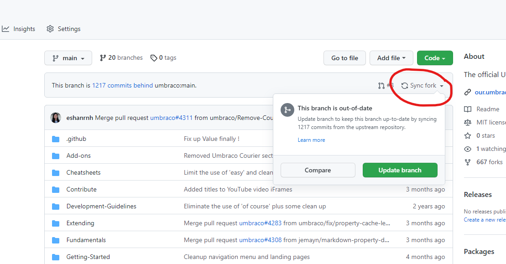

# Submit a Pull Request

You can contribute to the Umbraco Documentation by submitting a Pull Request (PR). A PR is a way to suggest changes to an open-source project, such as fixing errors, improving readability, or adding new content.

There are two ways to create a PR:

1. Edit a file directly on GitHub.
2. Create a fork of the GitHub repository.


You need a GitHub account to create a Pull Request.


## Option 1: Creating a PR directly on GitHub

You can submit a PR directly from our [repository](https://github.com/umbraco/UmbracoDocs/). You can also use the button on the right side of every article title. This allows you to jump straight into the file on GitHub and suggest your changes.

Following the approach is recommended for changes such as:

* Fixing typos or grammar mistakes.
* Changes that are confined to a single article.
* Updating code snippets.

<figure><figcaption><p>Highlighting the Edit on GitHub button.</p></figcaption></figure>

1. Navigate to the article you want to edit.
2. Select "Edit on GitHub" from the right side of the article.
3. Select the :pen\_ballpoint: icon to start editing the article.
4. Make the changes.
5. Add a commit message describing what you changed.
6. Select **Propose changes**.
7. Fill in the required information in the PR description.
8. Select **Create pull request** to submit the PR.


Are you working on a larger update that includes pictures and editing multiple files? Create a fork and follow the approach outlined in [Option 2: Creating a PR through a fork](pull-request.md#option-2-creating-a-pr-through-a-fork).


## Option 2: Creating a PR through a Fork

The second option to submit a PR is by using a fork of the Umbraco Documentation repository. This method requires more initial setup but lets you reuse your fork for future contributions.

&#x20;Following the approach is recommended for changes such as:

* Writing new articles or guides.
* Adding updates that affect multiple articles.
* Applying an update that needs to be added to multiple versions.

There are a lot of great tutorials available online on [how to fork a repository (GitHub)](https://help.github.com/articles/fork-a-repo/).


If you do not have Git installed on your machine, follow [these instructions](https://help.github.com/articles/set-up-git/) before moving on.


### Step 1: Creating a Fork

1. Ensure Git is installed on your machine.
2. Go to the [Umbraco Documentation repository](https://github.com/umbraco/UmbracoDocs/).
3. Select **Fork** in the top-right corner to create a personal copy of the repository.


Once the fork is created:

1. Clone your fork to your local machine.
2. Make your changes in a local branch.
3. If you add a new article, update the `SUMMARY.md` file to include it in the documentation navigation.
4. Sync your changes back to your fork.



If you’ve had your fork for a while, sync it with the original repository before starting new changes. This process is called rebasing.


To sync via command line:

* Set the original repository (UmbracoDocs) as an upstream to sync from.
* Fetch the updates.
* Update your own fork.

```console
git remote add upstream https://github.com/umbraco/UmbracoDocs/
git fetch upstream
git rebase upstream/main
```

To sync via GitHub:

* Use the **Sync fork** option when your fork is behind the original repository.

<figure><figcaption></figcaption></figure>

### Step 2: Creating a PR

Once you have made changes and are happy with the result, you can create a PR.

1. Navigate to the **Code** section of your fork.
2. Select **Contribute** > **Open pull request**.


3. Add a title and description explaining your changes.
4. Select **Create pull request** to submit a PR to the original repository.

### Step 3: The Review Process

Your PR will be reviewed by the documentation team at Umbraco HQ.&#x20;

Review times can vary based on the size and complexity of the contribution—from a few minutes to several weeks.
