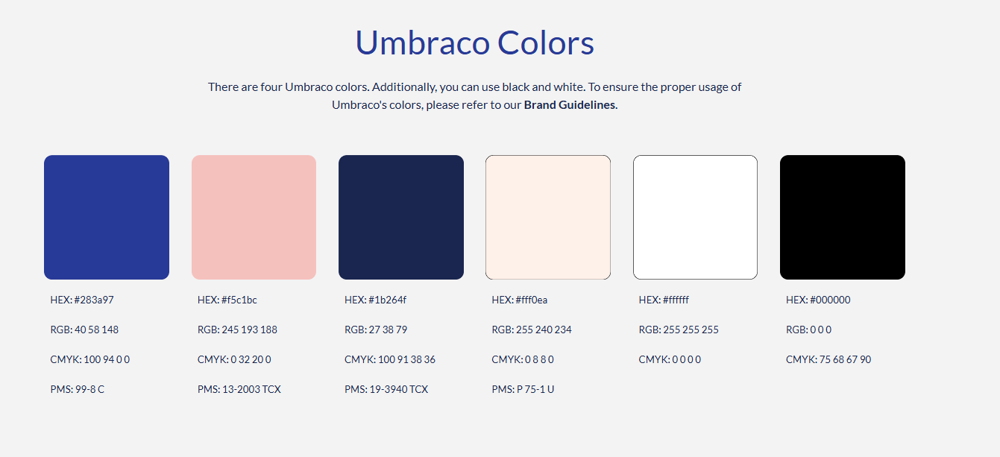

# Markdown Conventions

The Umbraco Documentation is written in Markdown.

In this article, you can learn how Markdown is used for adding different elements to the articles.

## Headings

To create a heading, add between one to four `#` symbols before your heading text. The number of `#` you use will determine the hierarchy level and size of the heading.

```markdown
# Article Title
## Heading 1
### Heading 2
#### Heading 3
```

<figure><figcaption><p>How the different levels of headings are diplayed on the Documentation site.</p></figcaption></figure>


The Article Title (`#`) must be used only once. All other headings should follow the correct hierarchical order.


When two or more headings are used in an article, they will be used to generate a table of contents on the right side of the article. Heading 3 will not be shown in the table of contents.

<figure><figcaption><p>A simplified example of a table of contents added based on headings in an article.</p></figcaption></figure>

## Styling text

| Style  | Syntax             | Example             | Output            |
| ------ | ------------------ | ------------------- | ----------------- |
| Bold   | `** **` or `__ __` | `This is **bold**.` | This is **bold**. |
| Italic | `* *` or `_ _`     | `This is *italic*.` | This is _italic_. |

## Links

In the following, you will find a few examples of different links.

### External links

Include either the complete URL using the following syntax:

```markdown
[yahoo something](https://yahoo.com/something)
```

All external links open in a new browser tab.

### Internal links

When linking between pages in the documentation, use **relative paths**.

Link to an article in the same directory as the current article:

```markdown
[Article Title](article.md)
```

Link to an article in a different directory than the current article:

```markdown
[Article Title](../../reference/article.md)
```

### Page Links

It is possible to add a page link that spans the entire width of the page. This is generally used for linking to a new subject related to the article at hand.

The following is a page link that links to the "Submit Feedback" article:

```markdown


[Article Title](issues.md)


```


[issues.md](../getting-started/issues.md)


### Link Text

Use the title of the article that is linked to as the _link text_. This is done to tell the reader what they will find on the other end.

Do not use "**here"** or "**link"** as the link text, as this provides no information about the destination.

:no\_entry: Learn more about Document Types [here](https://docs.umbraco.com/umbraco-cms/fundamentals/data/defining-content).

:white\_check\_mark: Learn more about Document Types in the [Defining Content](https://docs.umbraco.com/umbraco-cms/fundamentals/data/defining-content) article.

## Images

Images used in documentation articles must always be added to the repository. Use relative paths when referencing images in an article.

Always provide alt text. Add a caption where it helps the reader understand the context.

### Image Location

GitBook, the platform used to host the Umbraco Documentation, automatically places images uploaded through its web editor into a top-level `.gitbook/assets/` directory. For more information, see the [File Names and Structure](structure.md#file-structure) article.


Many existing articles still reference images from a local `/images/` directory next to the article. Both locations are valid while the documentation is being cleaned up to use the `.gitbook/assets/` directory.


### Syntax

Use the full `<figure>` block to include both alt text and a visible caption:

```
<figure>
  
  <figcaption>
    <p>The Content dashboard in the Umbraco backoffice.</p>
  </figcaption>
</figure>
```

* Alt text (`alt=""`): is read by screen readers and displayed if the image fails to load. Describe what the image shows.
* Caption (`<figcaption>`): is visible text rendered below the image. Use it to explain why the image is there or what the reader should notice.

For simple inline images where no visible caption is needed, the short Markdown syntax is acceptable:

```md

```

### Format

Use `.png` for screenshots and `.svg` for diagrams and icons. `.svg` ensures scalability. `.png` preserves sharp edges in UI captures. Avoid `.jpeg` for screenshots.

### Best practices

* Use clear and descriptive filenames. Example: `dashboard-view.png` instead of `image1.png`.
* Avoid placing large amounts of text in images. Provide any necessary text in the article instead.
* Crop screenshots tightly to the relevant UI area.
* When using annotations (arrows, boxes), keep them simple and use consistent Umbraco Colors.

<figure><figcaption></figcaption></figure>

* Write alt text that describes what the image shows and why it is there,  not just "screenshot". Keep the text under 125 characters.

### Images in lists

When a screenshot or diagram accompanies a step in a numbered or bulleted list, it must be added on a new line. A blank line after the image is required. GitBook will handle indentation automatically.

```markdown
1. Open the **Content** section.


2. Click **Create**.
```

## Notes and Warnings

Four types of hints can be added to our documentation: `info`, `success`, `warning`, and `danger`.

[Learn more about how to use hints in the GitBook Docs](https://docs.gitbook.com/tour/editor/blocks/hint).

## Advanced Blocks

It is possible to add more advanced elements such as Expandables and Tabs. These are created using specific GitBook syntax

Learn more about how to work with these elements on the official GitBook documentation:

* [Expandables](https://gitbook.com/docs/creating-content/blocks/expandable)
* [Tabs](https://gitbook.com/docs/creating-content/blocks/tabs)


Avoid editing the HTML used to generate [Cards](https://gitbook.com/docs/creating-content/blocks/cards) on landing pages  in the Umbraco Documentation.

To request changes, contact the Umbraco HQ Documentation Team.

