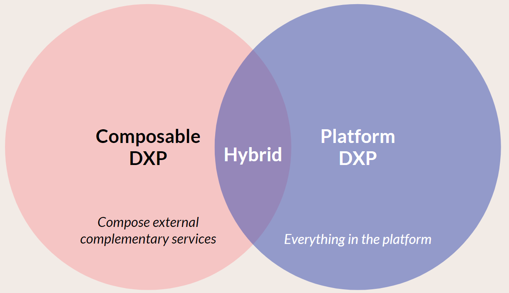

# Umbraco DXP

Within this Umbraco DXP (Digital Experience Platform) area of the Umbraco documentation, you'll find topics related to extending Umbraco CMS via packages and integrations.

Umbraco is used in solutions in both a "platform" and "composable" DXP context. With the former, Umbraco has responsibility for both content management and delivery, with extensions added as NuGet packages. In a composable DXP, Umbraco is often a stand-alone service that takes part in an overall architecture. In these cases, Umbraco CMS is focused on the management of content exposed via APIs for delivery.

Umbraco is also used in a hybrid DXP context. Here, some features are added directly to the Umbraco platform, like Umbraco Forms or Umbraco Commerce. However, Umbraco still acts as a component in a wider architecture.

In all situations, backoffice integrations with third-party services are an important part of providing an intuitive, unified editor experience.

Our aim is to support the different ways of using Umbraco in a DXP context and provide resources for building integrations with Umbraco.

### Packages and integrations

Packages for Umbraco are installed as [Nuget packages](https://docs.umbraco.com/umbraco-cms/extending/packages/types-of-packages).

Integrations provide functionality via a third-party service's API, whereas packages extend the functionality of the CMS (management or delivery).

.png>)

## Umbraco Commercial Products

Umbraco makes available four licensed add-ons that are available for purchase. They each have their dedicated documentation area:

<table data-card-size="large" data-view="cards"><thead><tr><th></th><th></th><th data-hidden data-card-target data-type="content-ref"></th><th data-hidden data-card-cover data-type="files"></th></tr></thead><tbody><tr><td><strong>Umbraco Forms</strong></td><td>Extend your Umbraco CMS website with custom forms in all shapes and sizes.</td><td><a href="https://docs.umbraco.com/umbraco-forms">https://docs.umbraco.com/umbraco-forms</a></td><td><a href=".gitbook/assets/forms7 (1).png">forms7 (1).png</a></td></tr><tr><td><strong>Umbraco Deploy</strong></td><td>Synchronize content and code changes between your Umbraco website environments.</td><td><a href="https://docs.umbraco.com/umbraco-deploy">https://docs.umbraco.com/umbraco-deploy</a></td><td><a href=".gitbook/assets/paperplane7 (1).png">paperplane7 (1).png</a></td></tr><tr><td><strong>Umbraco Workflow</strong></td><td>Structure content reviews and approval flows for Content Editors on your website.</td><td><a href="https://docs.umbraco.com/umbraco-workflow">https://docs.umbraco.com/umbraco-workflow</a></td><td><a href=".gitbook/assets/Workflow7 (1).png">Workflow7 (1).png</a></td></tr><tr><td><strong>Umbraco Commerce</strong></td><td>Setup shop within a familiar structure and interface that is the Umbraco CMS with Umbraco Commerce.</td><td><a href="https://docs.umbraco.com/umbraco-commerce">https://docs.umbraco.com/umbraco-commerce</a></td><td><a href=".gitbook/assets/Umbraco_Commerce_Blue (2).png">Umbraco_Commerce_Blue (2).png</a></td></tr><tr><td><strong>Umbraco UI Builder</strong></td><td>Generate a management user interface for your custom data sources.</td><td><a href="https://docs.umbraco.com/umbraco-ui-builder/">https://docs.umbraco.com/umbraco-ui-builder/</a></td><td><a href=".gitbook/assets/Umbraco_UI_Builder_Blue.png">Umbraco_UI_Builder_Blue.png</a></td></tr><tr><td><strong>Umbraco Engage</strong></td><td>A toolkit for personalizing user experiences, tracking visitor behavior, and optimizing conversions within the Umbraco CMS</td><td><a href="https://docs.umbraco.com/umbraco-engage">https://docs.umbraco.com/umbraco-engage</a></td><td><a href=".gitbook/assets/Umbraco_Engage_Logo_Icon.png">Umbraco_Engage_Logo_Icon.png</a></td></tr></tbody></table>

We aim to make all commercial products available as new major versions in alignment with the releases of Umbraco CMS. A new major version of Umbraco, running on the latest version of [.NET](https://dotnet.microsoft.com/en-us/download/dotnet), is expected every six months. At or around the same time, compatible Forms, Deploy, Workflow and Commerce releases will also be made available, along with [the additional, dependent packages](commercial-product-dependencies.md).

We align version numbers across the products. So when running for example Umbraco CMS 12, the same major version of the commercial products should be used.

## Umbraco Marketplace

The Umbraco Marketplace is a public website used to showcase Umbraco packages. These are commercial and open-source extensions available for use in Umbraco solutions. On the marketplace, you can browse and search for packages, understand their usage, and review their suitability for your project.

The marketplace is available at [marketplace.umbraco.com](https://marketplace.umbraco.com).

Within the [Marketplace section of the documentation](marketplace/introduction.md), you'll find details aimed at package developers looking to list their Umbraco CMS extensions and integrations.

## Umbraco Packages

We create and support open-source packages designed to improve the experience of creating integrations and developing Umbraco solutions as a DXP.

Within the packages section of the documentation you'll find information on using a component called [Authorized Services](packages/authorized-services.md). This package is designed for the purpose of simplifying custom integrations with third-party services that use a OAuth flow for authentication and authorization.

## Umbraco Integrations

Finally, Umbraco HQ develops and makes available open-source integrations. These add functionality to the Umbraco CMS to support working with third-party services.

These integrations are helpful starting points for anyone looking to integrate such services into their Umbraco solution.

When we have released an integration for a particular provider and use case that matches your needs, they are available for use directly. If we don't meet your particular requirement, we welcome feedback at the Issue Trackers. As all are open-source, they can be used as references for building similar integrations with related services.

Source code and issue trackers are found in the following GitHub repositories:

* [Umbraco CMS Integrations](https://github.com/umbraco/Umbraco.Cms.Integrations/)
* [Umbraco Forms Integrations](https://github.com/umbraco/Umbraco.Forms.Integrations/)

Within the [Integrations section of the documentation](integrations/categories.md), you'll find details on installing and working with the integration packages developed by Umbraco HQ.
