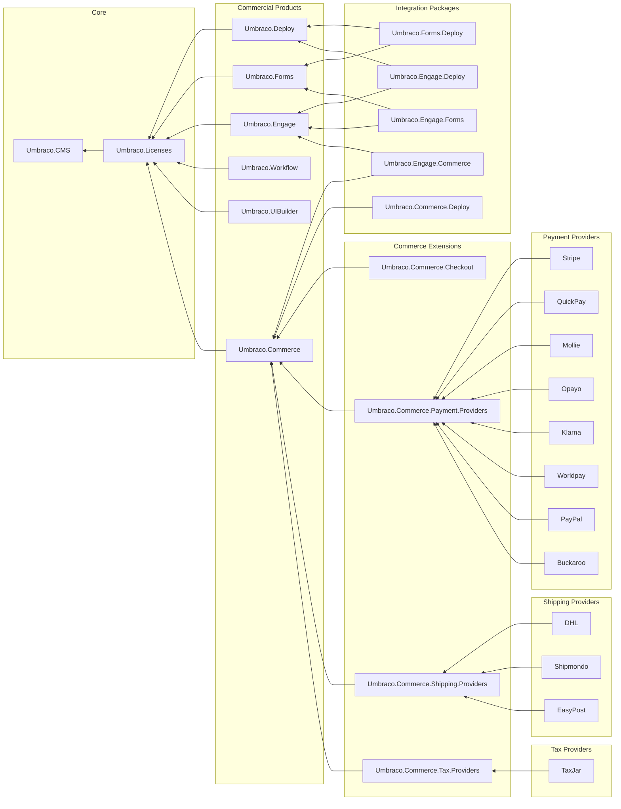

# Commercial Products, Relations, and Dependencies

The following diagram shows the Umbraco commercial products, their dependencies, and the relations between them. Depending on your setup, you may need one or more of the additional packages shown here when working with them.

Explanatory notes:

* `Umbraco.Licensing` supports the older licensing mechanism for Umbraco's products, including Forms and Deploy, when used on Umbraco Cloud.
* `Umbraco.Licenses` is the newer component supporting subscription licensing, used for Forms, Workflow, Commerce, and Deploy version 12 and above when used on-premise.
