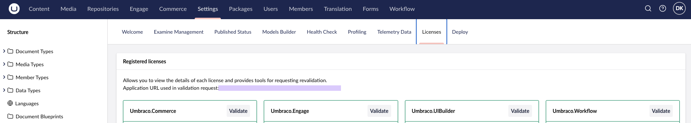

# Configure Licenses

Commercial Umbraco products require a valid license to run in production environments. This article covers how to install, configure, and validate licenses for Umbraco's commercial products.

## Product-Specific License Information

For product-specific information including what a license covers, pricing, and how to purchase:

* [Umbraco Commerce Licensing](https://docs.umbraco.com/umbraco-commerce/getting-started/the-licensing-model)
* [Umbraco Deploy Licensing](https://docs.umbraco.com/umbraco-deploy/installation/the-licensing-model)
* [Umbraco Engage Licensing](https://docs.umbraco.com/umbraco-engage/installation/licensing)
* [Umbraco Forms Licensing](https://docs.umbraco.com/umbraco-forms/installation/the-licensing-model)
* [Umbraco UI Builder Licensing](https://docs.umbraco.com/umbraco-ui-builder/getting-started/licensing-model)
* [Umbraco Workflow Licensing](https://docs.umbraco.com/umbraco-workflow/installation/licensing)

## Installing Your License

Umbraco commercial products use configuration-based licenses. These are installed by adding your license key to the `appsettings.json` file.


Umbraco Forms also supports file-based licenses, but starting from version 17, it will only support license keys. For more information, see the [announcement](https://github.com/umbraco/Announcements/issues/25).





For version 14 and above, licenses are configured under `Umbraco:Licenses:Products`:

1. Open the root directory for your project.
2. Locate and open the `appsettings.json` file.
3. Add your license key to `Umbraco:Licenses:Products:<ProductName>`:

```json
{
  "Umbraco": {
    "Licenses": {
      "Products": {
        "Umbraco.Commerce": "YOUR_LICENSE_KEY",
        "Umbraco.Deploy.OnPrem": "YOUR_LICENSE_KEY",
        "Umbraco.Engage": "YOUR_LICENSE_KEY",
        "Umbraco.Forms": "YOUR_LICENSE_KEY",
        "Umbraco.UIBuilder": "YOUR_LICENSE_KEY",
        "Umbraco.Workflow": "YOUR_LICENSE_KEY"
      }
    }
  }
}
```





For versions 10-13, licenses are configured under `Umbraco:Licenses`:

1. Open the root directory for your project files.
2. Locate and open the `appsettings.json` file.
3. Add your license key to `Umbraco:Licenses:<ProductName>`:

```json
{
  "Umbraco": {
    "Licenses": {
      "Umbraco.Commerce": "YOUR_LICENSE_KEY",
      "Umbraco.Deploy.OnPrem": "YOUR_LICENSE_KEY",
      "Umbraco.Engage": "YOUR_LICENSE_KEY",
      "Umbraco.Forms": "YOUR_LICENSE_KEY",
      "Umbraco.UIBuilder": "YOUR_LICENSE_KEY",
      "Umbraco.Workflow": "YOUR_LICENSE_KEY"
    }
  }
}
```





You might run into issues when using a period in the product name when using environment variables. Use an underscore in the product name instead, to avoid problems.

```json
"Umbraco_Commerce": "YOUR_LICENSE_KEY"
```



## Verifying the License Installation

You can verify that your license is successfully installed by logging into your project's backoffice:

1. Navigate to the **Settings** section.
2. Look for the **Licenses** dashboard.
3. Verify the license status displayed on the dashboard.



The dashboard will show the status of all installed commercial product licenses.

For each product, the dashboard also shows the **Application URL used in validation request**. An empty value means that Umbraco cannot determine its application URL. License validation cannot complete without this URL. See [Troubleshooting License Validation](#troubleshooting-license-validation).

## Configuring UmbracoApplicationUrl

License validation sends the domain of your site to the Umbraco license validation service. Umbraco takes this domain from the application URL of your Umbraco instance. To make sure the correct domain is used, configure the `UmbracoApplicationUrl` setting.

### When to Configure UmbracoApplicationUrl

From Umbraco CMS 17.4, configure `UmbracoApplicationUrl` on every site that runs a commercial product. Umbraco no longer detects the application URL from incoming requests by default. Without an explicit value, the licensing engine has no domain to validate. Validation does not run, and the license status stays pending.

On Umbraco CMS 17.3 and earlier, Umbraco detects the application URL from the incoming request. You only need to configure `UmbracoApplicationUrl` when your frontend and backoffice use different domains. In that case, set the value to your backoffice URL.

Setting `UmbracoApplicationUrl` explicitly is the recommended approach for all environments, including local development. You can also re-enable request-based detection, as described in [Configuring ApplicationUrlDetection](#configuring-applicationurldetection).

### How to Configure UmbracoApplicationUrl

An `UmbracoApplicationUrl` can be configured in your `appsettings.json` file:



```json
{
  "Umbraco": {
    "CMS": {
      "WebRouting": {
        "UmbracoApplicationUrl": "https://admin.my-custom-domain.com/"
      }
    }
  }
}
```



The value must contain the scheme (`http` or `https`) and the complete hostname. For more details, see the [Fixed Application Url](https://docs.umbraco.com/umbraco-cms/run-in-production/infrastructure-and-ops/health-check/guides/fixedapplicationurl) article in the CMS documentation.

### Configuring ApplicationUrlDetection


This setting is available from Umbraco CMS version 17.4.


The `ApplicationUrlDetection` setting controls how Umbraco detects the application URL from incoming HTTP requests. The setting applies only when `UmbracoApplicationUrl` is not set. The available values are `None`, `FirstRequest`, and `EveryRequest`.

The default value is `None`, which disables detection. With the default value, the licensing engine has no domain to validate, and the license status stays pending.

To detect the application URL from the first request instead, set the value to `FirstRequest`:



```json
{
  "Umbraco": {
    "CMS": {
      "WebRouting": {
        "ApplicationUrlDetection": "FirstRequest"
      }
    }
  }
}
```




Allowing auto-detection can enable a forged `Host` header to influence the URL that Umbraco uses. The risk applies when Umbraco is not behind a reverse proxy that validates the `Host` header. Explicitly configuring `UmbracoApplicationUrl` is the recommended approach.


For a description of each value, see the [Web routing](https://docs.umbraco.com/umbraco-cms/develop-with-umbraco/configuration/webroutingsettings#application-url-detection) article in the CMS documentation.

### Configuring UmbracoApplicationUrl on Umbraco Cloud

If you are hosting on Umbraco Cloud, you will find that the configuration described above won't be reflected in your environment. The reason for this is that Umbraco Cloud sets this value as an environment variable set to the Cloud project domain (`<your project>.umbraco.io`). This overrides what is set via the `appsettings.json` file.

There are two options in this case:

* Either the domains for each of your Cloud environments can be added to your license.
* Or, for more control and to ensure this value is set correctly for other reasons, you can apply the configuration via code.

For example, in your `Program.cs`:

```csharp
builder.Services.Configure<WebRoutingSettings>(o => o.UmbracoApplicationUrl = "<your application URL>");
```

In practice, you may want to make this configuration more flexible. You can read the value from another configuration key, removing the need to hard-code it and have it set as appropriate in different environments. You can also move this code into a composer or an extension method if you prefer not to clutter up the `Program.cs` file.

Umbraco Cloud sets this value on the Cloud environments only. A local clone of your Cloud project does not receive it. For local clones, see [Configuring the Application URL for Local Development](#configuring-the-application-url-for-local-development).

### Configuring the Application URL for Local Development

From Umbraco CMS 17.4, a local site has no application URL unless you configure one. New projects do not set `UmbracoApplicationUrl`, and request-based detection is disabled by default. License validation therefore does not run, and the **Licenses** dashboard shows **Validation pending** for each product.

The same applies to a local clone of an Umbraco Cloud project. Umbraco Cloud sets the application URL on the Cloud environments only.

To resolve the pending status, set `UmbracoApplicationUrl` to the URL you use to browse the local site. Add the setting to `appsettings.Development.json`, so that it applies only when you run the site locally:



```json
{
  "Umbraco": {
    "CMS": {
      "WebRouting": {
        "UmbracoApplicationUrl": "https://localhost:44339/"
      }
    }
  }
}
```



Replace the port with the one shown in your terminal output or in `Properties/launchSettings.json`. Restart the site, or select **Validate** on the **Licenses** dashboard.

As an alternative, set `ApplicationUrlDetection` to `FirstRequest` in `appsettings.Development.json`. Umbraco then detects the URL from the first request to the site. See [Configuring ApplicationUrlDetection](#configuring-applicationurldetection) for the security implications.

Commercial product licenses usually include `localhost` as a valid domain. For the domains covered by your license, see the licensing article for your product under [Product-Specific License Information](#product-specific-license-information).

## Validating a License Without an Outgoing Internet Connection

Some Umbraco installations will have a highly locked down production environment, with firewall rules that prevent outgoing HTTP requests. This will interfere with the normal process of license validation.

On start-up, and periodically whilst Umbraco is running, the license component will make an HTTP POST request to `https://license-validation.umbraco.com/api/ValidateLicense`.

If it's possible to do so, the firewall rules should be adjusted to allow this request.

If such a change is not feasible, there is another approach you can use.

### Setting Up License Relay

You will need to have a server, or serverless function, that is running and can make a request to the online license validation service. That needs to run on a daily schedule, making a request and relaying it onto the restricted Umbraco environment.

Configure a random string as an authorization key in configuration. This is used as protection to ensure only valid requests are handled. You can also disable the normal regular license checks - as there is no point in these running if they will be blocked:




```json
{
  "Umbraco": {
    "Licenses": {
      "Products": {
        "Umbraco.Commerce": "<your license key>"
      },
      "EnableScheduledValidation": false,
      "ValidatedLicenseRelayAuthKey": "<your authorization key>"
    }
  }
}
```





Ensure you use the latest product version, so the package dependency on `Umbraco.Licenses` is updated to 13.1.0 or later.

```json
{
  "Umbraco": {
    "Licenses": {
      "Umbraco.Commerce": "<your license key>"
    },
    "LicensesOptions": {
      "EnableScheduledValidation": false,
      "ValidatedLicenseRelayAuthKey": "<your authorization key>"
    }
  }
}
```




Your Internet-enabled server should make a request of the following form to the online license validation service:

```http
POST https://license-validation.umbraco.com/api/ValidateLicense
{
    "ProductId": "Umbraco.Commerce",
    "LicenseKey": "<your license key>",
    "Domain": "<your licensed domain>"
}
```

The response should be relayed exactly via an HTTP request to your restricted Umbraco environment:

```http
POST http://<your umbraco environment>/umbraco/licenses/validatedLicense/relay?productId=<product id>&licenseKey=<license key>
```

A header with a key of `X-AUTH-KEY` and the value of the authorization key you have configured should be provided.

This will trigger the same processes that occur when the normal scheduled validation completes ensuring your product is considered licensed.

## Troubleshooting License Validation

Use this section when a license does not validate, even though the license key is correct.

### License Status Shows Validation Pending

The **Licenses** dashboard shows **Validation pending** for a product, and the status does not change after a restart. The **Application URL used in validation request** field is empty.

The pending status means that Umbraco does not know its own application URL. License validation needs this URL to determine which domain to validate. Without it, no validation request is sent.

Umbraco logs a warning at startup when no application URL is available. The warning starts with `Application URL auto-detection is disabled and no explicit URL is configured`.

Common causes are:

* You run Umbraco CMS 17.4 or later without an explicit `UmbracoApplicationUrl`, and `ApplicationUrlDetection` has the default value `None`.
* You run a local site, or a local clone of an Umbraco Cloud project. Neither setup sets the application URL for you.

To resolve the issue:

1. Set `UmbracoApplicationUrl` as described in [How to Configure UmbracoApplicationUrl](#how-to-configure-umbracoapplicationurl). For local sites, see [Configuring the Application URL for Local Development](#configuring-the-application-url-for-local-development).
2. Restart the site, or select **Validate** on the **Licenses** dashboard.
3. Confirm that the **Application URL used in validation request** field now shows your URL.

You can also run the [Fixed Application Url](https://docs.umbraco.com/umbraco-cms/run-in-production/infrastructure-and-ops/health-check/guides/fixedapplicationurl) health check. From Umbraco CMS 17.5, the check reports an error when no application URL is configured and detection is disabled.

### Validation Fails Without an Outgoing Internet Connection

If your environment blocks outgoing HTTP requests, see [Validating a License Without an Outgoing Internet Connection](#validating-a-license-without-an-outgoing-internet-connection).
