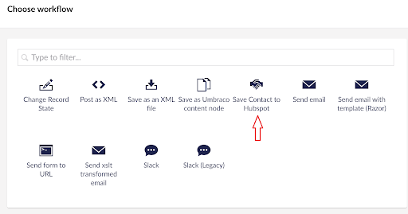

# HubSpot with Umbraco Forms

This integration provides a custom workflow for Umbraco Forms. The workflow settings allow form entries to be mapped to a HubSpot contact record. When the form is submitted, the details are stored within the Customer Relationship Management (CRM) platform.

## Package Links

* [NuGet install](https://www.nuget.org/packages/Umbraco.Forms.Integrations.Crm.Hubspot)
* [Source code](https://github.com/umbraco/Umbraco.Forms.Integrations/tree/main-v10/src/Umbraco.Forms.Integrations.Crm.Hubspot)
* [Umbraco marketplace listing](https://marketplace.umbraco.com/package/umbraco.forms.integrations.crm.hubspot)

## Minimum version requirements

To ensure compatibility, check the **Dependencies** tab on NuGet for the required Umbraco CMS version. For example, see [Umbraco.Forms.Integrations.Crm.Hubspot](https://www.nuget.org/packages/Umbraco.Forms.Integrations.Crm.Hubspot#dependencies-body-tab).

## Authentication

The package supports authentication using the OAuth protocol.

The first time the workflow is used, the installation needs to be authorized. That can be done by following these steps:

1. Click the prompted link which will redirect to the HubSpot authentication page for the Umbraco Forms HubSpot app.
2. Log into the HubSpot account and agree to the permissions that the app requires.
   * Permission is required in order to be able to read and write contact information.

After agreeing to the permissions a redirect happens to a website hosted at `https://hubspot-forms-auth.umbraco.com`.

3. Copy the authorization code issued by HubSpot.
4. Paste it into the field indicated within the Umbraco Forms installation.

Behind the scenes, this will make a request to HubSpot which will return two tokens - an access and a refresh token. The former will be provided in further API calls to HubSpot to authenticate the request. The latter will be stored via Umbraco's key/value service and will be used to retrieve a new access token when it expires.

A button is available to clear the authentication with HubSpot. Following this, the authentication process needs to be repeated before the integration can be used again.

When the OAuth authentication method is being used, the API call to retrieve the token is proxied via an endpoint on the same website. This allows the Umbraco Forms HubSpot app secret key to remain a secret.

## Working with the integration

Follow the steps outlined below to start working with the integration:

1. Add the "Save Contact to Hubspot" workflow to a form.
2. Configure the mappings between the form and Hubspot fields.

When a form is submitted on the website, the workflow will execute and create a new contact record in your Hubspot account. It will be populated using the information mapped from the fields in the form submission.

