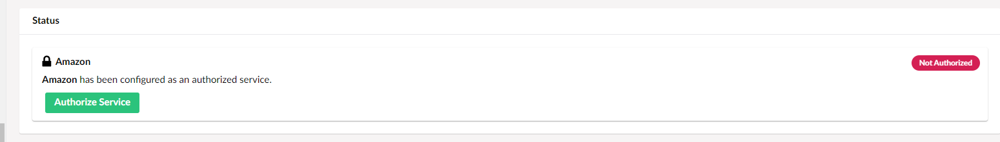
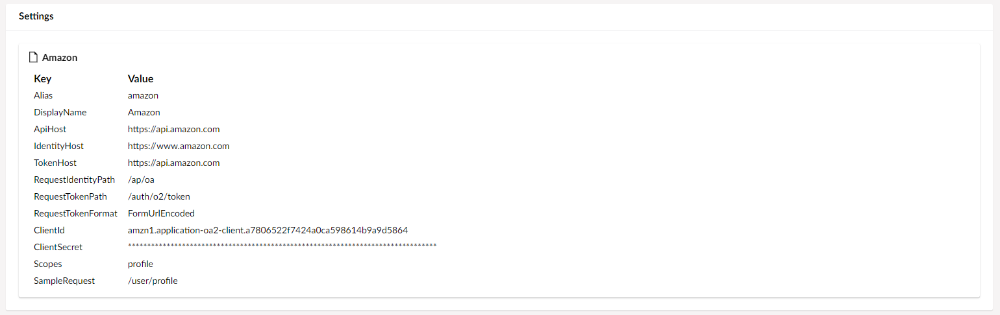

# Authorized Services

**Umbraco Authorized Services** is an Umbraco package designed to reduce the effort needed to integrate third-party services into Umbraco solutions. Many Software as a Service (SaaS) offerings require an OAuth flow for authentication and authorization. Working with them requires a fair bit of plumbing code to handle creating an authorized connection. This is necessary before the developer working with the service can get to using the provided API to implement the business requirements.

There are similarities to the flow that needs to be implemented for different services.  Steps include:

- Redirecting to an authentication endpoint.
- Handling the response including an authentication code and exchanging it for an access token.
- Securely storing the token.
- Including the token in API requests.
- Serializing requests and deserializing the API responses.
- Handling cases where the token has expired and obtaining a new one via a refresh token.

There are also differences across the request and response structures and variations in the details of the flow itself.

The package tries to implement a single, best practice implementation of working with OAuth. For particular providers the specific flow required can be customized via configuration or code.

## Features

For the solution developer, the Umbraco Authorized Services offers two primary features.

### Authorized Services in the backoffice

Firstly there's a tree available in the _Settings_ section of the backoffice, called _Authorized Services_. The tree shows the list of services based on the details provided in configuration.


Each tree entry has a management screen where an administrator can authenticate with an app that has been setup with the service. The status of each service is shown on this screen. When authorized, the authentication and authorization flow has been completed and an access token stored.




If the service is configured to allow the addition of access tokens manually, using the `CanManuallyProvideToken` setting, a new section will be available for providing an access token.


### IAuthorizedServiceCaller interface

Secondly, the developer has access to an interface - `IAuthorizedServiceCaller` - that they can inject instances of and use to make authorized requests to the service's API.

Using a settings screen the administrator can review the service configuration.



Depending on the authentication method of the service,
- `OAuth1`
- `OAuth2` (default)
- `ApiKey`

the interface provides two methods for retrieving the value of the access token or the API key:
- `GetToken`
- `GetApiKey` 

## Usage

In the following, you can learn more about how to use the Umbraco Authorized Services package.

### App Creation

Services that this package is intended to support will offer an OAuth2 default authentication and authorization flow against an "app". The developer will need to create this "app" with the service.  By doing this, information such as the "client ID" and "client secret" can be applied to the configuration.

In addition, the package supports integration with OAuth1 or Api key based authentication and authorization services.

### Installation

The package should be installed into your Umbraco solution from [NuGet](https://www.nuget.org/packages/Umbraco.AuthorizedServices).

### Configuring a Service

Details of services available need to be applied to the Umbraco web application's configuration.

An example of doing this through the `appSettings.json` file is shown below. Other sources such as environment variables can also be used, as per standard .NET configuration.

```json
  "Umbraco": {
    "CMS": {
        ...
    },
    "AuthorizedServices": {
      "TokenEncryptionKey": "",
      "Services": {
        {
          "<serviceAlias>": {
            "DisplayName": "",
            "AuthenticationMethod": "",
            "CanManuallyProvideToken": true|false,
            "ApiHost": "",
            "IdentityHost": "",
            "TokenHost": "",
            "RequestIdentityPath": "",
            "AuthorizationUrlRequiresRedirectUrl": true|false,
            "RequestTokenPath": "",
            "JsonSerializer": "",
            "RequestTokenFormat": "",
            "AuthorizationRequestRequiresAuthorizationHeaderWithBasicToken": true|false,
            "ApiKey": "",
            "ApiKeyProvision": {
              "Method": "",
              "Key": ""
            },
            "ClientId": "",
            "ClientSecret": "",
            "UseProofKeyForCodeExchange": true|false,
            "Scopes": "",
            "AccessTokenResponseKey": "access_token",
            "RefreshTokenResponseKey": "refresh_token",
            "ExpiresInResponseKey": "expires_in",
            "SampleRequest": ""
        }
      }
    }
```

`TokenEncryptionKey` is a setting for an optional key used for token encryption when they are saved and retrieved from storage. It's only necessary and advisable when using the non-default `AesSecretEncryptor` implementation.

`Services` contains the a collection of details for all the configured services structured as a dictionary.

The dictionary key is the alias of the service, which must be unique across the service collection.

The following table describes each of the service elements. Where appropriate, an example is provided for one service provider, GitHub.

Not all values are required for all services.  Those that are required are indicated below.

| Element                                                       | Description                                                                                                                                                                                                                                                  | Required? | Example                                    |
|---------------------------------------------------------------|--------------------------------------------------------------------------------------------------------------------------------------------------------------------------------------------------------------------------------------------------------------|-----------|--------------------------------------------|
| DisplayName                                                   | Provides a friendly name for the service used for identification in the user interface.                                                                                                                                                                      | Yes       |                                            |
| CanManuallyProvideToken                                                   | Toggles an UI section in the backoffice for manually providing an access token.                                                                                                                                                                     | No       |                                            |
| AuthenticationMethod                                                   | An enum value that controls the type of authentication. `OAuth2` is the default value; other available options are `OAuth1` and `ApiKey`.                                                                                                                                                               | No       |                                            |
| ApiHost                                                       | The host name for the service API that will be called to deliver business functionality.                                                                                                                                                                     | Yes       | `https://api.github.com`                   |
| IdentityHost                                                  | The host name for the service's authentication endpoint, used to initiate the authorization of the service by asking the user to login.                                                                                                                      | Yes       | `https://github.com`                       |
| TokenHost                                                     | Some providers make available a separately hosted service for handling requests for access tokens. If that's the case, it can be provided here. If not provided, the value of `IdentityHost` is used.                                                        | No        |                                            |
| RequestIdentityPath                                           | Used along with `IdentityHost` to construct a URL that the user is redirected to when initiating the authorization of the service via the backoffice.                                                                                                        | Yes       | `/login/oauth/authorize`                   |
| AuthorizationUrlRequiresRedirectUrl                           | Some providers require a redirect URL to be provided with the authentication request. For others, instead it's necessary to configure this as part of the registered app. The default value if not provided via configuration is `false`.                    | No        |                                            |
| RequestTokenPath                                              | Used, along with `TokenHost` to construct a URL used for retrieving access tokens.                                                                                                                                                                           | Yes       | `/login/oauth/access_token`                |
| RequestTokenFormat                                            | An enum value that controls how the request to retrieve an access token is formatted. Options are `Querystring` and `FormUrlEncoded`. `Querystring` is the default value.                                                                                    | No        |                                            |
| JsonSerializer                                                | An enum value that defines the JSON serializer to use when creating requests and deserializing responses. Options are `Default` and `JsonNet` and `SystemTextJson` as described below. If not provided, `Default` is used.                                   | No        |                                            |
| AuthorizationRequestRequiresAuthorizationHeaderWithBasicToken | This flag indicates whether the basic token should be included in the request for an access token. If `true`, a base64 encoding of `<clientId>:<clientSecret>` will be added to the authorization header. Default is `false`.                                | No        |                                            |
| ApiKey                                                   | Provides the service's API key, if `"AuthenticationMethod": "ApiKey"`                                                                                                                                                              | No       |                                            |
| ApiKeyProvision                                                   | Provides an object that dictates how the API key will be included with each request. This is configured using the `Method`(pass the API key as `QueryString` or `HttpHeader`) and `Key` (name of the key used to include the API key) properties.                                                                                                                                                                  | No       |                                            |
| ClientId                                                      | This value will be retrieved from the registered service app.                                                                                                                                                                                                | Yes       |                                            |
| ClientSecret                                                  | This value will be retrieved from the registered service app.  As the name suggests, it should be kept secret and so is probably best not added directly to `appSettings.json` and checked into source control.                                              | Yes       |                                            |
| Scopes                                                        | This value will be configured on the service app and retrieved from there. Best practice is to define only the set of permissions that the integration will need.                                                                                            | Yes       | `repo`                                     |
| UseProofKeyForCodeExchange                                    | This flag will extend the OAuth flow with an additional security layer called [Proof Key for Code Exchange (PKCE)](https://auth0.com/docs/get-started/authentication-and-authorization-flow/authorization-code-flow-with-proof-key-for-code-exchange-pkce).  | No        |                                            |
| AccessTokenResponseKey                                        | The expected key for retrieving an access token from a response. If not provided the default `access_token` is assumed.                                                                                                                                      | No        |                                            |
| RefreshTokenResponseKey                                       | The expected key for retrieving a refresh token from a response. If not provided the default `refresh_token` is assumed.                                                                                                                                     | No        |                                            |
| ExpiresInResponseKey                                          | The expected key for retrieving the datetime of token expiry from a response. If not provided the default `expires_in` is assumed.                                                                                                                           | No        |                                            |
| SampleRequest                                                 | An optional sample request can be provided, which can be used to check that an authorized service is functioning as expected from the backoffice.                                                                                                            | No        | `/repos/Umbraco/Umbraco-CMS/contributors`  |

The options for `JsonSerializer` are:

- `Default` - uses the Umbraco CMS default `IJsonSerializer`.
- `JsonNet` - uses the JSON.Net serializer.
- `SystemTextJson` - uses the System.Text.Json serializer.

With `UseProofKeyForCodeExchange` set to `true`, a random code will be generated on the client and stored under the name `code_verifier`. Using the `SHA-256` algorithm it will be hashed under the name `code_challenge`. When the authorization URL is generated, the `code_challenge` will be sent to the OAuth Server, which will store it. The next request for access token will pass the `code_verifier` as a header key. The OAuth Server will compare it with the previously sent `code_challenge`.

### Authorizing a Service

With one or more service configured, it will be available from the items within a tree in the _Settings_ section.

Selecting an item will show some details about the configured service, and it's authentication status.

If the service is not yet authorized, click the _Authorize Service_ button to trigger the authentication and authorization flow. You will be directed to the service to login, and optionally choose an account.  You will then be asked to agree to the permissions requested by the app. Finally you will be redirected back to the Umbraco backoffice. You should see confirmation that an access token has been retrieved and stored such that the service is now authorized. If provided, you can click the _Verify Sample Request_ button to ensure that service's API can be called.

### Calling an Service

To make a call to an authorized service, you first need to obtain an instance of `IAuthorizedServiceCaller`. This is registered with the dependency injection framework. As such it can be injected into a controller, view or service class where it needs to be used.

When making a request where all information is provided via the path and querystring, such as GET requests, the following method will be invoked:

```csharp
Task<TResponse> SendRequestAsync<TResponse>(string serviceAlias, string path, HttpMethod httpMethod);
```

The parameters for the request are as follows:

- `serviceAlias` - the alias of the service being invoked (e.g. `github`).
- `path` - the path to the API method being invoked (e.g. `/repos/Umbraco/Umbraco-CMS/contributors`).
- `httpMethod` - the HTTP method to use for the request (e.g. `HttpMethod.Get`).

There is also a type parameter:
- `TResponse` - defines the strongly typed representation of the service method's response, that the raw response content will be deserialized into.

If you need to provide data in the request an overload is available. This can be used for `POST` or `PUT` requests that trigger the creation or update of a resource:

```csharp
Task<TResponse> SendRequestAsync<TRequest, TResponse>(string serviceAlias, string path, HttpMethod httpMethod, TRequest? requestContent = null)
    where TRequest : class;
```

The additional parameter is:

- `requestContent` - the strongly typed request content, which will be serialized and provided in the request.

And additional type parameter:

- `TRequest` - defines the strongly typed representation of the requested content.

If you need to work with the raw JSON response, there are equivalent methods for both of these that omit the deserialization step:

```csharp
Task<string> SendRequestRawAsync(string serviceAlias, string path, HttpMethod httpMethod);

Task<string> SendRequestRawAsync<TRequest>(string serviceAlias, string path, HttpMethod httpMethod, TRequest? requestContent = null)
    where TRequest : class;
```

Finally, there are convenience extension methods available for each of the common HTTP verbs. These allow you to simplify the requests and omit the `HttpMethod` parameter, e.g.

```csharp
Task<TResponse> GetRequestAsync<TResponse>(string serviceAlias, string path);
```

Depending on the configured authentication method, there are two methods that can be used to retrieve the access token or the API key:

```csharp
string? GetToken(string serviceAlias);

string? GetApiKey(string serviceAlias);
```

## Verified Providers

The following service providers have been tested against the package implementation. For each one the necessary configuration is listed.

As integrations with more providers are successfully completed, we plan to maintain the details for each here. Pull requests updating this list with verified integrations are welcome.

<details>

<summary>Amazon</summary>

```json
"amazon": {
  "DisplayName": "Amazon",
  "ApiHost": "https://api.amazon.com",
  "IdentityHost": "https://www.amazon.com",
  "TokenHost": "https://api.amazon.com",
  "RequestIdentityPath": "/ap/oa",
  "AuthorizationUrlRequiresRedirectUrl": true,
  "UseProofKeyForCodeExchange": true,
  "RequestTokenPath": "/auth/o2/token",
  "RequestTokenFormat": "FormUrlEncoded",
  "ClientId": "",
  "ClientSecret": "",
  "Scopes": "profile",
  "SampleRequest": "/user/profile"
}
```

</details>

<details>

<summary>Aprimo</summary>

```json
"aprimo": {
  "DisplayName": "Aprimo",
  "ApiHost": "https://[tenant].dam.aprimo.com/api/core",
  "IdentityHost": "https://[tenant].aprimo.com",
  "TokenHost": "https://[tenant].aprimo.com",
  "RequestIdentityPath": "/login/connect/authorize",
  "RequestTokenPath": "/login/connect/token",
  "RequestTokenFormat": "FormUrlEncoded",
  "AuthorizationRequestsRequireRedirectUri": true,
  "UseProofKeyForCodeExchange": true,
  "ClientId": "",
  "ClientSecret": "",
  "Scopes": "api offline_access",
  "SampleRequest": ""
},
```

</details>

<details>

<summary>Atlasian</summary>

```json
"atlasian": {
  "DisplayName": "Atlasian",
  "ApiHost": "https://api.atlassian.com",
  "IdentityHost": "https://auth.atlassian.com",
  "TokenHost": "https://auth.atlassian.com",
  "RequestIdentityPath": "/authorize",
  "AuthorizationUrlRequiresRedirectUrl": true,
  "UseProofKeyForCodeExchange": true,
  "RequestTokenPath": "/oauth/token",
  "RequestTokenFormat": "FormUrlEncoded",
  "ClientId": "",
  "ClientSecret": "",
  "Scopes": "read:jira-user read:jira-work",
  "SampleRequest": "/oauth/token/accessible-resources"
}
```

</details>

<details>

<summary>Asset Bank</summary>

```json
"assetbank": {
  "DisplayName": "Asset Bank",
  "ApiHost": "https://my-assets-test.assetbank-server.com",
  "IdentityHost": "https://my-assets-test.assetbank-server.com",
  "TokenHost": "https://my-assets-test.assetbank-server.com",
  "RequestIdentityPath": "/assetbank-my-assets-test/oauth/authorize",
  "AuthorizationUrlRequiresRedirectUrl": true,
  "RequestTokenPath": "/assetbank-my-assets-test/oauth/token",
  "RequestTokenFormat": "FormUrlEncoded",
  "JsonSerializer": "SystemTextJson",
  "ClientId": "",
  "ClientSecret": "",
  "Scopes": "",
  "SampleRequest": "/assetbank-my-assets-test/rest/asset-search?assetIds=1234"
}
```

</details>

<details>

<summary>Bitbucket</summary>

```json
"bitbucket": {
  "DisplayName": "Bitbucket",
  "ApiHost": "https://api.bitbucket.org",
  "IdentityHost": "https://bitbucket.org",
  "TokenHost": "https://bitbucket.org",
  "RequestIdentityPath": "/site/oauth2/authorize",
  "AuthorizationUrlRequiresRedirectUrl": true,
  "RequestTokenPath": "/site/oauth2/access_token",
  "RequestTokenFormat": "FormUrlEncoded",
  "ClientId": "",
  "ClientSecret": "",
  "Scopes": "",
  "SampleRequest": "/user/profile"
}
```

</details>

<details>

<summary>Calendly</summary>


```json
"calendly": {
  "DisplayName": "Calendly",
  "ApiHost": "https://api.calendly.com",
  "IdentityHost": "https://auth.calendly.com",
  "TokenHost": "https://auth.calendly.com",
  "RequestIdentityPath": "/oauth/authorize",
  "AuthorizationUrlRequiresRedirectUrl": true,
  "RequestTokenPath": "/oauth/token",
  "RequestTokenFormat": "FormUrlEncoded",
  "ClientId": "",
  "ClientSecret": "",
  "Scopes": "",
  "SampleRequest": "/users/me"
}
```

</details>

<details>

<summary>Discord</summary>


```json
"discord": {
  "DisplayName": "Discord",
  "ApiHost": "https://discord.com",
  "IdentityHost": "https://discord.com",
  "TokenHost": "https://discord.com",
  "RequestIdentityPath": "/oauth2/authorize",
  "AuthorizationUrlRequiresRedirectUrl": true,
  "UseProofKeyForCodeExchange": false,
  "RequestTokenPath": "/api/oauth2/token",
  "RequestTokenFormat": "FormUrlEncoded",
  "JsonSerializer": "SystemTextJson",
  "ClientId": "",
  "ClientSecret": "",
  "Scopes": "email",
  "SampleRequest": "/users/@me"
}
```

</details>

<details>

<summary>Dropbox</summary>


```json
"dropbox": {
  "DisplayName": "Dropbox",
  "ApiHost": "https://api.dropboxapi.com",
  "IdentityHost": "https://www.dropbox.com",
  "TokenHost": "https://www.dropbox.com",
  "RequestIdentityPath": "/oauth2/authorize",
  "AuthorizationUrlRequiresRedirectUrl": true,
  "UseProofKeyForCodeExchange": true,
  "RequestTokenPath": "/oauth2/token",
  "RequestTokenFormat": "FormUrlEncoded",
  "ClientId": "",
  "ClientSecret": "",
  "Scopes": "profile openid email account_info.read files.content.read files.metadata.read",
  "SampleRequest": ""
}
```

</details>

<details>

<summary>Facebook</summary>


```json
"facebook": {
  "DisplayName": "Facebook",
  "ApiHost": "https://graph.facebook.com",
  "IdentityHost": "https://www.facebook.com",
  "TokenHost": "https://graph.facebook.com",
  "RequestIdentityPath": "/v3.0/dialog/oauth",
  "RequestTokenPath": "/v3.0/oauth/access_token",
  "RequestTokenFormat": "FormUrlEncoded",
  "AuthorizationRequestsRequireRedirectUri": true,
  "ClientId": "",
  "ClientSecret": "",
  "Scopes": "email public_profile",
  "SampleRequest": "/v3.0/me"
}
```

</details>

<details>

<summary>Figma</summary>


```json
"figma": {
  "DisplayName": "Figma",
  "ApiHost": "https://api.figma.com",
  "IdentityHost": "https://www.figma.com",
  "TokenHost": "https://www.figma.com",
  "RequestIdentityPath": "/oauth",
  "AuthorizationUrlRequiresRedirectUrl": true,
  "RequestTokenPath": "/api/oauth/token",
  "RequestTokenFormat": "FormUrlEncoded",
  "ClientId": "",
  "ClientSecret": "",
  "Scopes": "file_read",
  "SampleRequest": "/v1/me"
}
```

</details>

<details>

<summary>Fitbit</summary>


```json
"fitbit": {
  "DisplayName": "Fitbit",
  "ApiHost": "https://api.fitbit.com",
  "IdentityHost": "https://www.fitbit.com",
  "TokenHost": "https://api.fitbit.com",
  "RequestIdentityPath": "/oauth2/authorize",
  "AuthorizationUrlRequiresRedirectUrl": true,
  "UseProofKeyForCodeExchange": true,
  "RequestTokenPath": "/oauth2/token",
  "RequestTokenFormat": "FormUrlEncoded",
  "AuthorizationRequestRequiresAuthorizationHeaderWithBasicToken": true,
  "ClientId": "",
  "ClientSecret": "",
  "Scopes": "profile",
  "SampleRequest": "/1/user/-/profile.json"
}
```

</details>

<details>

<summary>GitHub</summary>


```json
"github": {
  "DisplayName": "GitHub",
  "ApiHost": "https://api.github.com",
  "IdentityHost": "https://github.com",
  "TokenHost": "https://github.com",
  "RequestIdentityPath": "/login/oauth/authorize",
  "RequestTokenPath": "/login/oauth/access_token",
  "RequestTokenFormat": "Querystring",
  "ClientId": "",
  "ClientSecret": "",
  "Scopes": "repo",
  "SampleRequest": "/repos/Umbraco/Umbraco-CMS/contributors"
},
```

</details>

<details>

<summary>Gitlab</summary>


```json
"gitlab": {
  "DisplayName": "Gitlab",
  "ApiHost": "https://gitlab.com",
  "IdentityHost": "https://gitlab.com",
  "TokenHost": "https://gitlab.com",
  "RequestIdentityPath": "/oauth/authorize",
  "AuthorizationUrlRequiresRedirectUrl": true,
  "UseProofKeyForCodeExchange": true,
  "RequestTokenPath": "/oauth/token",
  "RequestTokenFormat": "FormUrlEncoded",
  "ClientId": "",
  "ClientSecret": "",
  "Scopes": "api read_api read_user",
  "SampleRequest": "/api/v4/projects"
}
```

</details>

<details>

<summary>Google Search Console</summary>


```json
"google": {
  "DisplayName": "Google Search Console",
  "ApiHost": "https://searchconsole.googleapis.com",
  "IdentityHost": "https://accounts.google.com",
  "TokenHost": "https://oauth2.googleapis.com",
  "RequestIdentityPath": "/o/oauth2/auth",
  "RequestTokenPath": "/token",
  "RequestTokenFormat": "FormUrlEncoded",
  "AuthorizationRequestsRequireRedirectUri": true,
  "ClientId": "",
  "ClientSecret": "",
  "Scopes": "https://www.googleapis.com/auth/webmasters https://www.googleapis.com/auth/webmasters.readonly",
  "SampleRequest": "/v1/urlInspection/index:inspect"
},
```

</details>

<details>

<summary>HubSpot</summary>


```json
"hubspot": {
  "DisplayName": "HubSpot",
  "ApiHost": "https://api.hubapi.com",
  "IdentityHost": "https://app-eu1.hubspot.com",
  "TokenHost": "https://api.hubapi.com",
  "RequestIdentityPath": "/oauth/authorize",
  "AuthorizationRequestsRequireRedirectUri": true,
  "RequestTokenPath": "/oauth/v1/token",
  "RequestTokenFormat": "FormUrlEncoded",
  "JsonSerializer": "SystemTextJson",
  "ClientId": "",
  "ClientSecret": "",
  "Scopes": "crm.objects.contacts.read crm.objects.contacts.write",
  "SampleRequest": "/crm/v3/objects/contacts?limit=10&archived=false"
},
```

</details>

<details>

<summary>LinkedIn</summary>


```json
"linkedin": {
  "DisplayName": "LinkedIn",
  "ApiHost": "https://api.linkedin.com",
  "IdentityHost": "https://www.linkedin.com",
  "TokenHost": "https://www.linkedin.com",
  "RequestIdentityPath": "/oauth/v2/authorization",
  "RequestTokenPath": "/oauth/v2/accessToken",
  "RequestTokenFormat": "FormUrlEncoded",
  "AuthorizationRequestsRequireRedirectUri": true,
  "ClientId": "",
  "ClientSecret": "",
  "Scopes": "r_emailaddress r_liteprofile w_member_social",
  "SampleRequest": "/v2/me"
},
```

</details>

<details>

<summary>Mailchimp</summary>


```json
"mailchimp": {
  "DisplayName": "Mailchimp",
  "ApiHost": "https://login.mailchimp.com",
  "IdentityHost": "https://login.mailchimp.com",
  "TokenHost": "https://login.mailchimp.com",
  "RequestIdentityPath": "/oauth2/authorize",
  "AuthorizationUrlRequiresRedirectUrl": true,
  "UseProofKeyForCodeExchange": false,
  "RequestTokenPath": "/oauth2/token",
  "RequestTokenFormat": "FormUrlEncoded",
  "JsonSerializer": "SystemTextJson",
  "ClientId": "",
  "ClientSecret": "",
  "Scopes": "",
  "SampleRequest": "/oauth2/metadata"
}
```

</details>

<details>

<summary>Microsoft Dynamics</summary>


```json
"dynamics": {
  "DisplayName": "Dynamics",
  "ApiHost": "https://[instance].crm4.dynamics.com/api/data/v9.2",
  "IdentityHost": "https://login.microsoftonline.com",
  "TokenHost": "https://login.microsoftonline.com",
  "RequestIdentityPath": "/common/oauth2/v2.0/authorize",
  "RequestTokenPath": "/common/oauth2/v2.0/token",
  "RequestTokenFormat": "FormUrlEncoded",
  "AuthorizationRequestsRequireRedirectUri": true,
  "ClientId": "",
  "ClientSecret": "",
  "Scopes": "https://[instance].crm4.dynamics.com/.default",
  "SampleRequest": "/msdyncrm_marketingforms"
},
```

</details>

<details>

<summary>Miro</summary>

```json
"miro": {
  "DisplayName": "Miro",
  "ApiHost": "https://api.miro.com",
  "IdentityHost": "https://miro.com",
  "TokenHost": "https://api.miro.com",
  "RequestIdentityPath": "/oauth/authorize",
  "AuthorizationUrlRequiresRedirectUrl": true,
  "RequestTokenPath": "/v1/oauth/token",
  "RequestTokenFormat": "FormUrlEncoded",
  "ClientId": "",
  "ClientSecret": "",
  "Scopes": "boards:read",
  "SampleRequest": "/v2/boards?sort=default"
}
```

</details>

<details>

<summary>Semrush</summary>


```json
"semrush": {
  "DisplayName": "Semrush",
  "ApiHost": "https://oauth.semrush.com",
  "IdentityHost": "https://oauth.semrush.com",
  "TokenHost": "https://oauth.semrush.com",
  "RequestIdentityPath": "/auth/login",
  "RequestTokenPath": "/oauth2/access_token",
  "RequestTokenFormat": "FormUrlEncoded",
  "AuthorizationRequestsRequireRedirectUri": true,
  "ClientId": "",
  "ClientSecret": "",
  "Scopes": "user.id,domains.info,url.info,positiontracking.info",
  "SampleRequest": ""
},
```

</details>

<details>

<summary>Shopify</summary>


```json
"shopify": {
  "DisplayName": "Shopify",
  "ApiHost": "https://[shop-name].myshopify.com",
  "IdentityHost": "https://[shop-name].myshopify.com",
  "TokenHost": "https://[shop-name].myshopify.com/admin",
  "RequestIdentityPath": "/admin/oauth/authorize",
  "RequestTokenPath": "/oauth/access_token",
  "RequestTokenFormat": "FormUrlEncoded",
  "AuthorizationRequestsRequireRedirectUri": true,
  "ClientId": "",
  "ClientSecret": "",
  "Scopes": "read_products",
  "SampleRequest": "/admin/api/2022-01/products.json"
},
```

</details>

<details>

<summary>Slack</summary>


```json
"slack": {
  "DisplayName": "Slack",
  "ApiHost": "https://slack.com",
  "IdentityHost": "https://slack.com",
  "TokenHost": "https://slack.com",
  "RequestIdentityPath": "/oauth/v2/authorize",
  "AuthorizationUrlRequiresRedirectUrl": true,
  "UseProofKeyForCodeExchange": false,
  "RequestTokenPath": "/api/oauth.v2.access",
  "RequestTokenFormat": "FormUrlEncoded",
  "JsonSerializer": "SystemTextJson",
  "ClientId": "",
  "ClientSecret": "",
  "Scopes": "users:read.email users:read channels:read groups:read mpim:read im:read",
  "SampleRequest": "/api/conversations.list?limit=50"
}
```

</details>

<details>

<summary>Timely</summary>


```json
"timely": {
  "DisplayName": "Timely",
  "ApiHost": "https://api.timelyapp.com/1.1",
  "IdentityHost": "https://api.timelyapp.com/1.1",
  "TokenHost": "https://api.timelyapp.com/1.1",
  "RequestIdentityPath": "/oauth/authorize",
  "AuthorizationUrlRequiresRedirectUrl": true,
  "RequestTokenPath": "/oauth/token",
  "RequestTokenFormat": "FormUrlEncoded",
  "ClientId": "",
  "ClientSecret": "",
  "Scopes": "",
  "SampleRequest": "/1.1/accounts"
}
```

</details>

<details>

<summary>Twitter</summary>


```json
"twitter": {
  "DisplayName": "Twitter",
  "ApiHost": "https://api.twitter.com",
  "IdentityHost": "https://twitter.com",
  "TokenHost": "https://api.twitter.com",
  "RequestIdentityPath": "/i/oauth2/authorize",
  "RequestTokenPath": "/2/oauth2/token",
  "RequestTokenFormat": "FormUrlEncoded",
  "AuthorizationRequestsRequireRedirectUri": true,
  "UseProofKeyForCodeExchange": true,
  "ClientId": "",
  "ClientSecret": "",
  "Scopes": "offline.access tweet.read users.read",
  "SampleRequest": "/2/users/me"
},
```

</details>

<details>

<summary>Yahoo!</summary>


```json
"yahoo": {
  "DisplayName": "Yahoo!",
  "ApiHost": "https://api.login.yahoo.com",
  "IdentityHost": "https://api.login.yahoo.com",
  "TokenHost": "https://api.login.yahoo.com",
  "RequestIdentityPath": "/oauth2/request_auth",
  "AuthorizationUrlRequiresRedirectUrl": true,
  "UseProofKeyForCodeExchange": false,
  "RequestTokenPath": "/oauth2/get_token",
  "RequestTokenFormat": "FormUrlEncoded",
  "JsonSerializer": "SystemTextJson",
  "ClientId": "",
  "ClientSecret": "",
  "Scopes": "",
  "SampleRequest": "/openid/v1/userinfo"
}
```

</details>

<details>

<summary>YouTube</summary>


```json
"youtube": {
  "DisplayName": "YouTube",
  "AuthenticationMethod": "ApiKey",
  "ApiHost": "https://www.googleapis.com/youtube",
  "IdentityHost": "",
  "TokenHost": "",
  "RequestIdentityPath": "",
  "AuthorizationUrlRequiresRedirectUrl": true,
  "RequestTokenPath": "",
  "RequestTokenFormat": "",
  "ApiKey": "[youtube-api-key]",
  "ApiKeyProvision": {
    "Method": "QueryString",
    "Key": "key"
  },
  "ClientId": "",
  "ClientSecret": "",
  "Scopes": "",
  "SampleRequest": "/v3/videos?id=[youtube-video-id]&part=snippet,contentDetails,statistics,status"
}
```

</details>

<details>

<summary>Zendesk</summary>


```json
"zendesk": {
  "DisplayName": "Zendesk",
  "ApiHost": "https://api.getbase.com",
  "IdentityHost": "https://api.getbase.com",
  "TokenHost": "https://api.getbase.com",
  "RequestIdentityPath": "/oauth2/authorize",
  "AuthorizationUrlRequiresRedirectUrl": true,
  "RequestTokenPath": "/oauth2/token",
  "RequestTokenFormat": "FormUrlEncoded",
  "ClientId": "",
  "ClientSecret": "",
  "Scopes": "read",
  "SampleRequest": "/v2/contacts"
}
```

</details>

## Contributing

The Authorized Services package is open-source and we welcome Issues, suggestions for improvement, and PRs.

You can find the [source code and issue tracker at GitHub](https://github.com/umbraco/Umbraco.AuthorizedServices).

The readme file there contains further information, expanding on the documentation you have read here. This will help anyone interested in understanding how it has been developed and how to contribute to the solution.