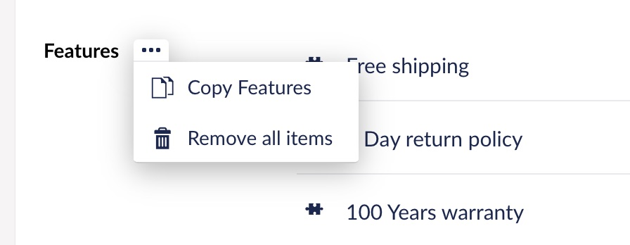

# Property Actions


This page is a work in progress. It has been migrated but the content is waiting to be updated for the new Backoffice.


Property Actions are a built-in feature that provide a generic place for secondary functionality for property editors.

Property Actions appear as a small button next to the label of the property, which expands to show the available actions. They are defined and implemented in the Property Editor, making it open as to what a Property Action is.

<figure><figcaption><p>Example of a Property Action on Nested Content Property Editor </p></figcaption></figure>

## Data Structure of Property Actions

Property Editors are an array of objects defining each action. An action is defined by the following properties:

```jsx
{
    labelKey: 'clipboard_labelForRemoveAllEntries',
    labelTokens: [],
    icon: 'trash',
    method: removeAllEntries,
    isDisabled: true
}
```

We use `labelKey` and `labelTokens` to retrieve a localized string that is displayed as the Actions label. [See localization for more info.](broken-reference)

`isDisabled` is used to disable an Action, which change the visual appearance and prevents interaction. Use this option when an action wouldn't provide any change. In the example above, the action `remove all entries` would not have any impact if there is no entries.

## Implementation

The implementation of Property Actions varies depending on whether your Property Editor is implemented with a Controller or as a Component.

### Controller Implementation

When your Property Editor is implemented with a Controller, use the following approach for the Property Action:

```jsx
angular.module("umbraco").controller("My.MarkdownEditorController", function ($scope) {

function myActionExecutionMethod() {
    alert('My Custom Property Action Clicked');
    // Disable the action so it can not be re-run
    // You may have custom logic to enable or disable the action
    // Based on number of items selected etc...
    myAction.isDisabled = true;
};

var myAction = {
    labelKey: 'general_labelForMyAction',
    labelTokens: [],
    icon: 'action',
    method: myActionExecutionMethod,
    isDisabled: false
}

var propertyActions = [
    myAction
];

this.$onInit = function () {
    if ($scope.umbProperty) {
        $scope.umbProperty.setPropertyActions(propertyActions);
    }
};


});
```

### Component Implementation

Follow this guide if your Property Editor is implemented as a Component. The Component must be configured to retrieve an optional reference to `umbProperty`. The requirement must be optional because property-editors are implemented in scenarios where it's not presented.

See the following example:

```jsx
angular.module('umbraco').component('myPropertyEditor', {
    controller: MyController,
    controllerAs: 'vm',
    require: {
        umbProperty: '?^umbProperty'
    }
    …
});
```

See the following example for implementation of Property Actions in a Component, notice the difference is that we are parsing actions to `this.umbProperty.setPropertyActions(...)`.

```jsx
var myAction = {
    labelKey: 'general_labelForMyAction',
    labelTokens: [],
    icon: 'action',
    method: myActionExecutionMethod,
    isDisabled: false
}

var propertyActions = [
    myAction
];

this.$onInit = function () {
    if (this.umbProperty) {
        this.umbProperty.setPropertyActions(propertyActions);
    }
};
```
