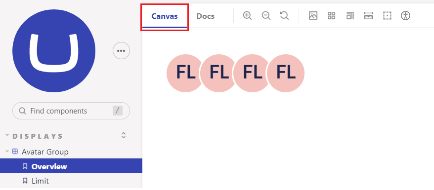
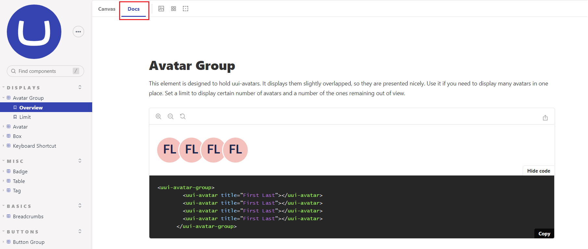

# UI Library


This page is a work in progress. It has been migrated but the content is waiting to be updated for the new Backoffice.


The Umbraco UI Library is a set of web components that can be used to build Umbraco User Interfaces. The UI Library separates the user interface from Umbraco’s business logic and creates a unified user experience. This is done with coherent styling and naming, across all the Umbraco platforms and projects including the ones developed by you.

With the UI Library, you get a collection of visual building blocks that consists of pieces to build any UI in Umbraco. Each component is a building block updating its display according to the data passed to it.

## UI Library Storybook

[Storybook](https://uui.umbraco.com/) is an application that gathers all the components together of the UI Library. It holds the documentation for the components and showcases different use case scenarios. You can explore all the components through stories reflecting their use cases.

Each story has interactive controls that allows you to change the state of the component in real-time. Every publicly available property is editable in Storybook, so you can test out custom configurations and use-cases.

You can also change the stylesheet of custom properties to see how the component will look like. Every story has a code example that you can copy and paste into your project. This will allow you to implement the components in your own packages and extensions.

## Installing the UI Library Components

The UI Library is generally available in the Backoffice from version 10.

You can also work with the components on a code level. If you want to do so, you can install the UI Library via npm, and there are two ways to import it:

1.  To import a specific component and register it at the same time, use the following command:

    ```sql
    import '@umbraco-ui/uui-button/lib';
    ```
2.  To build on top of the components functionality, you can extend its class:

    ```sql
    import { UUIButtonElement } from 
    '@umbraco-ui/uui-button/lib/uui-button.element';
    ```

For more information on installation or included components, see the [Readme file](https://github.com/umbraco/Umbraco.UI/blob/dev/packages/uui/README.md) in the [Github](https://github.com/umbraco/Umbraco.UI/tree/dev/packages/uui) project.

## Getting Started with the UI Library

The [Storybook](https://uui.umbraco.com/) is the starting point for working with the Umbraco UI Library. The Storybook contains two tabs:

1. Canvas - The Canvas tab allows to use the interactive controls.

<figure><figcaption></figcaption></figure>

2. Docs - Here, you can find code examples for all the stories and use them in your markup. You can look it up by tag name or head to the project repository, where, in the packages folder, you will find all the component packages with all the necessary scripts and examples in the readme files.

<figure><figcaption></figcaption></figure>

\
