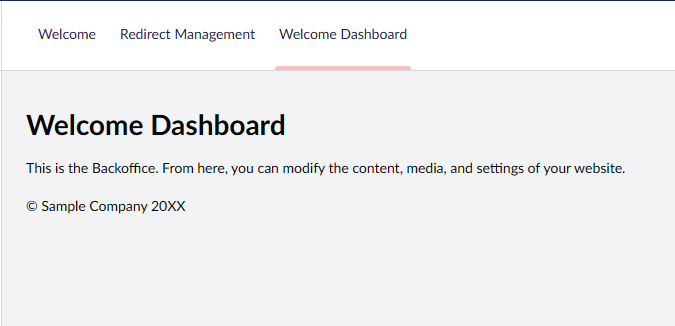

# Adding localization to the dashboard

## Overview

This is the second part of our guide to building a Custom Dashboard. This part continues work on the dashboard we built in part one: [Creating a Custom Dashboard](../creating-a-custom-dashboard.md), but further shows how to handle localization in a custom dashboard.

## Setup localization files

1. In the `welcome-dashboard` folder create a new folder called "`Localization`"
2. Then create two new files `en-us.js` and `da-dk.js`:

* Add the following code to `en-us.js`


```javascript
export default {
  welcomeDashboard: {
    heading: "Welcome",
    bodytext: "This is the Backoffice. From here, you can modify the content, media, and settings of your website.",
    copyright: "© Sample Company 20XX",
  }
};
```


* Add the following code to `da-dk.js`


```javascript
export default {
  welcomeDashboard: {
    heading: "Velkommen",
    bodytext: "Dette er Backoffice. Herfra kan du ændre indholdet, medierne og indstillingerne på din hjemmeside.",
    copyright: "© Sample Selskab 20XX",
  }
};
```


3. Now let's update our `umbraco-package.json` extensions object to register our new localization file:


```typescript
{
  ...
  "extensions": [
    {...},
    {
      "type": "localization",
      "alias": "MyPackage.Localize.EnUS",
      "name": "English (United States)",
      "meta": {
        "culture": "en-us"
      },
      "js": "/App_Plugins/welcome-dashboard/Localization/en-us.js"
    },
    {
      "type": "localization",
      "alias": "MyPackage.Localize.DaDK",
      "name": "Danish",
      "meta": {
        "culture": "da-dk"
      },
      "js": "/App_Plugins/welcome-dashboard/Localization/da-dk.js"
    }
  ]
}
```


<details>

<summary>See the entire file: umbraco-package.json</summary>


```json
{
  "$schema": "../../umbraco-package-schema.json",
  "name": "My.WelcomePackage",
  "version": "0.1.0",
  "extensions": [
    {
      "type": "dashboard",
      "alias": "my.welcome.dashboard",
      "name": "My Welcome Dashboard",
      "js": "/App_Plugins/welcome-dashboard/dist/welcome-dashboard.js",
      "elementName": "my-welcome-dashboard",
      "weight": -1,
      "meta": {
        "label": "Welcome Dashboard",
        "pathname": "welcome-dashboard"
      },
      "conditions": [
        {
          "alias": "Umb.Condition.SectionAlias",
          "match": "Umb.Section.Content"
        }
      ]
    },
    {
      "type": "localization",
      "alias": "MyPackage.Localize.EnUS",
      "name": "English (United States)",
      "meta": {
        "culture": "en-us"
      },
      "js": "/App_Plugins/welcome-dashboard/Localization/en-us.js"
    },
    {
      "type": "localization",
      "alias": "MyPackage.Localize.DaDK",
      "name": "Danish",
      "meta": {
        "culture": "da-dk"
      },
      "js": "/App_Plugins/welcome-dashboard/Localization/da-dk.js"
    }
  ]
}
```


</details>


It is currently not an option to localize the dashboard label. This is a work in progress.


We can use the `umb-localize` element to get the localizations out, which takes a key property in.

4. Let's start using the localizations. Update the `welcome-dashboard.element.ts`:


```typescript
render() {
    return html`
      <h1>
        <umb-localize key="welcomeDashboard_heading">Welcome</umb-localize>
        Dashboard
      </h1>
      <div>
        <p>
          <umb-localize key="welcomeDashboard_bodytext">
            This is the Backoffice. From here, you can modify the content,
            media, and settings of your website.
          </umb-localize>
        </p>
        <p>
          <umb-localize key="welcomeDashboard_copyright">
            © Sample Company 20XX
          </umb-localize>
        </p>
      </div>
    `;
  }
```


<details>

<summary>See the entire file: welcome-dashboard.element.ts</summary>


```typescript
import { LitElement, css, html, customElement} from "@umbraco-cms/backoffice/external/lit";
import { UmbElementMixin } from "@umbraco-cms/backoffice/element-api";

@customElement('my-welcome-dashboard')
export class MyWelcomeDashboardElement extends UmbElementMixin(LitElement) {

  render() {
    return html`
      <h1>
        <umb-localize key="welcomeDashboard_heading">Welcome</umb-localize>
        Dashboard
      </h1>
      <div>
        <p>
          <umb-localize key="welcomeDashboard_bodytext">
            This is the Backoffice. From here, you can modify the content,
            media, and settings of your website.
          </umb-localize>
        </p>
        <p>
          <umb-localize key="welcomeDashboard_copyright">
            © Sample Company 20XX
          </umb-localize>
        </p>
      </div>
    `;
  }

  static styles = [
    css`
      :host {
        display: block;
        padding: 24px;
      }
    `,
  ];
}

export default MyWelcomeDashboardElement;

declare global {
  interface HTMLElementTagNameMap {
    'my-welcome-dashboard': MyWelcomeDashboardElement;
  }
}
```


</details>

The dashboard's text will appear depending on the user's language.&#x20;

* If the user's language is Danish, the dashboard will use the text from our `da-dk` file.&#x20;
* If the user's language is English, the dashboard will use the text from our `en-us` file.


The text between the open and close tags of `umb-localize` is the fallback value in case the key can't be found or doesn't exist.


This is how our dashboard should now look like:

<div>

<figure><figcaption><p>Dashboard if the user's language is English / Fallback</p></figcaption></figure>

 

<figure><figcaption><p>Dashboard if the user's language is Danish</p></figcaption></figure>

</div>


Tip: If you do not have many translations, you can also choose to include the localizations directly in the meta-object. Read more about translations in the [**Localization**](../../extending/localization/) article.


## Going Further

With the part completed, you should have a dashboard welcoming your users' language.

In the next part, we will look into how to add more functionality to the dashboard using some of the Contexts that Umbraco offers.
