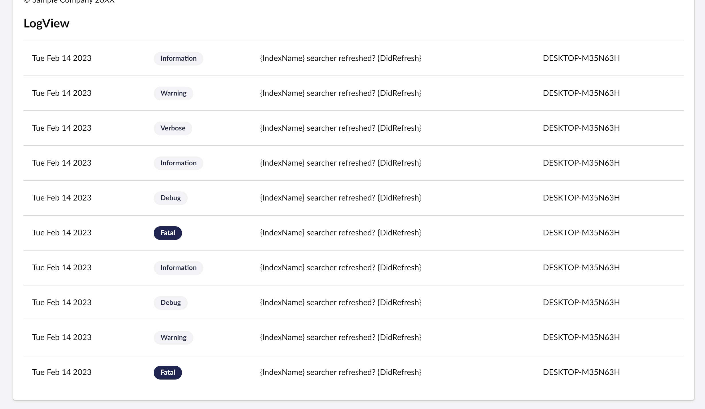

# Extending the Dashboard using Umbraco UI library

## Overview

The [Umbraco UI Library](broken-reference) is a set of web components that we can use to build Umbraco User Interfaces. It is already part of the Backoffice, so you can already start using it.

Let's start by wrapping a uui-box around everything we render. This makes our dashboard the same style as the built-in dashboards of Umbraco.

```typescript
render() {
    return html`
        <uui-box>
        
        // rest of the render code
        
        </uui-box>
    `;
}
```

The uui-box has a headline property. Let's move our headline into the headline property.

```typescript
 render() {
    return html`
        <uui-box headline="Welcome ${this._currentUser?.name ?? 'Unknown'}!">
        
        // rest of the render code
        
        </uui-box>
    `;
}
```


The [uui-box](https://uui.umbraco.com/?path=/docs/layout-box--docs) also has a headline slot if you want to add an element to the headline that includes more than a simple string.


This already looks a lot better!

<figure><figcaption></figcaption></figure>

Let's try another uui element.

Since we have a lot of information coming out from the log viewer, it could be a good idea to insert it into a proper table. The UUI Library also includes a [uui-table](https://uui.umbraco.com/?path=/docs/layout-table-table--docs), so let's use that.

in the renderLogView method, wrap `uui-table` around `_logs.map`:

```typescript
renderLogView() {
    if (!this._logs?.length) return html`There is no logs`;
    return html`<uui-table> ${this._logs.map((log) => this.renderLogViewItem(log))} </uui-table>`;
}
```

Then update the `renderLogViewItem` method with `uui-table-row` and `uui-table-cell`

```typescript
renderLogViewItem(item: LogMessageResponseModel) {
    const machineName = item.properties?.find((prop) => prop.name == 'MachineName');
    return html`<uui-table-row>
        <uui-table-cell>${item.timestamp ? this.renderTimestamp(item.timestamp) : nothing}</uui-table-cell>
        <uui-table-cell>${item.level}</uui-table-cell>
        <uui-table-cell>${item.messageTemplate}</uui-table-cell>
        <uui-table-cell>${machineName?.value}</uui-table-cell>
    </uui-table-row>`;
}
```

Let's put the `item.level` into a `uui-tag` for a better visual effect

```typescript
<uui-table-cell>
    <uui-tag look=${item.level == LogLevelModel.FATAL ? 'primary' : 'secondary'}> ${item.level} </uui-tag>
</uui-table-cell>
```

And here are the results:

<figure><figcaption></figcaption></figure>

Your dashboard component should now look like this:

<details>

<summary>welcome-dashboard.element.ts</summary>

```typescript
import { UUITextStyles } from '@umbraco-ui/uui-css';
import { UmbLogViewerRepository } from '@umbraco-cms/backoffice/logviewer';
import { UmbElementMixin } from '@umbraco-cms/backoffice/element-api';
import { LitElement, css, customElement, html, nothing, state } from '@umbraco-cms/backoffice/external/lit';
import {
	UMB_CURRENT_USER_STORE_CONTEXT_TOKEN,
	UmbCurrentUserStore,
	UmbLoggedInUser,
} from '@umbraco-cms/backoffice/current-user';
import { LogLevelModel, LogMessageResponseModel } from '@umbraco-cms/backoffice/backend-api';

@customElement('my-welcome-dashboard')
export class MyWelcomeDashboardElement extends UmbElementMixin(LitElement) {
	@state()
	private _currentUser?: UmbLoggedInUser;

	@state()
	private _logs?: LogMessageResponseModel[];

	private _currentUserStore?: UmbCurrentUserStore;
	private _logRepository = new UmbLogViewerRepository(this);

	constructor() {
		super();
		this._getLogs();

		this.consumeContext(UMB_CURRENT_USER_STORE_CONTEXT_TOKEN, (instance) => {
			this._currentUserStore = instance;
			this._observeCurrentUser();
		});
	}

	private async _observeCurrentUser() {
		if (!this._currentUserStore) return;

		this.observe(this._currentUserStore.currentUser, (currentUser) => {
			this._currentUser = currentUser;
		});
	}

	private async _getLogs() {
		const logs = await this._logRepository.getLogs({
			skip: 0,
			take: 10,
		});
		if (!logs.data) return;
		this._logs = logs.data.items;
	}

	render() {
		return html`
			<uui-box headline="Welcome ${this._currentUser?.name ?? 'Umbraco HQ'}!">
				${this.renderHappyAnniversary()}
				<div>
					<p>This is the Backoffice. From here, you can modify the content, media, and settings of your website.</p>
					<p>© Sample Company 20XX</p>
				</div>
				<div>
					<h2>LogView</h2>
					${this.renderLogView()}
				</div>
			</uui-box>
		`;
	}

	renderHappyAnniversary() {
		if (!this._currentUser?.createDate) return;
		const today = new Date();
		const createDate = new Date(this._currentUser?.createDate);

		if (
			today.getDate() == createDate.getDate() &&
			today.getMonth() == createDate.getMonth() &&
			today.getFullYear() > createDate.getFullYear()
		)
			return html`Happy Anniversary! 🥳🎉`;
		return;
	}

	renderLogView() {
		if (!this._logs?.length) return html`There is no fatal errors`;
		return html`<uui-table> ${this._logs.map((log) => this.renderLogViewItem(log))} </uui-table>`;
	}

	renderLogViewItem(item: LogMessageResponseModel) {
		const machineName = item.properties?.find((prop) => prop.name == 'MachineName');
		return html`<uui-table-row>
			<uui-table-cell>${item.timestamp ? this.renderTimestamp(item.timestamp) : nothing}</uui-table-cell>
			<uui-table-cell>
				<uui-tag look=${item.level == LogLevelModel.FATAL ? 'primary' : 'secondary'}> ${item.level} </uui-tag>
			</uui-table-cell>
			<uui-table-cell>${item.messageTemplate}</uui-table-cell>
			<uui-table-cell>${machineName?.value}</uui-table-cell>
		</uui-table-row>`;
	}

	renderTimestamp(t: string) {
		const timestamp = new Date(t).toDateString();
		return html`${timestamp}`;
	}

	static styles = [
		UUITextStyles,
		css`
			:host {
				display: block;
				padding: var(--uui-size-layout-1);
			}
		`,
	];
}

export default MyWelcomeDashboardElement;

declare global {
	interface HTMLElementTagNameMap {
		'my-welcome-dashboard': MyWelcomeDashboardElement;
	}
}
```

</details>

And that's it! The `uui-table-row` also have a selectable property. We advise you to continue to experiment with different UUI elements from the UI library to build awesome interfaces!&#x20;
