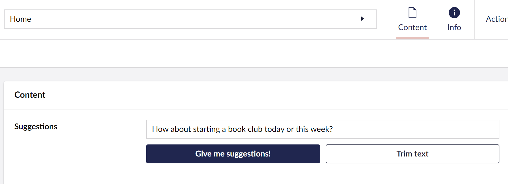

# Creating a Property Editor


This page is a work in progress. It will be updated as the software evolves.


This guide explains how to set up a property editor and hook it into Umbraco's Data Types. It also covers the creation of a basic property editor and how we can test our property editor.

The steps we will go through in part 1 are:

* ​[Setting up a Plugin](./#setting-up-a-plugin)​
* [​Creating a Web Component​](./#creating-a-web-component)
* ​[Registering the Data Type in Umbraco](./#registering-the-data-type-in-umbraco)
* [Adding styling and setting up events in Web Components](./#adding-styling-and-setting-up-events-in-the-web-components)
* [Setup Event Logic](./#setup-event-logic)

This tutorial uses Typescript and Lit with Umbraco, It is expected that your package is already [set up to use Typescript and Lit](../../extending/development-flow/vite-package-setup.md).

To see how to set up an extension in Umbraco using Typescript and Lit, read the article [Creating your first extension](../creating-your-first-extension.md).

### **Resources**

This tutorial will not go in-depth on how Typescript and Lit work. To learn about Typescript and Lit, you can find their documentation below:

* [Typescript Docs](https://www.typescriptlang.org/docs/)
* [Lit Docs](https://lit.dev/docs/)

### The End Result

At the tutorial's end, we'll have a Umbraco Suggestions Data Type, registered in the backoffice, and assigned to a Document Type. This Data Type can create and suggest values.

The entire `welcome-dashboard.element.ts` file is available for reference at the end of the step to confirm your placement for code snippets.


At each step, you will find a dropdown for`suggestions-property-editor-ui.element.ts, and umbraco-package.json`to confirm your placement for code snippets.


### Setting up a plugin

1. Follow the [Vite Package Setup](../../extending/development-flow/vite-package-setup.md) by creating a new project folder called "`suggestions`" in `App_Plugins`.
2. Then create the manifest file named `umbraco-package.json` at the root of the `suggestions` folder. Here we define and configure our dashboard.
3. Add the following code to `umbraco-package.json`:

```json
{
    "$schema": "../../umbraco-package-schema.json",
    "name": "My.AwesomePackage",
    "version": "0.1.0",
    "extensions": [
        {
            "type": "propertyEditorUi",
            "alias": "My.PropertyEditorUi.Suggestions",
            "name": "My Suggestions Property Editor UI",
            "js": "/App_Plugins/Suggestions/dist/suggestions.js",
            "elementName": "my-suggestions-property-editor-ui",
            "meta": {
                "label": "Suggestions",
                "icon": "icon-list",
                "group": "common",
                "propertyEditorSchemaAlias": "Umbraco.TextBox"
            }
        }
    ]
}
```


Make sure to restart the application after you create and update`umbraco-package.json`


### Creating a Web Component

Now let's create the web component we need for our property editor.

1. Create a file in the `src` folder with the name `suggestions-property-editor-ui.element.ts`
2. In this new file, add the following code:

```typescript
import { LitElement, html, customElement, property } from "@umbraco-cms/backoffice/external/lit";
import { UmbPropertyEditorUiElement } from "@umbraco-cms/backoffice/extension-registry";

@customElement('my-suggestions-property-editor-ui')
export class MySuggestionsPropertyEditorUIElement
    extends LitElement
    implements UmbPropertyEditorUiElement
{
    @property({ type: String })
    public value = "";

    render() {
        return html`I'm a property editor!`;
    }
}

declare global {
    interface HTMLElementTagNameMap {
        'my-suggestions-property-editor-ui': MySuggestionsPropertyEditorUIElement;
    }
}
```


In the `vite.config.ts` file replace the `entry` to our newly created `.ts` file: `entry: "src/suggestions-property-editor-ui.element.ts".`


Now our basic parts of the editor are done, namely:

* The package manifest, telling Umbraco what to load
* The web component for the editor

3. Restart the application.

### Registering the Data Type in Umbraco

1. Add our newly added property editor "Suggestions" in the Document Type and save it.

<figure><figcaption></figcaption></figure>

We can now edit the assigned property's value with our new property editor.

We should now have a property editor that looks like this:

<figure><figcaption></figcaption></figure>

### Adding styling and setting up events in the Web Components

Let's start by creating an input field and some buttons that we can style and hook up to events.

1. Update the render method to include some input fields and buttons in the `suggestions-property-editor-ui.element.ts` file:

```typescript
render() {
    return html`
      <uui-input
        id="suggestion-input"
        class="element"
        label="text input"
        .value=${this.value || ""}
      >
      </uui-input>
      <div id="wrapper">
        <uui-button
          id="suggestion-button"
          class="element"
          look="primary"
          label="give me suggestions"
        >
          Give me suggestions!
        </uui-button>
        <uui-button
          id="suggestion-trimmer"
          class="element"
          look="outline"
          label="Trim text"
        >
          Trim text
        </uui-button>
      </div>
    `;
  }
```


The Umbraco UI library is already a part of the backoffice, which means we can start using it


2. Add some styling. Update the import from lit to include CSS:

```typescript
import { LitElement, html, css } from "@umbraco-cms/backoffice/external/lit";
```

3. Add the CSS:

```typescript
render() {
  ...
}

static styles = [
  css`
    #wrapper {
      margin-top: 10px;
      display: flex;
      gap: 10px;
    }
    .element {
      width: 100%;
    }
  `,
];
```

It should now look something like this:

<figure><figcaption></figcaption></figure>

It's starting to look good! Next, let's look into setting up the event logic.

### Setup Event Logic

#### Setup Input Field

Let's start with the input field. When we type something in the input field, we want the property editor's value to change to the input field's current value.

We then have to dispatch an `property-value-change` event:

```typescript
  #onInput(e: InputEvent) {
    this.value = (e.target as HTMLInputElement).value;
    this.#dispatchChangeEvent();
  }

  #dispatchChangeEvent() {
    this.dispatchEvent(new CustomEvent('property-value-change'));
  }

  render() {
    return html`
      <uui-input
        id="suggestion-input"
        class="element"
        label="text input"
        .value=${this.value || ""}
        @input=${this.#onInput}
      >
      </uui-input>

      ....
}
```

Let's look at the suggestions button next.

#### Setup Suggestions Button

* When we press the suggestion button we want the text to update to the suggestion that we get. Similar to how the value of our property editor changes when we write in the input field.
* We also want the value to change when we press the suggestion button.

1. Update the import for Lit:

```typescript
import { LitElement, html, css, customElement, property, state } from "@umbraco-cms/backoffice/external/lit";
```

2. Add suggestions to the property editor:

```typescript

  @property({ type: String })
  public value = "";

  @state()
  private _suggestions = [
    'You should take a break',
    'I suggest that you visit the Eiffel Tower',
    'How about starting a book club today or this week?',
    'Are you hungry?',
  ];

```

3. Update the suggestion button in the render method to call a `onSuggestion` method when we press the button:

```typescript
 #onSuggestion() {
    const randomIndex = (this._suggestions.length * Math.random()) | 0;
    this.value = this._suggestions[randomIndex];
    this.#dispatchChangeEvent();
  }

 render() {
    return html`

    ...

    <uui-button
      id="suggestion-button"
      class="element"
      look="primary"
      label="give me suggestions"
      @click=${this.#onSuggestion}
      >
        Give me suggestions!
      </uui-button>
    ...
  `;
 }
```

<details>

<summary>See the entire file: <code>suggestions-property-editor-ui.element.ts</code></summary>


```typescript
import { LitElement, css, html, customElement, property, state } from "@umbraco-cms/backoffice/external/lit";
import { UmbPropertyEditorExtensionElement } from "@umbraco-cms/backoffice/extension-registry";

@customElement('my-suggestions-property-editor-ui')
export class MySuggestionsPropertyEditorUIElement
    extends LitElement
    implements UmbPropertyEditorExtensionElement
{
    @property({ type: String })
    public value = "";

    @state()
    private _suggestions = [
        "You should take a break",
        "I suggest that you visit the Eiffel Tower",
        "How about starting a book club today or this week?",
        "Are you hungry?",
    ];

    #onInput(e: InputEvent) {
        this.value = (e.target as HTMLInputElement).value;
        this.#dispatchChangeEvent();
    }

    #onSuggestion() {
        const randomIndex = (this._suggestions.length * Math.random()) | 0;
        this.value = this._suggestions[randomIndex];
        this.#dispatchChangeEvent();
    }

    #dispatchChangeEvent() {
        this.dispatchEvent(new CustomEvent("property-value-change"));
    }

    render() {
        return html`
            <uui-input
                id="suggestion-input"
                class="element"
                label="text input"
                .value=${this.value || ""}
                @input=${this.#onInput}
            >
            </uui-input>
            <div id="wrapper">
                <uui-button
                    id="suggestion-button"
                    class="element"
                    look="primary"
                    label="give me suggestions"
                    @click=${this.#onSuggestion}
                >
                    Give me suggestions!
                </uui-button>
                <uui-button
                    id="suggestion-trimmer"
                    class="element"
                    look="outline"
                    label="Trim text"
                >
                    Trim text
                </uui-button>
            </div>
        `;
    }

    static styles = [
        css`
            #wrapper {
                margin-top: 10px;
                display: flex;
                gap: 10px;
            }
            .element {
                width: 100%;
            }
        `,
    ];
}

declare global {
    interface HTMLElementTagNameMap {
        'my-suggestions-property-editor-ui': MySuggestionsPropertyEditorUIElement;
    }
}
```


</details>

4. Clear your cache, reload the document, and see the Suggestions Data Type running.

<figure><figcaption></figcaption></figure>

When we save or publish, the value of the Data Type is now automatically synced to the current content object and sent to the server.

Learn more about extending this service by visiting the [Property Editors page](../../extending/extension-types/property-editors/).

## Going further

With all the steps completed, we have created a Suggestion data type running in our property editor.

In the next part, we will look at adding configurations to our property editor.
