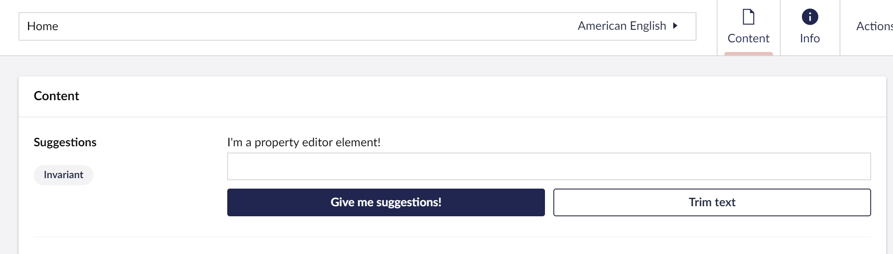

# Creating a Property Editor


This page is a work in progress. It will be updated as the software evolves.


This guide explains how to set up a property editor, hook it into Umbraco's Data Types, create a basic property editor, and how we can test our property editor.

The steps we will go through in part 1 are:

* ​[Setting up a Plugin](./#1.-setting-up-a-plugin)​
* ​[Writing basic web components](./#2.-writing-basic-web-components)​
* ​[Registering the Data Type in Umbraco](./#3.-registering-the-data-type-in-umbraco)
* [Adding styling and setting up events in Web Components](./#4.-adding-styling-and-setting-up-events-in-the-web-components)

### Prerequisites

This tutorial uses Typescript and Lit with Umbraco, so it does not cover Typescript or Lit. It is expected that your package is already set up to use Typescript and Lit. To read about setting up an extension in Umbraco using Typescript and Lit, please read the article [Creating your first extension](../creating-your-first-extension.md).

For resources on Typescript or Lit, you can find some here:

* [Typescript Docs](https://www.typescriptlang.org/docs/)
* [Lit Docs](https://lit.dev/docs/)

There are a lot of parallels with Creating a Custom Dashboard. The tutorial [Creating a Custom Dashboard](../creating-a-custom-dashboard.md) is worth a read too.

### The End Result

By the end of this tutorial, we will have a Suggestions data type running inside of Umbraco, registered as a Data Type in the backoffice, and assigned to a Document Type. The data type can create and suggest values.

### 1. Setting up a plugin

Assuming you have read the tutorial [Creating your first extension](../creating-your-first-extension.md), you should have a folder named App\_Plugins in your project. Let's call our project Suggestions. Start by creating a folder in App\_Plugins called `Suggestions`.

Now create the manifest file named `umbraco-package.json` at the root of the `Suggestions` folder. Here we define and configure our dashboard.

Add the following code

```json
{
  "$schema": "../../umbraco-package-schema.json",
  "name": "My.AwesomePackage",
  "version": "0.1.0",
  "extensions": [
    {
      "type": "propertyEditorUi",
      "alias": "My.Suggestions",
      "name": "My Suggestions",
      "js": "/App_Plugins/Suggestions/dist/my-suggestions.js",
      "elementName": "my-property-editor-ui-suggestions",
      "meta": {
        "label": "My Suggestions",
        "pathname": "my-suggestions",
        "icon": "document",
        "group": "common",
        "propertyEditorModel": "Umbraco.JSON"
      }
    }
  ]
}
```


Make sure to restart the application after you create and update`umbraco-package.json`


### 2. Writing basic Web Components

Let's start with creating a folder `src` in our Suggestions folder. We want to start creating the web components we need for our property editor. Create two files in the `src` folder with the names

* property-editor-ui-suggestions.element.ts
* suggestions-input.element.ts


We will use the `property-editor-ui-suggestions.element` file to handle the Property Editor's configuration and the `suggestions-input.element` file for the visual input. Splitting the configuration and the visual aspect apart gives us the opportunity to reuse the web components for other things. We could for example have a different configuration using the same visuals, or a different visual for the the same configuration.


In the `property-editor-ui-suggestions.element` file we'll add:

```typescript
import { LitElement, html } from "lit";
import { customElement, property } from "lit/decorators.js";
import { UmbPropertyEditorExtensionElement } from "@umbraco-cms/backoffice/extension-registry";
import type { UmbDataTypePropertyCollection } from '@umbraco-cms/backoffice/components';
import { UmbElementMixin } from "@umbraco-cms/backoffice/element-api";
import './suggestions-input.element.js';

@customElement("my-property-editor-ui-suggestions")
export class MyPropertyEditorUISuggestionsElement
  extends UmbElementMixin(LitElement)
  implements UmbPropertyEditorExtensionElement
{
  @property({ type: String })
  public value = "";

  @property({ type: Array, attribute: false })
  public set config(config: UmbDataTypePropertyCollection) {
    // we will add configuration here later
  }

  render() {
    return html`I'm a property editor element!  
      <my-suggestions-input .value=${this.value}></my-suggestions-input>`;
  }
}

export default MyPropertyEditorUISuggestionsElement;

declare global {
  interface HTMLElementTagNameMap {
    "my-property-editor-ui-suggestions": MyPropertyEditorUISuggestionsElement;
  }
}
```

in the `suggestions-input.element` file we'll add:

```typescript
import { LitElement, html } from 'lit';
import { customElement, state } from 'lit/decorators.js';
import { FormControlMixin } from '@umbraco-ui/uui-base/lib/mixins';

@customElement('my-suggestions-input')
export class MySuggestionsInputElement extends FormControlMixin(LitElement) {
	@state()
	private _suggestions = [
		'You should take a break',
		'I suggest that you visit the Eiffel Tower',
		'How about starting a book club today or this week?',
		'Are you hungry?',
	];

	protected getFormElement() {
		return undefined;
	}

	render() {
		return html`I'm the property editor's input element!`;
	}
}

export default MySuggestionsInputElement;

declare global {
	interface HTMLElementTagNameMap {
		'my-suggestions-input': MySuggestionsInputElement;
	}
}
```

Now our basic parts of the editor are done, namely:

* The package manifest, telling Umbraco what to load
* The web components for the editor

### 3. Registering the Data Type in Umbraco

We will now restart our application. In the Document Type, let's add our newly added property editor "Suggestions" and save it.

<figure><figcaption></figcaption></figure>

We can now edit the assigned property's value with our new property editor.

We should now have a property editor that looks like this

<figure><figcaption></figcaption></figure>

### 4. Adding styling and setting up events in the Web Components

Let's start by creating an input field and some buttons that we can style and hook up to events. Open the `suggestions-input.element` file and update the render method to include some input fields and buttons:


The Umbraco UI library is already a part of the backoffice, which means we can start using it


```typescript
render() {
  return html`<div class="blue-text">${this.value}</div>
    <uui-input
      id="suggestion-input"
      class="element"
      label="text input"
      .value="${this.value || ''}
      @input=${this.#onInput}"></uui-input>		
    <div id="wrapper">
      <uui-button
	id="suggestion-button"
	class="element"
	look="primary"
	label="give me suggestions"
	@click=${this.#onSuggestion}>
	Give me suggestions!
     </uui-button>
     <uui-button
       id="suggestion-trimmer"
       class="element"
       look="outline"
       label="Trim text"
       @click=${this.#onTextTrim}>
       Trim text
     </uui-button>
   </div>
   `;
}
```

To get rid of the errors let's create the methods that will be called when the events are triggered:

```typescript
#onInput(e: UUIInputEvent) {
  /* Code will be added later! */
}
    
#onSuggestion() {
  /* Code will be added later! */
}
    
#onTextTrim() {
  /* This method will trim our text later! */
}

render() {
  ....
}
```

Next, let's add some styling Update the import from lit to include CSS:

```typescript
import { LitElement, html, css } from 'lit';
```

Then add the CSS:

```typescript
render() {
  ...
}

static styles = [
  css`
    .blue-text {
      color: var(--uui-color-focus);
    }
    #wrapper {
      margin-top: 10px;
      display: flex;
      gap: 10px;
    }
    .element {
      width: 100%;
    }
  `,
];
```

It should now look something like this:

<figure><figcaption></figcaption></figure>

It's starting to look good! Next, let's look into setting up the event logic.

We will start by creating a new method called `dispatchChangeEvent` that we will call every time our property editor's value has changed. This way our other file `property-editor-ui-suggestions.element` will be able to update the value.

```typescript
#dispatchChangeEvent() {
  this.dispatchEvent(new CustomEvent('change', { bubbles: true, composed: true }));
}

render() {
  ...
}
```

We want our value to change when we enter a new in the input field, but also when we request a suggestion. Let's update the `onInput` and `onSuggestion` methods:

```typescript
import { UUIInputEvent } from '@umbraco-ui/uui';
```

```typescript
#onInput(e: UUIInputEvent) {
  this.value = e.target.value as string;
  this.#dispatchChangeEvent();
}
    
#onSuggestion() {
  const randomIndex = (this._suggestions.length * Math.random()) | 0;
  this.value = this._suggestions[randomIndex];
  this.#dispatchChangeEvent();
}
```

Our file should now look something like this:

```typescript
import { LitElement, html, css } from 'lit';
import { customElement, state } from 'lit/decorators.js';
import { UUIInputEvent } from '@umbraco-ui/uui';
import { FormControlMixin } from '@umbraco-ui/uui-base/lib/mixins';

@customElement('my-suggestions-input')
export class MySuggestionsInputElement extends FormControlMixin(LitElement) {
  @state()
  private _suggestions = [
    'You should take a break',
    'I suggest that you visit the Eiffel Tower',
    'How about starting a book club today or this week?',
    'Are you hungry?',
  ];
	
  protected getFormElement() {
    return undefined;
  } 

  #onInput(e: UUIInputEvent) {
    this.value = e.target.value as string;
    this.#dispatchChangeEvent();
  }
	    
  #onSuggestion() {
    const randomIndex = (this._suggestions.length * Math.random()) | 0;
    this.value = this._suggestions[randomIndex];
    this.#dispatchChangeEvent();
  }
	    
  #onTextTrim() {
  /* This method will trim our text later! */
  }
		
  #dispatchChangeEvent() {
    this.dispatchEvent(new CustomEvent('change', { bubbles: true, composed: true }));
  }
	
  render() {
    return html`<div class="blue-text">${this.value}</div>
      <uui-input
	id="suggestion-input"
	class="element"
	label="text input"
	.value="${this.value || ''}"
	@input=${this.#onInput}></uui-input>	
      <div id="wrapper">
        <uui-button
          id="suggestion-button"
	  class="element"
	  look="primary"
	  label="give me suggestions"
	  @click=${this.#onSuggestion}>
	  Give me suggestions!
	</uui-button>
	<uui-button
	  id="suggestion-trimmer"
	  class="element"
	  look="outline"
	  label="Trim text"
	  @click=${this.#onTextTrim}>
	  Trim text
	</uui-button>
      </div>
    `;
  }
  
  static styles = [
    css`
      .blue-text {
        color: var(--uui-color-focus);
      }
      #wrapper {
        margin-top: 10px;
        display: flex;
        gap: 10px;
      }
      .element {
        width: 100%;
      }
    `,
  ];
}

export default MySuggestionsInputElement;

declare global {
  interface HTMLElementTagNameMap {
    'my-suggestions-input': MySuggestionsInputElement;
  }
}
```

The last this we need to do is listen for the dispatched event in the property-editor-ui-suggestions.element.ts file and update our value. For now, we will also print the value output in the render method to make sure it works, you may remove it afterward.

Go to the `property-editor-ui-suggestions.element` and add an event listener and method:

```typescript
import { MySuggestionsInputElement } from './suggestions-input.element.ts';
```

```typescript
#onChange(e: CustomEvent) {
  this.value = (e.target as MySuggestionsInputElement).value as string;
  this.dispatchEvent(new CustomEvent('property-value-change'));
}

render() {
  return html`${this.value}<my-suggestions-input
    .value=${this.value}
    @change=${this.#onChange}></my-suggestions-input>`;
}
```

Next, clear the cache, reload the document, and see the Suggestions Data Type running.

<figure><figcaption></figcaption></figure>

The file `property-editor-ui-suggestions.element` should now look something like this:

```typescript
import { html } from 'lit';
import { customElement, property } from 'lit/decorators.js';
import { MySuggestionsInputElement } from './suggestions-input.element.js';
import { UmbPropertyEditorExtensionElement } from '@umbraco-cms/backoffice/extension-registry';
import { UmbLitElement } from '@umbraco-cms/internal/lit-element';
import { UmbDataTypePropertyCollection } from '@umbraco-cms/backoffice/data-type';
import './suggestions-input.element.js';

@customElement('my-property-editor-ui-suggestions')
export class MyPropertyEditorUISuggestionsElement extends UmbLitElement implements UmbPropertyEditorExtensionElement {
	
  @property({ type: String })
  public value = '';  
    
  @property({ type: Array, attribute: false })
  public set config(config: UmbDataTypePropertyCollection) {
    // we will add configuration here later
  }
    
  #onChange(e: CustomEvent) {
    this.value = (e.target as MySuggestionsInputElement).value as string;
    this.dispatchEvent(new CustomEvent('property-value-change'));
  }

  render() {
    return html`${this.value}<my-suggestions-input
      .value=${this.value}
      @change=${this.#onChange}></my-suggestions-input>`;
  }
}

export default MyPropertyEditorUISuggestionsElement;

declare global {
  interface HTMLElementTagNameMap {
    'my-property-editor-ui-suggestions': MyPropertyEditorUISuggestionsElement;
  }
}
```

When we save or publish, the value of the Data Type is now automatically synced to the current content object and sent to the server.

Learn more about extending this service by visiting the [Property Editors page](../../extending/property-editors/).
