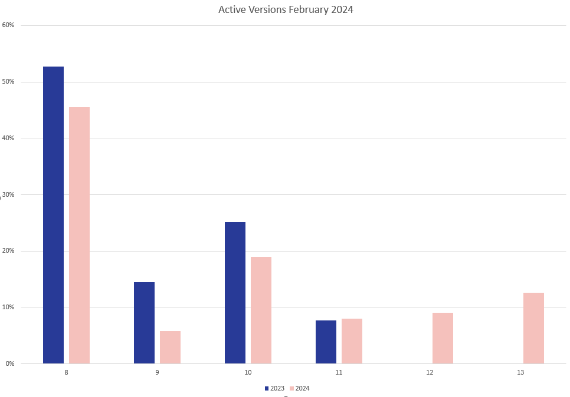

# Telemetry Status February 2024

Last year, around this time, we released our [first telemetry report](https://umbraco.com/blog/how-umbraco-cms-is-used-telemetry-status-february-2023/). However, most of all, it was a disclaimer because we only had a few sites, that opted into detailed telemetry. We asked for your help and hoped to also count your project next year - which is now this year. And you did opt in! The number of responses has increased by 7000%, and there is now no reason for a disclaimer. #H5YR

Be aware though, that the telemetry does not cover V7 sites at all. However, it includes only basic data for V8 (from v8.10+), as the detailed telemetry was first introduced with v9.5.

### Adoption of new features
One of the things we at HQ are curious about is, how the adoption of new features is going. In v11 we introduced the [Block Grid](https://docs.umbraco.com/umbraco-cms/fundamentals/backoffice/property-editors/built-in-umbraco-property-editors/block-editor/block-grid-editor) (also added to v10.4+). We now see that it is used in 21% of all projects although the BlockList outshines it with 59%. 

Another new feature is the [Content Delivery API](https://docs.umbraco.com/umbraco-cms/reference/content-delivery-api). We see this enabled on 6% of all projects. However, we also see that 27% have disabled public access. This number shouldn't be higher than the number of elements, as the Content Delivery API is disabled by default. A takeaway from this is that it is important to know that the Content Delivery API is disabled by default.

Since the last telemetry report, we've also started counting the number of External Login Providers. Here, UmbracoID seems to be the primary provider. However, there are still 5% that use other external providers and 1% that have implemented more than one. 

### Average project
What is an average project? Based on average calculations, we'll see that such a project has 1023 content items based on 58 document- and element types. It has 925 media items, 8 users, 2,5 nodes in the root and 1,7 languages. However, this average hides the fact, that there are some big projects and a lot of smaller ones. That goes hand in hand with our vision. To be the "preferred CMS for partners and mid-market to lower enterprise" but still grow in the actual number of Umbraco installations.
  
Looking at the average "smaller" projects, we see:
* 63% have less than 100 content nodes
* 58% have less than 100 media items
* 68% have only one language
* 44% have only one root node
* 85% don't have any members

This is similar to what we saw last year. But this year, with a much bigger dataset, we can also say more about the bigger projects. What we see is that:

* 4% have more than 5000 content nodes
* 3% have more than 5000 media items 
* 8% have more than 200 document types
* 2% have more than 5 languages
* 3% have more than 250 members

### Long Term Supported (LTS) versions are popular - and they should be
Besides the detailed telemetry data behind the numbers above, we also collect the basic telemetry that has been reported since version 8.10. In the chart below, we see that there still are a few V8 sites running (45%). But we also see, that the Long Term Supported (LTS) versions are popular. Although V13 hasn't been public for more than a couple of months, it's adopted by 13%. Only surpassed by the V10 Long Term Supported (19%) and V8.

This behaviour is aligned with how we hoped our release schedules would work. Adopt new Standard Term Supported (STS) versions if you can make use of the latest functionality. Or stay on Long Term Supported (LTS) versions if you want minimal work related to upgrades. 

And, as last year, the two most installed packages outside HQ are uSync (24%) and Contentment (9%).

### Some final notes
We've only counted projects AspEnvironment set to Production, as we believe this is the best indicator for only counting production sites. Among the responses, there are some pretty wild outliers. Especially, when it comes to the number of languages, media, content, macros, domains, users, examine indexes, members, root nodes and pretty much everything. However, these individual outliers are not mentioned in this blog post.

As the last word on this article: Thank you, for opting in. I'm sure it will help us build an even better Umbraco CMS in the future.
