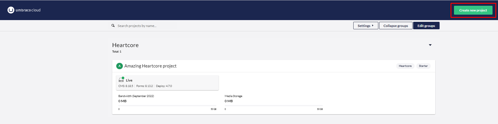
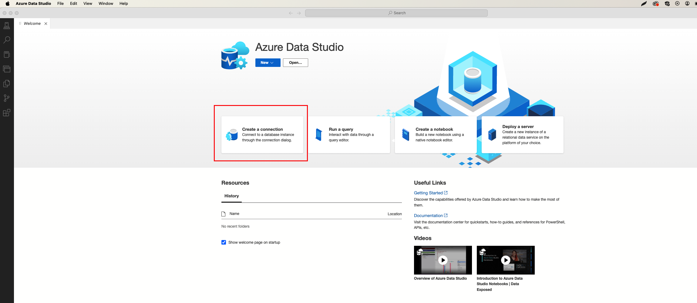

# Create a Cloud Project

Starting your journey with Umbraco Cloud begins with creating your first project. A streamlined process designed to get you up and running quickly with all the power of Umbraco and the cloud, without complex setup.

You can either create a [trial project](./#umbraco-cloud-trialproject) or a project from the [Umbraco Cloud Portal](./#creating-a-project-from-the-umbraco-cloud-portal). Both provide access to the core Umbraco Cloud experience, but there are key differences to keep in mind depending on your goals.

## Umbraco Cloud Trial Project

A trial project provides an opportunity to explore the Cloud platform without any commitment.

The easiest way to start with an Umbraco Cloud project is to take a [14-day free trial](https://try.umbraco.com/cloud). The project is automatically created, and you are ready to start within a few minutes.

Since everything is already set up for you, it is recommended that you get to know your project before you start building.

You can either work directly in the backoffice on the Cloud environment or [clone down the project to your local machine](../../build-and-customize-your-solution/handle-deployments-and-environments/working-locally/).


Creating a Trial Project


### Can I convert a Trial Project to a Paid Project?

Yes. You can upgrade to a Paid project within the 14 days trial period without losing your work. You can upgrade your trial to a paid plan within the Umbraco Cloud portal.

Umbraco Cloud provides a seamless transition from a trial to a paid plan. You can adjust your plan or resources as your project evolves.

## Creating a Project from the Umbraco Cloud Portal

You can create a paid project from the Cloud Portal, which offers the latest features and full control.

To create a project from the Umbraco Cloud Portal:

1. Log in to the [Umbraco Cloud Portal](https://www.s1.umbraco.io/projects) with your credentials.
2. Click **Create Project**.

<figure><figcaption>
Create Project Button on Cloud Portal
</figcaption></figure>

3. Click **Select Cloud Project** from the list of projects.
4. Choose a **Plan Selection** as per your choice.
5. Choose the Umbraco version for your project.
6. Enter the **Project Name**.
7. Choose a **Region**.
8. Choose a **Project Owner.**
9. Add a **Technical Contact** to your project.
10. Click **Continue**.
11. Verify that everything looks correct in the **Summary** page.
12. Select **I have read and agree to the terms and conditions and the Data Processing Agreement**.
13. Click **Create Project**.

## Comparison between Trial v/s Paid Projects

| Feature               | Trial Project       | Paid Project                                         |
| --------------------- | ------------------- | ---------------------------------------------------- |
| **Price**             | Free                | Depends on plan                                      |
| **Duration**          | 14 days             | Unlimited                                            |
| **Environments**      | Live                | Dev, Staging, Flexible, Live (depending on the plan) |
| **Features**          | Limited             | Latest Features (can be customized)                  |
| **Production Use**    | Not allowed         | Fully supported                                      |
| **Domains**           | 1 assigned domain\* | Custom domains                                       |
| **Support**           | Not included        | Depends on plan                                      |
| **Upgrade Available** | Yes                 | Depends on plan                                      |

\* _It is not possible to publish a website with a Trial project._

## Naming a Project

When you create a Trial project a unique project name will be generated for you.

When you create a new Project from the Umbraco Cloud Portal you must give the project a name.

All project names are unique.

## Project Overview

Once a project is created, you can get an overview of it from the Umbraco Cloud Portal:

1. Log in to the [Umbraco Cloud Portal](https://www.s1.umbraco.io/projects).
2. Select your Project from the **Projects** dashboard.
3. Click on **Overview** from the left side menu.

<figure><figcaption>
Project Overview
</figcaption></figure>

The **Overview** menu consists of:

* A place to manage the [**Environments**](../../build-and-customize-your-solution/handle-deployments-and-environments/manage-environments.md) on your project.
* A place to manage the [**Team**](../project-features/team-members/) that has access to your project.
* A page that gives a **Summary** of your project, like when it was created, that plan, and more.

<figure><figcaption>
Summary page
</figcaption></figure>

## Different ways to start an Umbraco Cloud project

Not every project starts from scratch. Depending on your needs, there are other ways to kick-start your Cloud journey:


[migrate-to-umbraco-cloud.md](migrate-to-umbraco-cloud.md)



[baselines.md](baselines.md)

