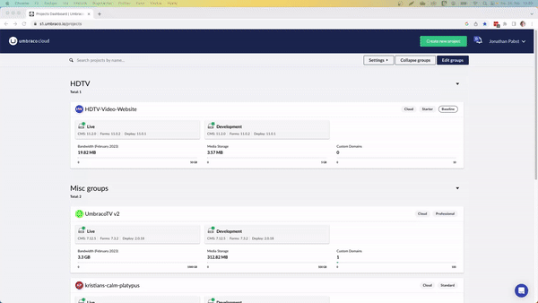

# Baselines

A Baseline Child project is similar to a Fork (forked repository) on GitHub. A clone is created of an existing project while maintaining a connection between the two projects. The connection exists between the Live environment of the **Baseline project**, and the left-most mainline environment of the **Child project**.

Any project can act as a Baseline project.

The basic idea is that you have a project that contains all your standard Umbraco packages/components. Some default Document Types which you want to use as a baseline for future projects is also configured. When you've made changes to your Baseline project, you push these changes out to all the Child projects with a click of a button.

## Video Tutorial


Learn how to work with Baselines.


## Create a Child Project

To create a child project:

1. Log in to the [Umbraco Cloud Portal](https://www.s1.umbraco.io/projects).
2. Click the **Create New Project** button.
3. Select **Baseline Project**.
4. Open the **Choose baseline** drop-down list and select the Cloud project, the new project should be based on.
5. Choose either **Starter**, **Standard** or **Professional** plan from the **Plan Selection** window.
6. Enter the **Project Name** in the **Project Information** window.


Any Umbraco Cloud project can be used as a Baseline project


7. **Choose an Owner** from the drop-down list.
8. Enter your **Name**, **Email**, and **Telephone** in the **Technical Contact** section.
9. Click **Continue**.
10. Review the entered information and select **I have read and agree to the terms and conditions and the Data Processing Agreement**.
11. Click **Create Project**.

It might take couple of minutes for the project to spin up before your environments are ready. When your environments are ready, you will see a _green_ light next to the environment name.


Depending on the size of the project you've chosen as a Baseline project, it might take several minutes before the Child project is ready.


### Restore content from the Baseline project

When you've created the Child project you can choose to restore content from your Baseline project:

1. Go to the **Content** section.
2. Right-click the top of the **Content** tree in the Umbraco backoffice.
3. Choose **Workspace Restore**.
4. The _Baseline project_ should already be selected as the environment to restore from
5. Click **Restore from Baseline**

If you do not see the content, **Reload** the content tree once the restore is complete.

## [Merge Conflicts](../../troubleshooting/baseline-merge-conflicts.md)

As with any Git repository-based development, it is not uncommon to have merge conflicts as the repositories begin to differ. Read this article for more on the merge strategy we use and how to approach resolving these conflicts.

## [Pushing upgrades to a Child Project](broken-reference)

In this article, you'll find a guide on how to upgrade your Child project with changes from your Baseline project.

## [Handling configuration files](broken-reference)

When you are working with Baseline Child projects you might sometimes want to have an individual configuration for each project - this can be handled using config transforms.

## [Break reference between baseline and child project](broken-reference)

In this article, we will look at how to break the connection between the baseline and one of its child projects.
