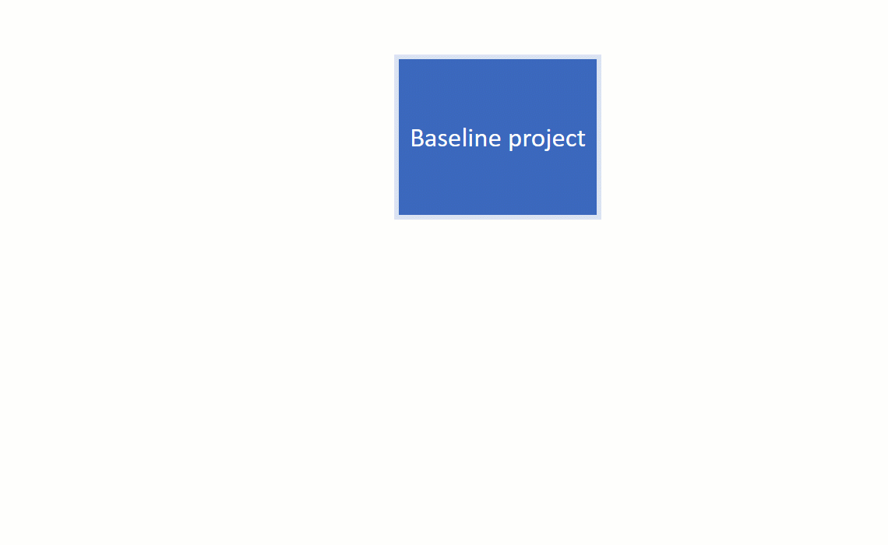
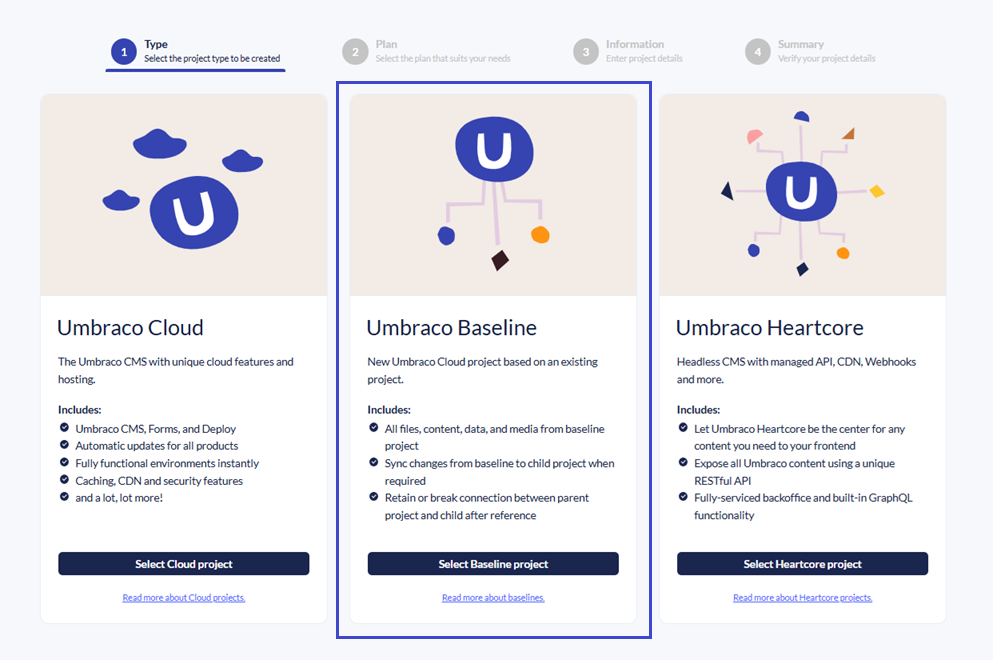

# Baselines

A Baseline project is similar to a fork (forked repository) on GitHub. A clone of an existing project is created while maintaining a connection between the two projects. The connection exists between the Live environment of the **Baseline project** and the left-most mainline environment of the **Child project**.

Any project can act as a Baseline project.

The idea is that you have a project containing all your standard Umbraco packages and components. Some default Document Types that you want to use as a baseline for future projects are also configured. When you've made changes to your Baseline project, you can push them out to all the Child projects with a click of a button.

## Create a Child Project

To create a Child project from a Baseline, follow these steps:

1. Log in to the [Umbraco Cloud Portal](https://www.s1.umbraco.io/projects).
2. Click the **Create Project** button.
3. Click **Select Baseline project**.

<figure><figcaption>Select Baseline Project</figcaption></figure>

4. Use the dropdown to choose an existing project to use as the baseline.

<figure><figcaption>Choose an existing project that will become a base for your new project </figcaption></figure>

5. Click **Confirm**.
6. Choose a **Plan** for the project.
7. Enter the **Project Name**.
8. **Choose an Owner** from the drop-down list.
9. Fill in the required **Technical Contact** information.
10. Click **Continue**.
11. Review the **Summary** of the information provided.
12. Select **I have read and agree to the terms and conditions and the Data Processing Agreement**.
13. Click **Create Project**.



The Child project creation time depends on the size of the Baseline project.



### Restore content from the Baseline project

When you've created the Child project, you can restore content from the Baseline project:

1. Go to the newly created project.
2. Click **Backoffice**.
3. Go to the **Content** section.
4. Click **...** next to the **Content** tree.
5. Select **Environment Restore**.
6. Ensure **Baseline** is selected in the dropdown as the source environment.
7. Click **Restore from Baseline**.

If you do not see the content, reload the content tree once the restore is complete.

## Manage child projects

A **Baseline** label appears at the bottom of the left-side menu on a Baseline project. Click it to open the **Manage child projects** page. You can also go to **Management** > **Baselines**. The page lists all child projects connected to the baseline.

<figure><figcaption>
The Manage child projects page lists child projects connected to the baseline.
</figcaption></figure>

Each child project shows the **Last update (UTC)**. A child that has not been updated within the last 5 baseline updates shows a generic message instead.

<figure><figcaption>
A child project that has not been updated within the last 5 baseline updates shows a generic message.
</figcaption></figure>

### Pushing changes from baseline to children

Use the checkboxes to select which child projects you want to update. Click **Update selected** to push changes from the baseline to the child projects.

### Actions, sorting and filters

Click a column header to sort the list by `Project name` or `Last update (UTC)`.

The **Filter children** input field filters the list by project name.

Use the action bar button with label "Select outdated (#)" to select all children where component versions are behind the baseline. Then click **Update selected** to push changes.

A child project can show an indicator for components that are behind the baseline. Tracked components include Umbraco CMS, Deploy, Forms, Umbraco ID, `Umbraco.Cloud.Cms`, and more.

<figure><figcaption>
Show components on child project which are behind the baseline.
</figcaption></figure>

## Related articles


[Pushing upgrades to a Child Project](../../optimize-and-maintain-your-site/monitor-and-troubleshoot/resolve-issues-quickly-and-efficiently/baseline-merge-conflicts/upgrading-child-projects.md)



[Configuration files](../../optimize-and-maintain-your-site/monitor-and-troubleshoot/resolve-issues-quickly-and-efficiently/baseline-merge-conflicts/configuration-files.md)



[Baseline Merge Conflicts](../../optimize-and-maintain-your-site/monitor-and-troubleshoot/resolve-issues-quickly-and-efficiently/baseline-merge-conflicts/)



[Break the baseline reference](../../optimize-and-maintain-your-site/monitor-and-troubleshoot/resolve-issues-quickly-and-efficiently/baseline-merge-conflicts/break-baseline.md)

