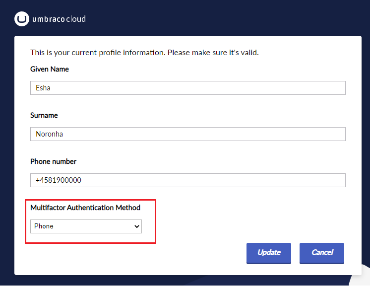
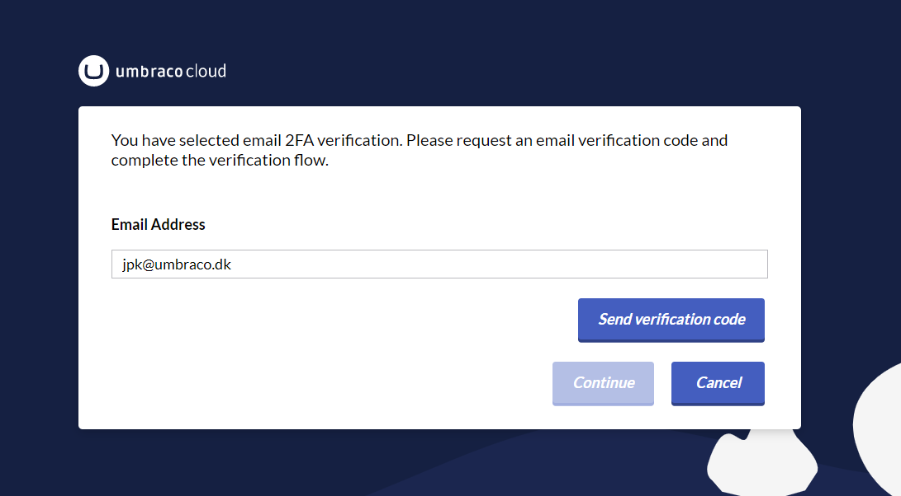
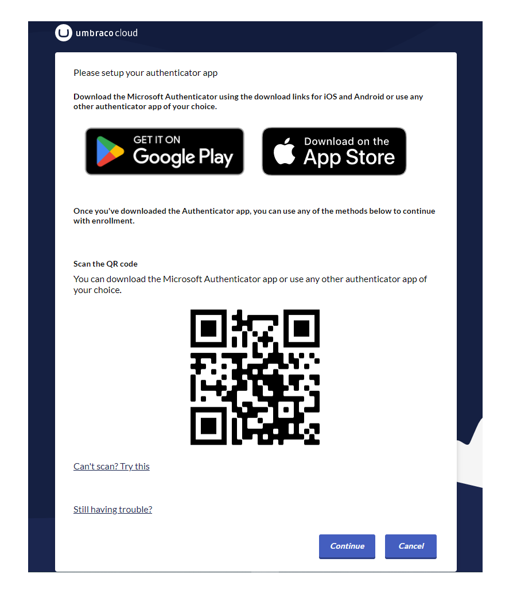

# Multi-Factor Authentication

On Umbraco Cloud, you can add Multi-Factor Authentication (MFA) for your Umbraco Cloud account.

It is also possible on the organizational level to [enforce Multi-Factor Authentication](../the-cloud-portal/organizations.md#multi-factor-authentication-mfa-enforcement) for the members.

You can use Email, Phone, or an Authenticator App when logging in to the Umbraco Cloud Portal or the Umbraco Backoffice.


You will not be prompted to authenticate your backoffice login if you have already done it for the portal. This is because both logins use the same centralized login service.


## Enabling MFA

MFA can be enabled when editing your Umbraco Cloud profile.

To enable MFA, follow these steps:

1. Go to your **Profile** on Umbraco Cloud.
2. Click **Edit Profile** in the **Profile Settings** section.
3. Select the desired **Multifactor Authentication Method** from the drop-down list. 
4. Follow the steps shown below to enable MFA.

### Email Authentication

You will get an email with a code that you need to enter when logging in through the Umbraco Cloud portal or the backoffice.

### Authenticator App

You have the option to use an Authenticator App when logging in to the Umbraco Cloud Portal or the Umbraco Backoffice.

You can use the Microsoft Authenticator App for both iOS and Android or any other authenticator app of your choice.

In case you want to reset the authenticator app settings for your user, an administrator in your Umbraco Cloud organization can do this. It may be relevant if you want to use another authenticator app on your current phone or transfer the authentication process to another device.

### Phone Authentication

You have the option to use your phone when you log in to the Umbraco Cloud portal or the Umbraco Backoffice. You can choose to receive a text message with a code or a call to log you in.


Before deactivating your old phone number, make sure to update the phone number used for your MFA. Changing the phone number used for MFA will require verification through the old number.


## Disabling MFA

You can always disable MFA from your profile.

To disable MFA for your user, you will need to use the authentication method that you had enabled to disable it again.

If you had phone authentication enabled, it will then need to be used to disable it again.

The same is the case for email authentication.
