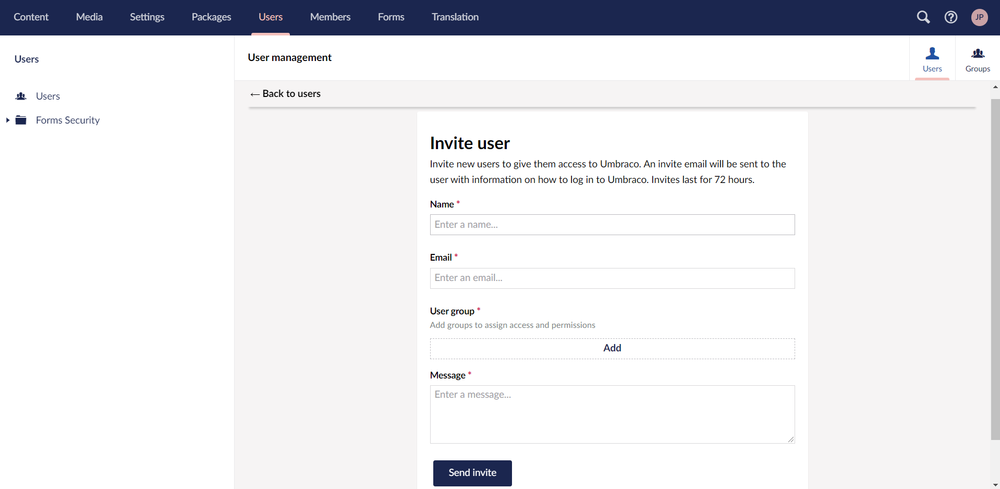
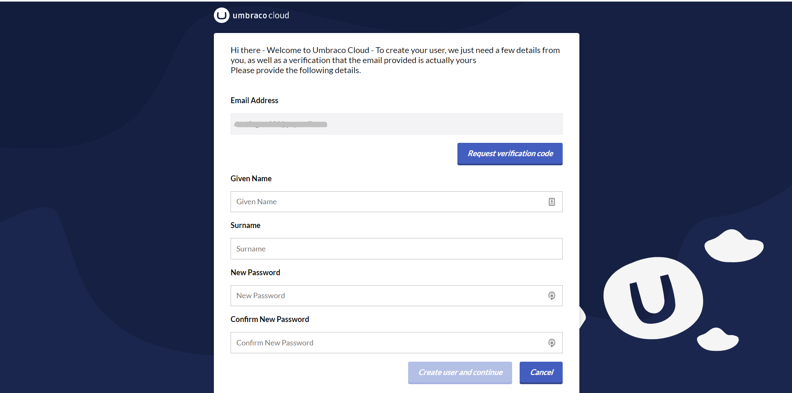
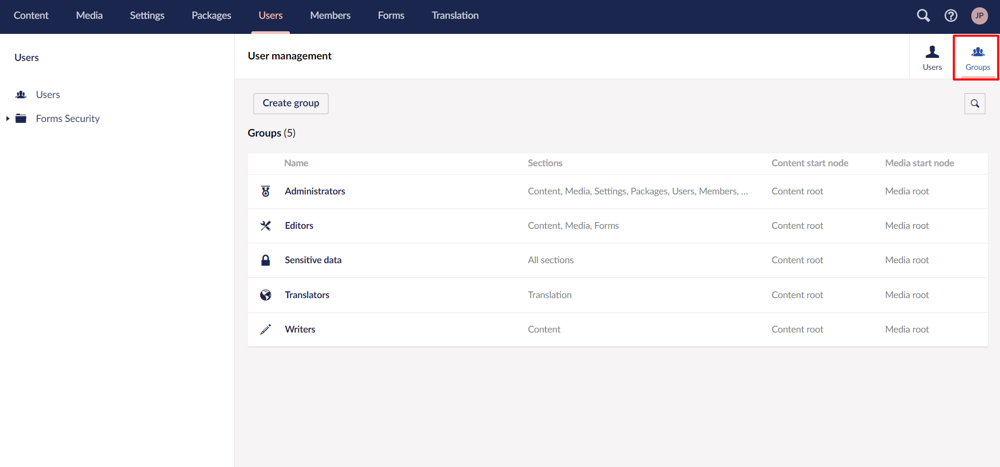
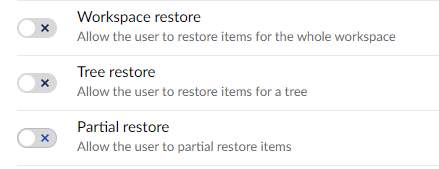
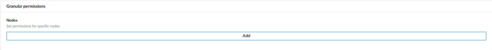
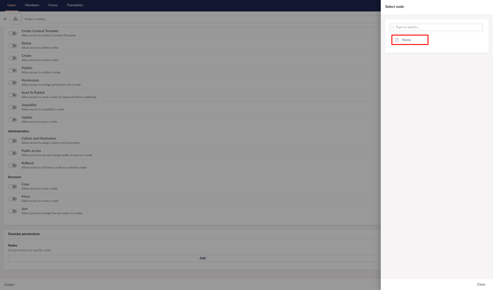
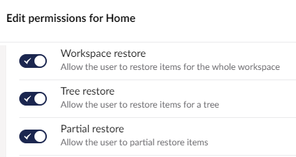

# Users

On Umbraco Cloud, users work in almost the same way as on a normal installation of Umbraco. However, there are a few more settings available for the backoffice users on Umbraco Cloud.

In this article, we will show how users work, as well as explain the different settings for users on Umbraco Cloud.

## Umbraco ID

On Umbraco Cloud project we use Umbraco ID. Umbraco ID is a centralized login for all users on Umbraco Cloud, both team members and Umbraco Backoffice users. It is used when you log in to the Umbraco Cloud Portal, projects, as well as when you clone down a project to your local machine.

When working locally the initial login will go through Umbraco ID and the online login flow. After the initial login, you can set a password on your user or create a new login for the backoffice, which can be used for local logins.

## Adding users on Umbraco Cloud

There are two ways of adding a user to your backoffice on Umbraco Cloud.

You can add them as a [team member](team-members/)) from the project portal on Umbraco Cloud.

By default, when added to the project as a team member, they will be added as users to the backoffice of all the environments as administrators.

Users can also be invited directly from the backoffice of your Umbraco Cloud project, from where you can give them different permissions.

Check out the [Users article](https://docs.umbraco.com/umbraco-cms/fundamentals/data/users) for an in-depth explanation about Umbraco users in general.


Users are environment-specific on Umbraco Cloud. This means that they will not be transferred over when doing a deployment to the next environment they will need to be added to the different environments on Umbraco Cloud.


## Invite User through the Umbraco backoffice

As mentioned it is possible to invite new Users to your Umbraco Cloud project through the backoffice as you would on a normal installation of Umbraco.

To invite a User you need to do the following:

1. Go to the backoffice of your Umbraco Cloud project.
2. Go to the **Users** section in the backoffice.
3. Click on the **Invite User** button.
4. Enter the **Name**, **Email**, add a User Group to assign access and permissions, and enter a new **Message** for the invitation.

### Accept invitation

Once the User has been invited they will receive an invitation for the project.

If the invited person already has a user on Umbraco Cloud they will be able to see the invitation in the project portal under "Project Invites".

If the User being invited does not have a User on Umbraco Cloud, they will receive an email asking them to create one.

Once the User has been created, it is now possible for them to log in to the Umbraco Cloud portal.

From here they will be able to see a pending invitation to the project they have been invited to.

Once the invitation has been accepted, they can now access the project through the Umbraco Cloud portal and access their site from there.

<figure><figcaption>
Project overview
</figcaption></figure>

## User group permissions for transfers and restores

On Umbraco Cloud, it is possible to control which users have access to transferring and restoring content and media on your Umbraco Cloud project.

This can be done when creating a new User Group or when editing an existing group.

You have the option to decide whether a specific User Group has permission to do a restore, partial restore, or queue content for transfer to the next environment.

It is also possible to get Granular control on a per-node basis so that you can disable restore and transfer for specific content on your site. This can help avoid mistakes and ensure that the proper workflows are followed.

### Set up Permissions for transfers and restores

There are two ways that you can set up these permissions:

* Create a new User Group
* Edit an existing one

To create a User Group, go to the **Users** section of the backoffice.

1.  Click on "Groups" in the right corner, from here you are able to either create a new User Group or edit an existing one.

    
2. Click "Create group"
3.  Scroll down and go to the "Content" heading in the "Default permissions" section. Here you can see three options:

    
4. Decide whether the users in the new User Group can restore items for the whole workspace, restore items for a tree, or partially restore items and click **Save**.

To edit an already existing User Group:

1. Go to the User Group you want to edit, e.g Editors or Writers.
2. Update the permissions and click **Save**.

### Granular Permissions

It is also possible to set Granular permissions for a specific content node on your Cloud project.

You can set the permission when you are creating or editing an existing User Group.

1.  Add the setting for Granular permission for your content nodes at the bottom of the User Group.

    
2. Click "Add".
3.  Choose the content node which you want to set the Granular settings for.

    
4.  Set permissions for restore, partial restore, and queueing content for transfer.

    
