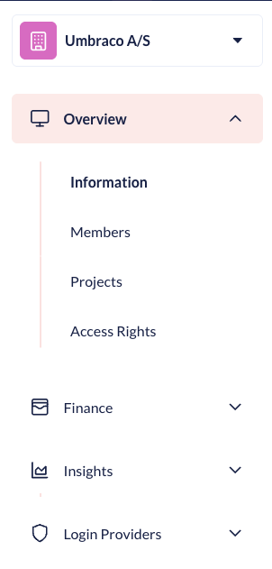

# Organizations

On Umbraco Cloud it is possible to setup an Organization. An organization is handy if you are managing many projects for different customers. It is also handy if you need to manage permissions for multiple users (such as developers, content editors etc.).

With an organization, you get an overview of all projects and members that are part of it. You can also manage payment methods for projects, as well as many other functions outlined on this page.

In the following sections, we will go through the different options that are available to an Organization:

<figure><figcaption>
Organization Overview
</figcaption></figure>


Are you interested in getting an organization, or need a project added to a different organization? Please reach out to the Support Team in the small chat box in your [project overview](https://www.s1.umbraco.io/projects).


## Overview

### Information

In the **Information** section of the Organization, you can find all the details about your Organization. If there are any changes to your details, you can change them here.

### Members

In the **Members** section, you can view current members, pending invites, and see the Multi-Factor Authentication (MFA) status for the Members of your Organization. You can also set up different permissions for your Members, such as Read, Write, and Administrators for your organization by adjusting their **Roles**.

<figure><figcaption></figcaption></figure>

Members added to your organization can see different details about their organization based on the user group they are added to. Currently there are three different groups, **Read**, **Write** and **Admin**. Below you can see what each user group has access to under the organization they are a part of.

Organization Members with **Admin Access** can do the following in the organization:

* Update the organization's information
* Invite others to the organization
* Invite Users to project under the organization
* Edit organization team
* See pending invitations
* See organization information
* See organization projects
* See payment history
* See subscriptions
* See organization Members
* See payment history
* Handle Multi-Factor Authentication (MFA) for users
* Handle payment methods
* Change permissions for Members
* Remove role from users

Organization members with **Write Access** can do the following in the organization:

* See Organization information
* See Organization Members
* Invite to the organization
* See pending invitations

Organization Members with **Read Access** can do the following in the organization:

* See Organization information
* See Organization Members


Being a Member of an organization does not give access to any projects under it. To get access to a project under an organization, you need to be [invited](../project-features/users-on-cloud.md) to the project. This can be done by either someone who is already part of the project or an administrator in your organization.


### Multi-Factor Authentication (MFA) enforcement

When working in organizations on Umbraco Cloud, as a company, you can enforce a certain type of Multi-Factor Authentication (MFA) method for members.

Administrators of Organizations on Umbraco Cloud can enforce MFA for specific members of their organization.

To enforce a certain MFA for a member, follow these steps:

1. Go to the **Organizations** tab under your user on Umbraco Cloud.
2. Go to the **Members** tab under Organization.
3. Go to **Multi-Factor Authentication**.
4. Find the member that needs to have MFA enabled.
5. Click on the cogwheel and select the **Enforced MFA Method** from the drop-down list for the member.

Once it has been enabled, the next time the member logs in, they will be forced to setup the chosen Multi-Factor Authentication (MFA) method. It is possible for an administrator to reset the authenticator app settings for members of the organization.

### Projects

In the **Projects** section, you can get an overview of all the Projects that have been created in your Organization.

It is possible to see the plan, project status, payment status, creation date, region, and number of environments for each of your projects.

As an administrator, you can invite members of your organization to the different projects under the organization.

### Access Rights

In the **Access Rights** section, you can get a list of all the Access Rights your Members have to each Project in your Organization.

## Finance
<figure><figcaption>
Finance section
</figcaption></figure>

### Payment methods

In the **Payment Methods** section, you can view the payment methods for your organization. From here, you can add or delete credit card details for your Organization. These payment options will be used, when you create new projects under your organization.

<figure><figcaption>
Payment methods
</figcaption></figure>

### Payment History

In the **Payment History** section, you can see the payment history for your organization.

## Insights
<figure><figcaption>
Insights section
</figcaption></figure>

### Sustainability


This is a Beta feature and currently only open to a few early testers. If you want to help test the feature, get in touch somehow [TODO: describe how]...


The Sustainability Dashboard is designed to help users monitor and improve the environmental impact of their websites on Umbraco Cloud. For more information, see the [Sustainability Dashboard](../../optimize-and-maintain-your-site/monitor-and-troubleshoot/sustainability-dashboard.md) article.

## Login Providers
<figure><figcaption>
Insights section
</figcaption></figure>

This section will allow you to configure access to the Umbraco Cloud Portal and Projects for your Organizations via the Login Provider(s) you use.

To start setting up a Login Provider for your Organization, see the [Login Providers article](login-providers/README.md).

### External Login Providers

This section will allow you to configure access to the Umbraco Cloud Portal for your Organizations. 

### Project Configurations

Use this section to configure Project Permissions in the Portal when users are signing in with an Organization's Login Providers.

### Audit

Here you can keep an eye on all things related to your Login Providers. See User Sign-ins, Changes to Login Provider Configurations and changes to Project Configurations.