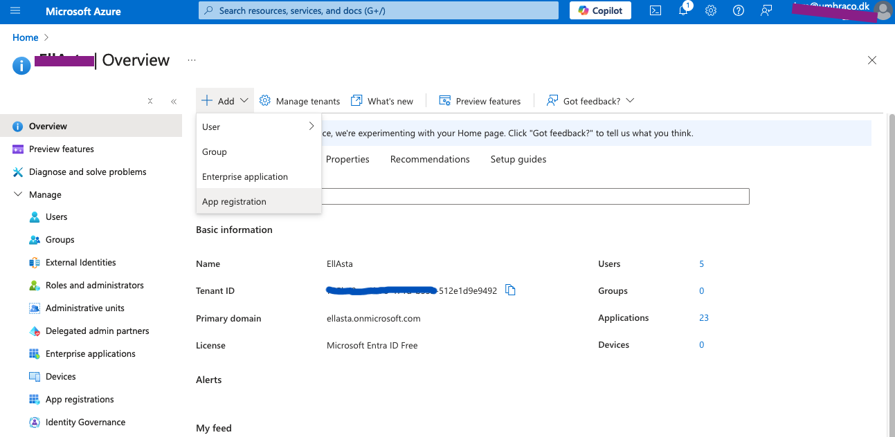
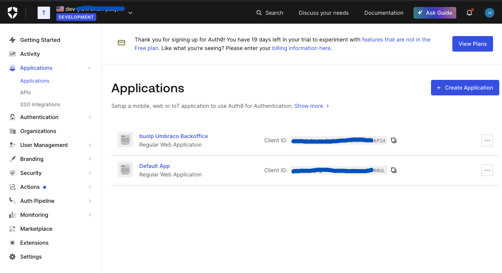
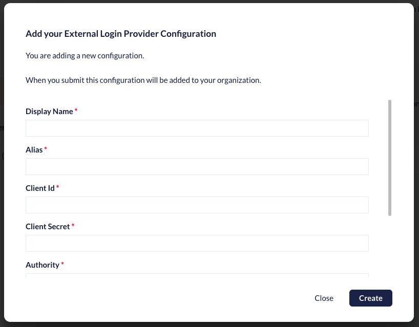
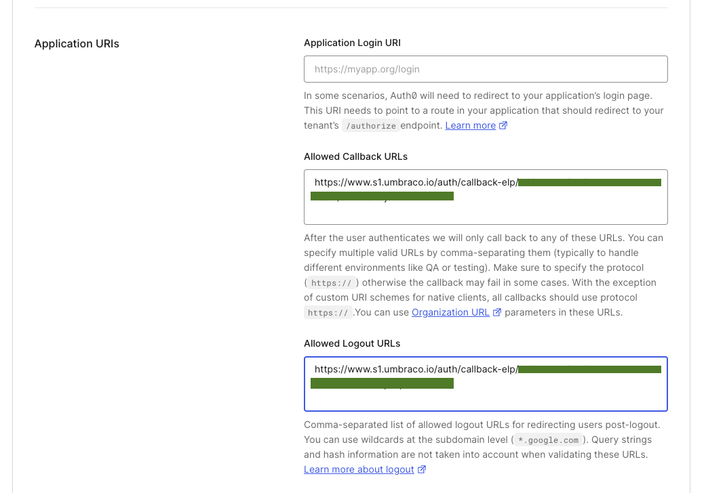
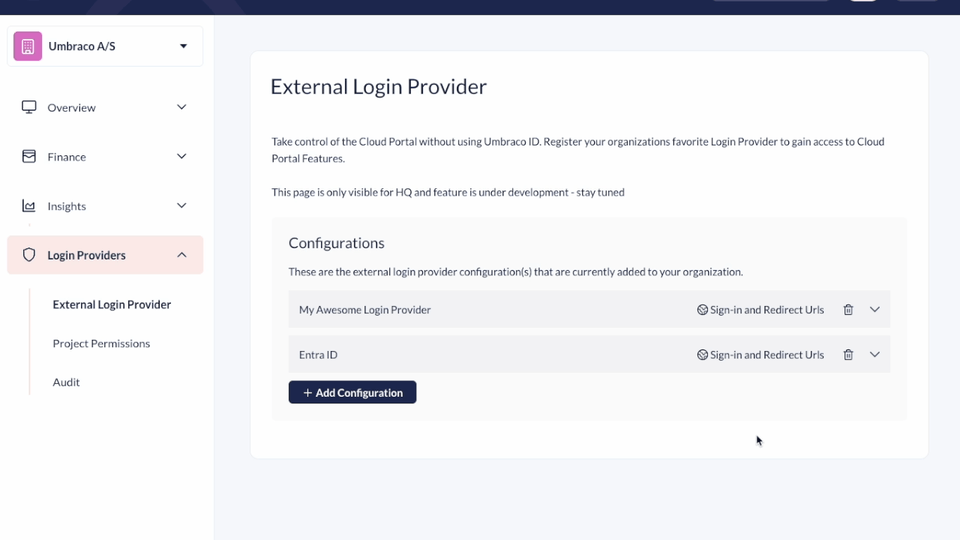
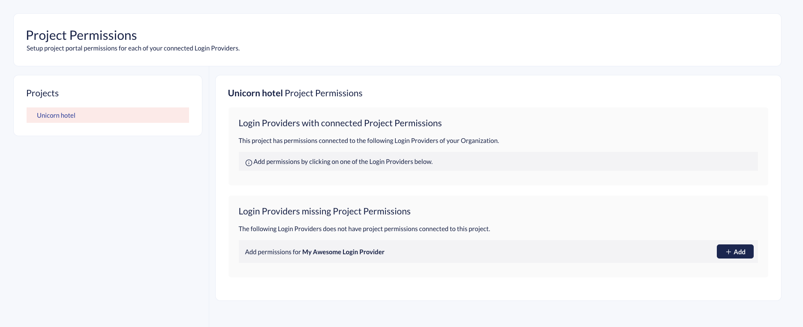
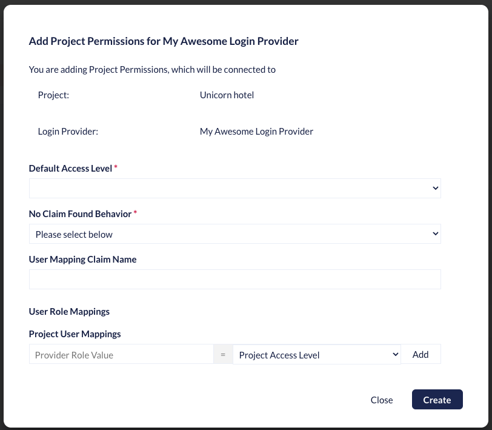
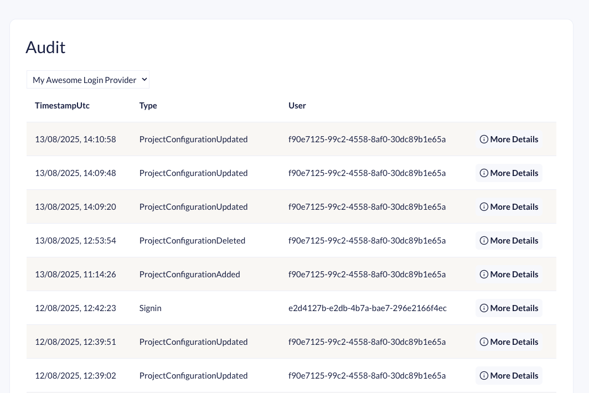

# Organization Login Providers



**Beta feature**. Help improve the feature by [reporting feedback](mailto:beta-cloud-portal-login-providers@umbraco.dk).



The External Login Providers feature in Umbraco Cloud allows you to integrate third-party authentication systems to manage Portal user logins securely and efficiently. This functionality is especially useful for teams that want to simplify login management or use their existing identity systems.

Using OpenID Connect, Umbraco Cloud supports external login providers such as Microsoft Entra ID, Auth0, Google, and so on. This feature helps administrators manage backoffice access, assign user roles, and improve security.



This is exclusively for Cloud Portal access and access to Project features only available within the portal. [You can see how to set up External Login Providers for the Backoffice on Cloud Projects in this article](../../../project-features/external-login-providers.md).



## External Login Providers


The Organization Areas is only available for user logged in with Umbraco Id. Additionally the Login Providers Section can only be accessed by user who has Admin rights to the Organization.


This guide shows you how to set up and configure external login providers for the Cloud Portal, and configure related Project Permissions. It includes the following steps:

- [Prepare your Login Provider](#prepare-your-login-provider)
- [Register the Login Provider in Cloud Portal](#register-the-login-provider-in-cloud-portal)

### Prepare your Login Provider




1. Access the Microsoft Azure Portal.
2. Locate the Microsoft Entra ID and enter your tenant.
3. Select **Add**.

4. Choose **App registration**.
5. Register your app.
   * Ignore the Redirect URI as that will be covered later in the guide.

<figure><figcaption></figcaption></figure>

6. Click **Register**.

Once the app has been registered, you must find and note down a series of keys. These keys will be used to set up the login provider on Umbraco Cloud.

Locate and note down the following keys:

* **Application (client) ID** - found on the **Overview** page for the app.
* **Authority URL** - available from **Endpoints** on the **Overview** page.
* **Secret ID** - needs to be generated on the **Certificates & Secrets** page.


**Enterprise or custom setup**

If you're working with an enterprise or a custom setup, ensure the email claim is included in the ID token configuration.






1. Access your Auth0 dashboard.
2. Navigate to **Applications**.
3. Select **Create Application**.

4. Give the application a name and select **Regular Web Application**.
5. Go to the **Settings** section.
6. Identify and note down the following keys:
   * **Domain URL** (Authority URL)
   * **Client Id**
   * **Client Secret**





1. Access the Google Developer Console.
2. Select **Create Project** and give it a name.
3. Go to the **OAuth consent screen** page.
4. Select the **Internal** User Type and click **Create**.
5. Fill in the required information.
6. Add **Authorized domains** from where login should be allowed.
7. Click **Save and continue**.
8. Navigate to **Credentials**.
9. Select **+ Create Credentials** and choose **OAuth client ID**.
10. Choose **Web Application** as the application type.
11. Fill in the required fields.
12. Click **Save** to complete creating the credentials.

Before you move on, take note of the following keys:

* **Client ID** (generated through the steps above)
* **Client Secret** (generated through the steps above)
* **Authority URL** (`https://accounts.google.com`)




Once you have the keys from your login provider, you need to follow the next steps in the Umbraco Cloud Portal.

Keep the configuration for your login provider open, as you will come back to it later in the guide.

### Register the login provider in the Cloud Portal

1. Access the Umbraco Cloud Portal.
2. Navigate to your Organization
3. Navigate to **External Login Providers** page under the **Login Provider** section.

<figure><figcaption></figcaption></figure>

4. Select **Add Configuration**.
5. Fill out the fields.
   - [Learn how to fill out the form](#how-to-fill-in-the-external-login-provider-configuration).

<figure><figcaption></figcaption></figure>

6. Click **Create** to add the new configuration.
7. Click on **Sign-in and Redirect Urls**.
8. Take note of the Redirect URI.
9. Head back to the configuration for your external login provider.




1. Click on **Authentication**.
2. Select **Add a platform**.
3. Select **Web** and add the Redirect URI.
4. Add more Redirects URIs if needed.
5. Under **Implicit grant and hybrid flows** check the following options:
   * Access Tokens (used for implicit flows)
   * ID tokens (used for implicit and hybrid flows)
6. Click **Configure** to complete the configuration.





1. Navigate to the **Settings** section.
2. Scroll down to find the **Application URIs**.
3. Add the Redirect URI to the **Allowed Callback URLs**.
4. Also add the Redirect URI to the **Allowed Logout URLs**

5. Add more Redirect URIs if needed.





1. Open the **Credentials** created earlier through this guide.
2. Select **Add URI**.
3. Add the Redirect URI.
4. Click **Save** to complete the configuration.




## How to fill in the External Login Provider Configuration

Learn about what type of data and information you need for each field in the configuration form.

### Display Name

A Friendly name for the Login Provider

### Alias (required)

A unique alias for the provider in the Organization. 
Use only lower-case. 
Spaces are not allowed. 

### Client Id (required)

A unique Client ID generated in the external login provider.Entra ID: Guid Auth0: Random characters Google: <code>{randomchars}.apps.googleusercontent.com</code>

### Client Secret (required)

A secret that is generated in the External Login Provider and is associated with the Client Id.

### Authority (required)

The URL for the External Login Provider. This can be found in the External Login Provider.

Entra ID: `https://login.microsoftonline.com/&#x3C;Directory (tenant)>`
Auth0: `https://{accountId}.uk.auth0.com`
Google: `https://accounts.google.com`

### Metadata Address

If you need a special metadata address for your External Login Provider, you can set it here. By default, the system will resolve the metadata address from the Authority Url, which is why this property is optional.

A common scenario for using a special metadata address is when working with Entra ID and configuring claims mapping. In this case, you must set the metadata address to the following: `https://login.microsoftonline.com/{tenant}/v2.0/.well-known/openid-configuration?appid={client-id}`.

### User Mapping Claim Name

Your provider may assign users to specific roles (For example: Admin, Editor, Viewer).  The <strong>User Mapping Claim Name</strong> is the field in the authentication token (claim) that identifies these roles. The system reads this claim to determine a user’s permissions.

Example: If the roles claim is called `user_roles` in your provider, you set the **User Mapping Claim Name** to `user_roles`.

## Signing in using the Login Provider

When trying to access Umbraco Cloud Portal through `s1.umbraco.io` you will still be greeted by an Umbraco ID sign in screen. 

In order to sign in with your Login Provider you will need to use a special sign-in URL, unique to your Login Provider.

You need to go back to Cloud Portal where you registered the Login Provider. On this page click on the `Sign-in and Redirect Urls` button.

<figure><figcaption>How to retrive the Sign in Url</figcaption></figure>

Give this Url to the Organization members you want to sign in using your Login Provider.

## Project Permissions

Here you will setup access to Projects in the Portal while signed in with your Login Provider.

You will need to add a Project Permission model per Project and per Login Provider. It is not required to add Project Permissions to all project. Projects without a Project Permissions tied to a Login Provider will not be shown to user logged in with that particular Login Provider.  

<figure><figcaption>Project Permission Screen</figcaption></figure>

When setting up a Project Permission first select a Project in the left side of the screen. Next click on "+ Add" on the Login Provider you want to add a Project Permissions for.

<figure><figcaption>Add Project Permission</figcaption></figure>

The modal has the following fields:

- Default Access Level (required)
- No Claim Found Behavior (required)
- User Mapping Claim Name
- Project User Mappings
  - Consists of two fields: "Provider Role Value" and "Project Access Level"

## How to fill in the Project Permissions

### Default Access Level

Select the level of access you want users signing in with the External Login Provider to get for this Project.

The dropdown has two possible permissions:

- Read Only
- Read and Write

#### Read

A team member with Read permissions can only view the project in the portal as well as the backoffices. They are not able to deploy or change anything on the project itself.

#### Read And Write

A team member with Write permissions can do everything on a project except delete it and edit the team. A user with Write permissions can deploy changes between environments through the portal.

This value is meant to be a fallback value and can be overwritten by "Project User Mappings" setting.
If there are no Mappings available for the user the "No Claim Found Behavior" setting will evaluate if this fallback Permissions is used or "NoAccess".

### No Claim Found Behavior

Use this setting for more fine grained control.
This will allow you to use the Role Claim in you Login Provider to assign Permissions to your users.
 
The setting has two Settings:
- NoAccess
- Use Default Access Level

When `NoAccess` is selected it will block the users access to the Project if they do not have the correct Role assigned. 
Using the "Use Default Access Level"-option, all users in your Login Provider will automatic get the permission you selected in "Default Access Level". Unless they have a hit on the Project User Mappings.

### User Mapping Claim Name

Enter the name of your providers default or custom Role claim name. This is if you want to override the one already entered in the Login Provider configuration.

### Project User Mappings

Use this to map the Provider Role Value (a role coming from your external login provider) to a Project Permission Level in the portal.

If your external login provider is configured to assign roles to users, those role values are included in the ID token. You can then use these values to automatically assign the appropriate access level when the user signs in to the portal.

For example, a role like `Happy.Write` from your identity provider could be mapped to the `Read And Write` permission level for your Cloud project.

## Audit

Use Audit section to troubleshoot your Login Providers and keep an eye on user Sign-ins.

There is audit log for each Login Provider. Keep in mind that if you remove the Login Provider the audit log will also disappear. 

<figure><figcaption>Audit page</figcaption></figure>

The following audit types are listed:

| Type | Sub-Type | Description |
|---|---|---|
| User Sign-ins | - | See information about Project Permissions evaluated at the Sign-in. |
| External Login Providers | Added and Updated | Entries includes the changed properties. The Client Secret is always redacted. |
| Project Permission | Added, Updated and Deleted | Shows information on the changed properties and stored Role mapping options |

