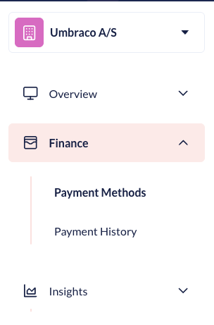
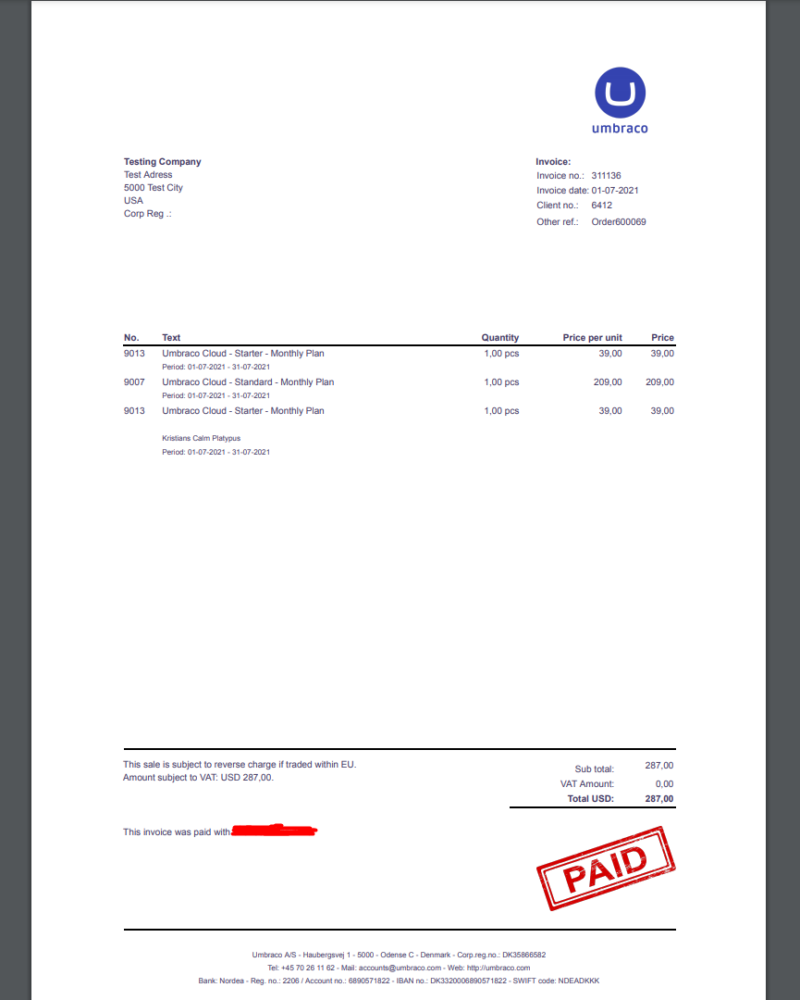

# Payments

In this article, you will be able to find information on the following:

* How to manage your subscriptions.
* How to download and pay invoices.
* How to change your credit card for payments.

## Manage Subscriptions

To manage your subscription on Umbraco Cloud, go to the menu in the top right corner and select "Organization".

<figure><figcaption>
manage subscriptions
</figcaption></figure>

You will see an overview of your organization on Umbraco Cloud. From here you can see the information about the organization.

## Payment methods

To change your payment method on Umbraco Cloud, go to your organization and select "Payment Methods" in the left side menu.

<figure><figcaption></figcaption></figure>

On this page, you can see the credit cards you have already added or you can add a new one.

Once a credit card has been added it will show up in a drop-down when creating new projects. You can also change the payment method for a specific project from here.

<figure><figcaption>
Select Payment Methods
</figcaption></figure>

## Changing and removing payment methods

In some cases, you might need to change the credit card information on the Umbraco Cloud Organization.

If you add multiple cards, you can choose which one will be billed on the 1st of the month. To do this, click the **Set as primary** button on the card you want to use.

To remove an expired or unused card, click the trash can icon next to that card.

## Payment and Invoices

On Umbraco Cloud, we are sending out one single invoice with all the projects that you are paying for via email every month.

You can view the invoices for your projects under your organization in the Payment History section. You can see the following information for each invoice:

* The invoice ID
* The total amount paid
* When the invoice was created
* The due date
* The status of the invoice
* An option to download the invoice

<figure><figcaption>
An overview of invoices for a Cloud Organization
</figcaption></figure>

When downloaded for a given month, the invoice will contain all the projects that you were paying for during the month.

