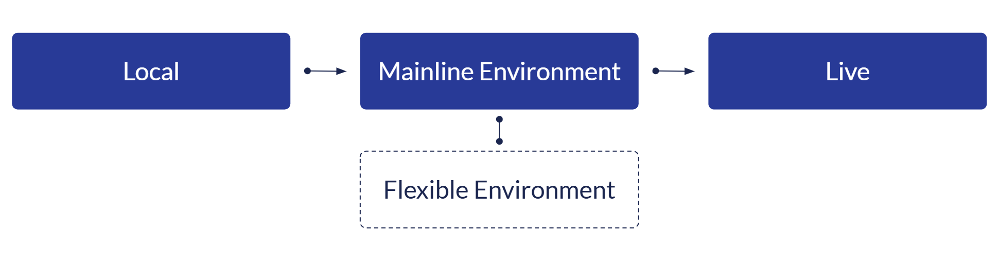
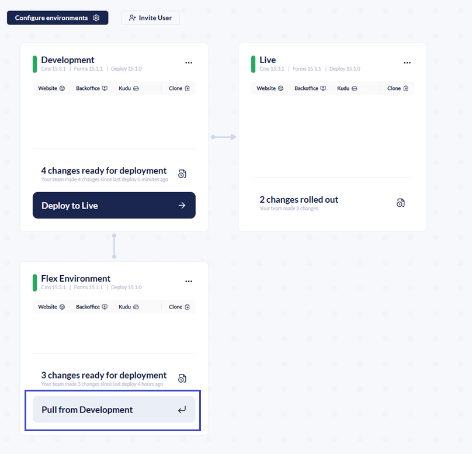
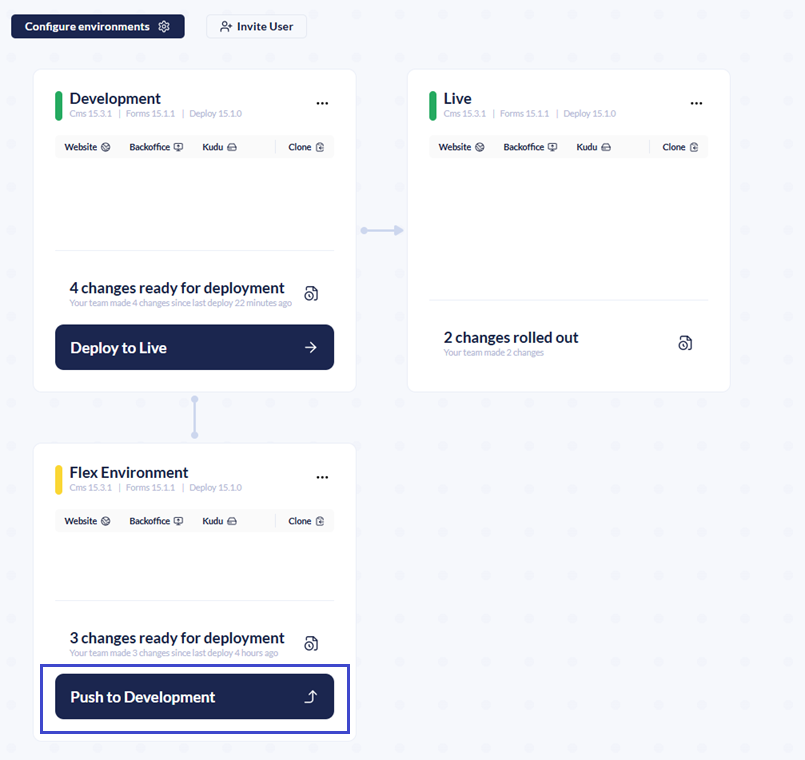
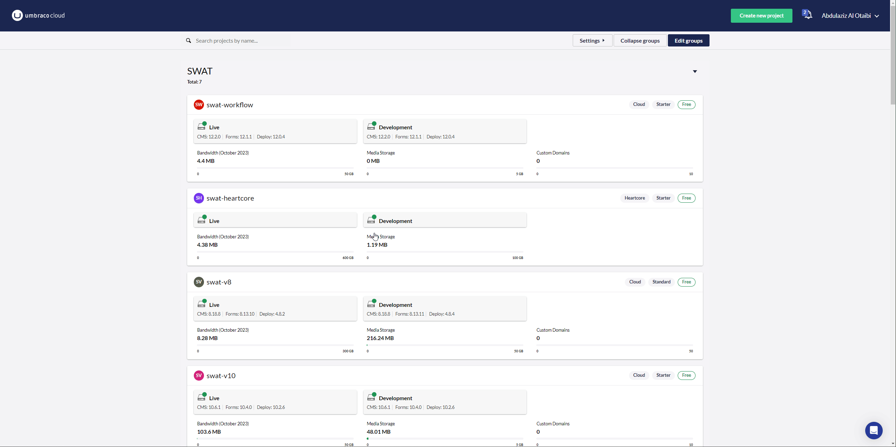

# Deployment

Umbraco Cloud uses a deployment model based on Git, Kudu, and Umbraco Deploy to move changes between environments. This follows a left-to-right deployment approach. Changes start in the local or left-most environment and are deployed to the production/Live environment. This workflow is called the mainline.

The mainline environments are used when building and deploying the initial website. Upgrades, both manual and automatic also go through the mainline environments.

Flexible environments can be used to work on features separate from the mainline. This is done without interfering with upgrades or other changes being worked on in the mainline.



## [Deploy Settings](https://docs.umbraco.com/umbraco-deploy/getting-started/deploy-settings)

All configuration for Umbraco Deploy is stored in the `appSettings.json` file found at the root of your Umbraco website.



Some deployments can trigger an Umbraco Cloud environment to restart. The table below outlines which actions initiate a restart.

| Action:                             | Application Restart? |
| ----------------------------------- | -------------------- |
| Config file change                  | Yes                  |
| Schema deployment                   | No                   |
| File change (for example, CSS file) | No                   |
| Content or Media transfer           | No                   |



From the Umbraco Cloud Portal, you can manually restart your environments.

<figure><figcaption><p>Restart an environment</p></figcaption></figure>



The `umbraco-cloud.json` file defines deployment settings, identifies the current environment, and determines the next deployment target.



The `name` attribute in the `umbraco-cloud.json` can be updated to clarify deployment destinations in the Workspaces dashboard.






<details>

<summary>Deployment Approach</summary>

Umbraco Cloud separates schema and content during deployment. Schema includes Document Types, Templates, Forms, Views, and config files. Content includes content items and media.

* **Deploy:** Moves schema between environments using a Git client or the Umbraco Cloud Portal.
* **Transfer:** Move content and media directly via the Umbraco backoffice.

### Types of Deployments

| Schema Deployments                                                                                                                | Content and Media Transfers                                                                                                                                                                                                                                                 |
| --------------------------------------------------------------------------------------------------------------------------------- | --------------------------------------------------------------------------------------------------------------------------------------------------------------------------------------------------------------------------------------------------------------------------- |
| Schema is stored in a Git repository. These are **deployed** between environments using a Git client or the Umbraco Cloud Portal. | Content and Media items are not stored in the Git repository. They must be **transferred** directly from the Umbraco backoffice using the **Queue for Transfer** option. Once queued, use the **Deployment** Dashboard in the **Content** section to complete the transfer. |

Content editors do not need Umbraco Cloud Portal access. They can manage content through the backoffice, while developers handle schema deployments via Git.

### Deploying Schema

The source and target environments must be in sync before transferring content and media. Deploy schema first to ensure consistency.

* [Deploy changes from Local to Cloud](broken-reference)
* [Deploy changes between Cloud environments](broken-reference)
* [Umbraco Forms on Cloud](../umbraco-forms-on-cloud.md)

### Transfer Content and Media

Content and media move between environments through the Umbraco backoffice. Content can be transferred from Local to Development and restored from Live or Staging.

* [Transfer Content and Media](broken-reference)
* [Restore Content and Media](../restoring-content.md)


The transfer and restore process is the same for Local to Cloud and between Cloud environments.


</details>

<details>

<summary>Deploy Dashboard</summary>

Below you will find the different sections on the Deploy dashboard and how they can be used.

## Deploy Status

Here you can see whether the latest deployment has been completed or failed. You can see the version of Umbraco Deploy you are running, and the last time an operation was run.

<figure><figcaption><p>Umbraco Deploy status</p></figcaption></figure>

## Deploy Operations

With the Deploy operations, you can run different operations in Umbraco Deploy.

<figure><figcaption><p>The different Deploy operations.</p></figcaption></figure>

Below you can read what each operation will do when run through the dashboard.

### Update Umbraco Schema From Data Files

Running this operation will update the Umbraco Schema based on the information in the `.uda` files on disk.

### Export Schema To Data Files

Running this operation will extract the schema from Umbraco and output it to the `.uda` files on disk.

### Clear Cached Signatures

Running this operation will clear the cached artifact signatures from the Umbraco environment. This should not be necessary, however, it may resolve reports of schema mismatches when transferring content that has been aligned.

### Set Cached Signatures

This operation will set the cached artifact signatures for all entities within the Umbraco environment. Use this when signatures have been cleared and you want to ensure they are pre-generated before attempting a potentially longer restore or transfer operation.

## Download Deploy Artifacts

Running this operation will download a zip file with all the Deploy artifacts representing the Umbraco schema in the form of `.uda` files.

This operation is useful if you want to move to another Umbraco instance and migrate the data with you.

<figure><figcaption><p>Download the Deploy artifacts</p></figcaption></figure>

## Configuration Details

In the Configuration details, you can see how Umbraco Deploy has been [configured](https://docs.umbraco.com/umbraco-deploy/deploy-settings) on your environment. You get an overview of the Setting options, the current value(s), and notes help you understand each of the settings. Updates to the need to be applied in the `appsettings.json` file.

<figure><figcaption><p>Example of Umbraco Deploy configuration.</p></figcaption></figure>

## Schema Comparison

The Schema Comparison table shows the schema information managed by Umbraco Deploy.

You can see a comparison between the information that is held in Umbraco and the information in the `.uda` files on disk.

The table shows:

* The name of the schema
* The file name
* Whether the file exists in Umbraco
* Whether the file exists
* Whether the file is up-to-date

<figure><figcaption><p>Document type schema comparison</p></figcaption></figure>

You can also view details about a certain element by selecting "View Details".

This will show the difference between entities stored in Umbraco and the `.uda` file stored on disk.

<figure><figcaption><p>Showing how you can compare schema in the deploy dashboard</p></figcaption></figure>

</details>

<details>

<summary>Deploying Changes</summary>

Let's see how to deploy your code changes and metadata from a local instance to your Cloud environment.

Local changes in your Umbraco Cloud project are automatically detected and synced with your Git client for seamless collaboration.

There are two ways this can be done. You can push the changes using a Git UI or your terminal. This guide will show how you can use both ways to deploy your local changes to Umbraco Cloud.

## Prerequisites

* A clone of your Cloud project.
* A [Git UI](https://git-scm.com/downloads/guis) or a Terminal.
* Created some Document Types and Data Types with corresponding `.uda` files.
  * The files are located in the `/umbraco/Deploy/Revision` folder.

## Deploying using a Git UI

Once you have created some Documents and Data types, follow the steps below to deploy your local changes using a Git UI. The guide will use [Fork](https://git-fork.com/) as the Git UI, however you can use your own preferred Git UI.

1. Go to your Git UI.
2. Check for local changes in your UI.

<figure><figcaption><p>Local changes in Git UI.</p></figcaption></figure>

3. Prepare changes, so they are ready to be committed.
4. Write a commit subject
5. Write a description of the commit.
6. Commit the files.

<div align="right" data-full-width="false"><figure><figcaption><p>Ready the files for commit.</p></figcaption></figure></div>

4. Push the files to your cloud project in the UI.

<figure><figcaption><p>Push changes to Umbraco Cloud.</p></figcaption></figure>

The deployment will kick in and the new Documents and Data Types you have created locally are now automatically created on the remote environment.

After deploying changes locally to your Cloud environment, use the Umbraco Cloud portal's **'Deploy changes to ..'** button for subsequent deployments to other environments. For more information, see the [Deploying between Cloud Environments](broken-reference) article.

## Deploying local changes using the terminal

To deploy your local changes from local to Umbraco Cloud using a terminal follow the steps below:

1. Navigate to your local projects folder using the `cd YourProjectName` command in the terminal.
2. Check for pending changes in your project with `git status`.
3. Add the pending changes with `git add -`.
4. Commit the staged files using `git commit -m "Adding updated schema changes"`.
5. Push the changes to Umbraco Cloud using `git push`.
   1. Do a `git pull` if the push is rejected.

If you have to pull down, make sure to see if any of these commits contain changes to the schema (anything in `umbraco/Deploy/Revision/`).

To validate your local site and ensure compatibility with the updated schema, use the [**Deploy Dashboard**](https://docs.umbraco.com/umbraco-cloud/deployments/deploy-dashboard) in the **Settings** section of the Umbraco backoffice.

Here, you can see the status of ongoing or completed deployment processes. The status will show whether an operation has been triggered and is in progress has been completed, or has failed.

The dashboard will show the status based on the marker files on the disk, eg. `deploy-progress`. From the **Deploy** Dashboard, it is also possible to trigger different processes.

</details>

<details>

<summary>Deploying between Environments</summary>

When you are working in your Cloud environment, changes made through the Backoffice are automatically detected and committed to the site's Git repository. This includes Umbraco-specific items like Document Types and Templates. These changes are also referred to as metadata.

## Deploying between Mainline Environments

Changes made in your Cloud environments will appear in the Umbraco Cloud portal. You can see what files have been added or changed and who made the changes.

To deploy metadata changes from one Cloud environment to another, click the **Deploy changes** button on the environment where the changes were made.

<figure><figcaption></figcaption></figure>

The deployment starts, and you can follow the progress in the **Overview** section of your project.

<figure><figcaption><p>Deployment in progress</p></figcaption></figure>

Once complete, the changes are deployed to the next Cloud environment in the deployment flow. If you have additional environments, repeat this process to deploy the changes through each environment.

## Syncing Changes Between Mainline and Flexible Environment

When working with a flexible environment alongside your mainline environments, it's important to keep them aligned to avoid conflicts and ensure consistent deployments.

If any changes have been made in a mainline environment those changes must be pulled into the flexible environment before pushing updates back. The changes can be updated Document Types, content, or other schema changes.



If what you've been working on in the flexible environment has also been changed in the mainline, a merge conflict will occur. These conflicts need to be resolved before you can continue with the deployment. For information on how to resolve them, see the [Merge Conflicts on Flexible Environments](../troubleshooting/deployments/merge-conflicts-on-flexible-environments.md) article.

Once you’ve completed your feature or update in the flexible environment and it’s synced with the latest mainline changes:

* Push your changes from the flexible environment to the mainline environment.
* From there, the changes become part of the regular deployment flow.



## Important Notes

When you deploy, for example, from your left-most mainline environment to your Live environment, changes are made to the Live environment. These changes will then be merged back into the left-most mainline environment.

Here are the automatic steps Umbraco Cloud goes through when you hit the _"Deploy changes"_ button:

* Before pushing your changes from the source environment, the engine running Umbraco Cloud - **Umbraco Deploy** - looks for changes in the repository on the target environment
* If changes are found, Umbraco Deploy _merges_ the changes from the target environment into the repository on the source environment.
* After the merge, the changes from the source environment are pushed to the repository on the target environment.
* Finally, the changes pushed to the target repository are extracted to the site, and you will now see your changes reflected in the Backoffice and on the Frontend.

It is recommended that you **only make changes to metadata on the left-most mainline environment or a flexible environment**. Making changes directly on other mainline environments can cause merge conflicts when you deploy.


It is important to be aware of how deletions work between environments. Some deletions are environment-specific and others are not. For more information see the [Deploying Deletions article](broken-reference).


Refer to our troubleshooting documentation about [how to resolve collision errors](../troubleshooting/deployments/structure-error.md), if you should run into issues while deploying between your Umbraco Cloud environments.

</details>

<details>

<summary>Deploying Deletions</summary>

On Umbraco Cloud, deletions are environment specific. To delete something entirely from your project, you need to delete it in all environments.

In this article, you can read about the correct way of deleting files, schema, and content from your Umbraco Cloud project.

When you have an Umbraco Cloud project, you might have couple of environments including a local clone of the project. Each of these environments have their own database. These databases store references to your content, media, and schema files, such as Document Types and Templates.

The databases are environment specific. During deployment across environments, Umbraco Cloud's engine compares schema files with database references using _alias_ and _GUID_ for accuracy. If something doesn't add up, for example, there is a mismatch between the database references and the files deployed, you will see an error. Learn more about this in the [Troubleshooting section](../troubleshooting/deployments/).

The workflow described above does not recognize deletions of content and schema from the database. You'll need to delete the content and/or schema on all your environments to fully complete the deletion.

The main reason not to delete schema and content on deployments is that it could lead to an unrecoverable loss of data.

Here's an example of what can happen when a Document Type is deleted and deployed:

* A Document Type is deleted in the left-most mainline environment.
* This deletion is then pushed to the Live environment, where many content nodes depend on the deleted Document Type.
* When the deployment is completed, all those content nodes would be instantly removed.

In the scenario described above, there is no option to roll back because the Document Type they rely on no longer exists. To prevent such situations, manual deletion is necessary. You must actively decide on each environment for the process to occur. Below is the same scenario explained in more detail.

## Example scenario

The following example will build in the scenario outlined above, calling the left-most mainline environment the **Development** environment. In addition to the deletion, additional changes that have been made will also be deployed.

Before you deploy the changes, the Development environment will show that the following changes are ready to be deployed:

<figure><figcaption><p>Changes ready for deployment</p></figcaption></figure>

Following the **Activity log** in the browser, you'll notice that the `.uda` file for the Document Type gets deleted. Additionally, other files with changes are copied to the Live environment.

Once the deployment is completed, the following changes has taken place:

* The template is correctly updated.
* The Document Type you deleted on the Development environment is still present in the backoffice on the Live environment.

The reason for the Document Type to still be there is, that the associated `.uda` file is deleted. The Document Type still exists in the database.

To delete the Document Type from your entire project, you need to delete it from the backoffice of the other environments. When the Document Type has been deleted from the backoffice of all the environments and no `.uda` file exist, it is fully removed.

If you save your Document Type during the process, a new `.uda` file is generated. This can recreate your deleted Document Type when deploying changes between environments.

## Which deletions are deployed?

Every **file** that's deleted, will also be deleted on the next environment when you deploy. However, there are some differences depending on what you have deleted.

Here's an overview of what happens when you deploy deletions to the next environment.

### Deleting Schema (Document Types, Datatypes, etc.)

| Deleted                     | Not Deleted                                       |
| --------------------------- | ------------------------------------------------- |
| The associated `.uda` file. | The entry in the database.                        |
|                             | The item will still be visible in the backoffice. |

### Deleting a Template

| Deleted                                       | Not Deleted                                                              |
| --------------------------------------------- | ------------------------------------------------------------------------ |
| The associated `.uda` file.                   | The entry in the database.                                               |
| The associated `.cshtml` file (the view file) | The template file will be empty, but still be visible in the backoffice. |

### Deleting Files (CSS files, config files, etc.)

All files are deleted in the next environment upon deployment.

### Deleting Content and/or Media

Deletions of content and media won't be detected during deployments. You must manually delete them on each environment where removal is desired.

### Deleting Backoffice Languages

| Deleted                     | Not Deleted                                                                                        |
| --------------------------- | -------------------------------------------------------------------------------------------------- |
| The associated `.uda` file. | The entry in the database.                                                                         |
|                             | The language will still be visible in the Backoffice/Content dashboard (for multilingual content). |

Deleting the language in the backoffice on the target environment will ensure the environments are in sync.

</details>

<details>

<summary>Deployment Webhook</summary>

You can now configure a deployment webhook to be triggered upon successful deployments to any of your Umbraco Cloud environments. For example, when deploying from your local environment to one of your Cloud environments. Upon successful deployment, general information about the deployment will be posted in a JSON format to the specific URL you have configured.

## Use cases

There are many use cases for deployment webhooks such as providing a detailed audit trail. Here are some scenarios where webhooks could be useful:

1. Any deployments to the Live site could be relevant for many parties in a company. Posting information about a deployment in internal communication channels like Slack is made possible using this feature.
2. Monitoring of the whole deployment cycle. A successful deployment might cause an error to show on the website. Integrating the webhook with other monitoring services, you could find out which deployment caused the issue.
3. Letting content editors know about particular deployments such as when a new Document Type was added. Will inform them that they can now use the new Document Type.

## How to set up a webhook



1. From the Umbraco Cloud Portal go to **Settings** -> **Webhooks**
2. Select the environment to register a webhook.
3. Fill in the **Webhook URL** to which the data about a deployment should be posted to. An absolute URL with HTTP/HTTPS schema is an acceptable input to the field - ex. `https://exampleURL.com`
4. Click **Add Webhook**.

## Sample data

General information about the deployment (to the configured environment) will be posted in JSON format to the URL (configured in the previous section).

### Headers

The headers contain information about the payload in JSON format as well as a version of the payload.

```json
X-Umb-Webhook-Version: 1
Content-Type: application/json; charset=utf-8
```

### Contents

Contents of the payload contain general information about the current deployment with links to the project in the Portal and the frontend of the environment. The final section lists deployed commits, including author, commit message, and changed files in the environment.

```json
{
    "Id": "40810bf1bbbfc16dd273162509de297ad386fb4e",
    "Status": "success",
    "StatusText": "",
    "AuthorEmail": "laughingunicorn@example.com",
    "Author": "Laughing Unicorn",
    "Message": "Adding document type 'LaughingUnicornLaughs'",
    "Progress": "",
    "ReceivedTime": "2017-10-02T11:19:00.4984213Z",
    "StartTime": "2017-10-02T11:19:04.1328336Z",
    "EndTime": "2017-10-02T11:19:24.3470224Z",
    "LastSuccessEndTime": "2017-10-02T11:19:24.3470224Z",
    "Complete": true,
    "ProjectName": "laughingUnicorn",
    "ProjectUrl": "s1.umbraco.io/project/laughingunicorn",
    "SiteUrl": "laughingunicorn.s1.umbraco.io",
    "EnvironmentName": "Live",
    "Commits": [
        {
            "AuthorName": "Laughing Unicorn",
            "AuthorEmail": "laughingunicorn@example.com",
            "Message": "Adding document-type 'LaughingUnicornLaughs'\n",
            "Timestamp": "2017-10-02T07:16:39",
            "ChangedFiles": [
                "data\\revision\\document-type__9ac71ecba6d84344af4bcbf43ab6cd80.uda"
            ]
        },
        {
            "AuthorName": "Laughing Unicorn",
            "AuthorEmail": "laughingunicorn@example.com",
            "Message": "Adding template 'LaughingUnicornLaughs'\n",
            "Timestamp": "2017-10-02T07:16:38",
            "ChangedFiles": [
                "Views\\laughingunicornlaughs.cshtml",
                "data\\revision\\template__80d64e8172df46479ccf330bb9f63f2c.uda"
            ]
        }
    ]
}
```

</details>

<details>

<summary>Transferring Content, Media, Members, and Forms</summary>

After deploying changes to the metadata, it's time to transfer your content and media. This is done from the Umbraco Backoffice.

Content and media transfers are flexible which means you have complete control over which content nodes and/or media items you want to transfer - all in one go, a few at a time, or a single node.

Transferring content will overwrite any existing nodes on the target environment. Content transfers will transfer the items that you select in the "source" environment to the "target" environment the same as it was in the "source". This means that if you have some content on the target environment already, this will be replaced by the new content from the source environment.

**Important**: Content and Media transfers will only work if you've deployed all changes to your metadata beforehand. Please refer to our documentation on how to deploy metadata from either [Local to Cloud](broken-reference) or [Cloud to Cloud](broken-reference).

## Step-by-step

Let’s go through a content transfer step by step. Imagine you’ve finished working on new content for your project locally and you are ready to transfer the changes to your Cloud Development environment.

You want to transfer the whole site. You start from the `Home` node and choose to transfer everything under it:

1. Right-click **...** next to the `Home` node in the **Content** tree.
2. Select **Queue for transfer**.
3. Alternatively, if you are in the Home page editor, you can go to the **Actions** dropdown and select **Queue for transfer**.
4. Choose if you want to **include all items below** the chosen page or only transfer the chosen node. Alternatively, right-click the **Content** tree and select **Queue for transfer** to transfer all your content at once.
5. Click **Queue**.
6. Select **Open transfer queue**. The **Workspaces** dashboard opens.
   * You will be able to see which items are currently ready to be transferred - this will include both content and media that you've _queued for transfer_.
7. Click **Transfer to Development** and monitor the progress of the transfer.

Once the transfer is completed, you will see a confirmation message stating that the transfer has succeeded.

### Media Items

Media items are transferred the same way as content:

1. Right-click the items in the **Media** section and select **Queue for transfer**. Alternatively, right-click the Media tree and select **Queue for transfer** to transfer all your media at once.
2. Click **Queue**.
3. Select **Open transfer queue**. The **Workspaces** dashboard opens.
4. Click **Transfer to Development**.

### [Members and Member Groups](https://docs.umbraco.com/umbraco-deploy/deploy-settings#allowmembersdeploymentoperations-and-transfermembergroupsascontent)

To be able to transfer Members and Member groups make sure that `AllowMembersDeploymentOperations` is configured to `transfer` and `TransferMemberGroupsAsContent` is set to `true`. This needs to be done in the `appSettings.json` file

```json
"Umbraco": {
    "Deploy": {
        "Settings": {
            "AllowMembersDeploymentOperations": "Transfer",
            "TransferMemberGroupsAsContent": true,
        }
    }
  }
```

Once the settings have been configured Members can be transferred in the same ways as both content and media from the Members section:

1. Right-click on the **Members** or the **Member Groups** folder and choose **Queue for transfer.**
2. Click Queue.
3. Select **Open transfer queue**. The workspace dashboard opens.
4. Click **Transfer to Development**.

### Umbraco Forms

You'll need to ensure the `TransferFormsAsContent` the setting is set to `true` in the `appsettings.json`file:

```json
"Umbraco": {
    "Deploy": {
        "Settings": {
            "TransferFormsAsContent": true,
        }
    }
  }
```

Once the setting has been added to the source and target environment, Forms can be transferred the same way as content and media:

1. Right-click the items in the Forms section and choose **Queue for transfer**. Alternatively, right-click the Forms tree and select **Queue for transfer** to transfer all your Forms at once.
2. Click **Queue**.
3. Select **Open transfer queue**. The **Workspaces** dashboard opens.
4. Click **Transfer to Development**.


This does not include entries submitted via the forms.


### TransferDictionaryAsContent <a href="#transferdictionaryascontent" id="transferdictionaryascontent"></a>

Deploy can be configured to allow for backoffice transfers of dictionary items instead of using files serialized to disk by setting `TransferDictionaryAsContent` as `true`.

```json
"Umbraco": {
    "Deploy": {
        "Settings": {
             "TransferDictionaryAsContent": true,
        }
    }
  }
```


When changing the values for`TransferDictionaryAsContent` and `TransferFormsAsContent` to `true,`remove any `.uda` files for Forms and Dictionary entities that have been serialized to disk. These will no longer be updated. By deleting them you avoid any risk of them being processed in the future and inadvertently reverting a form to an earlier state.


## Schema Mismatches

Sometimes a content transfer might not be possible. For example, if you add a new property to the HomePage Document type and you don’t have that property in the other Cloud environment, you’ll get an error with a hint on how to fix this.


If you are seeing this type of issue when trying to transfer content, refer to the [Schema Mismatches](../troubleshooting/deployments/schema-mismatches.md) article, where you can read about how to resolve the issues.

</details>
