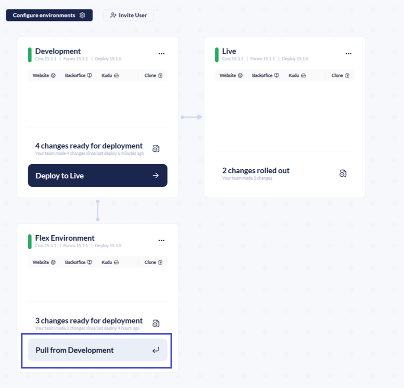
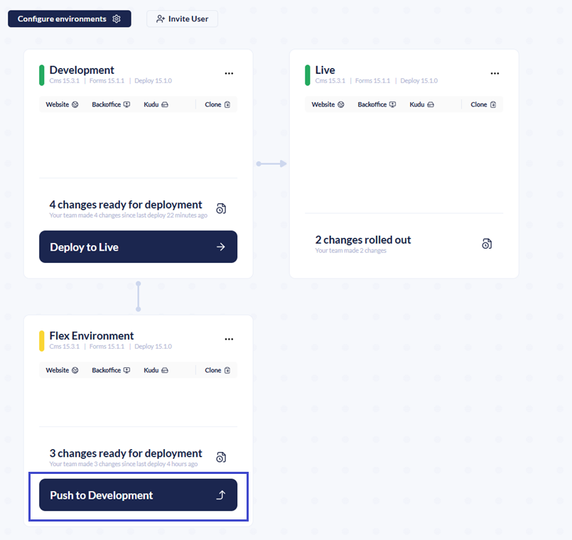

# Deploying between environments

When you are working in your Cloud environment, changes made through the Backoffice are automatically detected and committed to the site's Git repository. This includes Umbraco-specific items like Document Types and Templates. These changes are also referred to as metadata.

## Deploying between Mainline Environments

Changes made in your Cloud environments will appear in the Umbraco Cloud portal. You can see what files have been added or changed and who made the changes.

To deploy metadata changes from one Cloud environment to another, click the **Deploy changes** button on the environment where the changes were made.

<figure><figcaption></figcaption></figure>

The deployment starts, and you can follow the progress in the **Overview** section of your project.

<figure><figcaption>
Deployment in progress
</figcaption></figure>

Once complete, the changes are deployed to the next Cloud environment in the deployment flow. If you have additional environments, repeat this process to deploy the changes through each environment.

## Syncing Changes Between Mainline and Flexible Environment

When working with a flexible environment alongside your mainline environments, it's important to keep them aligned to avoid conflicts and ensure consistent deployments.

If any changes have been made in a mainline environment those changes must be pulled into the flexible environment before pushing updates back. The changes can be updated Document Types, content, or other schema changes.

If what you've been working on in the flexible environment has also been changed in the mainline, a merge conflict will occur. These conflicts need to be resolved before you can continue with the deployment. For information on how to resolve them, see the [Merge Conflicts on Flexible Environments](../../../optimize-and-maintain-your-site/monitor-and-troubleshoot/resolve-issues-quickly-and-efficiently/deployments/merge-conflicts-on-flexible-environments.md) article.

Once you’ve completed your feature or update in the flexible environment and it’s synced with the latest mainline changes:

* Push your changes from the flexible environment to the mainline environment.
* From there, the changes become part of the regular deployment flow.

## Important Notes

When you deploy, for example, from your left-most mainline environment to your Live environment, changes are made to the Live environment. These changes will then be merged back into the left-most mainline environment.

Here are the automatic steps Umbraco Cloud goes through when you hit the _"Deploy changes"_ button:

* Before pushing your changes from the source environment, the engine running Umbraco Cloud - **Umbraco Deploy** - looks for changes in the repository on the target environment
* If changes are found, Umbraco Deploy _merges_ the changes from the target environment into the repository on the source environment.
* After the merge, the changes from the source environment are pushed to the repository on the target environment.
* Finally, the changes pushed to the target repository are extracted to the site, and you will now see your changes reflected in the Backoffice and on the Frontend.

It is recommended that you **only make changes to metadata on the left-most mainline environment or a flexible environment**. Making changes directly on other mainline environments can cause merge conflicts when you deploy.


It is important to be aware of how deletions work between environments. Some deletions are environment-specific and others are not. For more information see the [Deploying Deletions article](deploying-deletions.md).


Refer to our troubleshooting documentation about [how to resolve collision errors](../../../optimize-and-maintain-your-site/monitor-and-troubleshoot/resolve-issues-quickly-and-efficiently/deployments/structure-error.md), if you should run into issues while deploying between your Umbraco Cloud environments.
